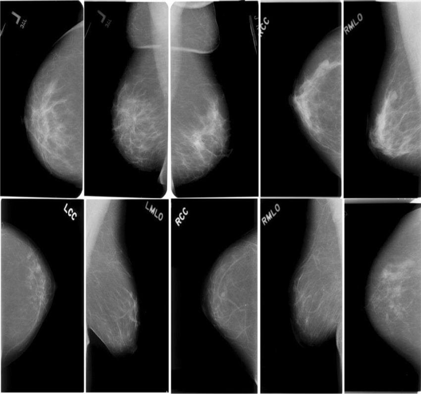

## Описание задания

Октябрь – это Всемирный месяц осведомленности о раке молочной железы, самом распространенном раковом заболевании среди женщин. В этом задании вы реализуете и обучите модель компьютерного зрения для анализа маммограмм из набора CBIS-DDSM (Curated Breast Imaging Subset of DDSM): от подготовки данных и вариативной постановки задачи до обучения и интерпретации результатов.

## Что находится в датасете

- Маммограммы (полные снимки и вырезки (crops) вокруг аномалий) и соответствующие им ROI-маски (пиксельная разметка областей с аномалиями)
- Метаданные: идентификаторы пациента/серии/кадра, анатомические атрибуты (проекция CC/MLO, левая/правая), а также патология (benign / malignant) по каждому очагу

### Два типа аномалий

В CBIS-DDSM представлены две большие группы аномалий:

- Mass (опухолевидные образования) — локальные уплотнения ткани;
- Calcification (кальцификаты) — скопления микрокальцинатов.

И mass , и calcification могут быть доброкачественными или злокачественными (тип патологии указан в метаданных)

## Постановки задачи на выбор

Вы можете выбрать одну из постановок задачи, либо выполнить несколько и сравнить полученные результаты:

1. **Бинарная классификация: норма и аномалия.** Объедините все типы (mass + calcification, benign + malignant) в один класс «аномалия» и решайте семантическую сегментацию (или детекцию) этого класса.
2. Многоклассовая классификация: норма и виды аномалий. Выделите, например, следующие классы: например:
    - 3 класса: mass, calcification, normal;
    - 3 класса: benign, malignant, normal ;
    - 5 класса: {mass, calcification} × {benign, malignant}, normal.

Особенности преобразования изображений

- любые преобразования применяйте одновременно к маммограмме и маске;
- интерполяция: применяйте bilinear/bi-cubic для маммограммы и только nearest-neighbor для маски;
- сохраняйте соотношение сторон (при необходимости используйте letterbox : вписать и допаддить).

### Работа с метаданными

В блокноте CDIS-DDSM.ipynb вы найдете код, который облегчает работу с метадаными.

## Критерии оценивания

### Обязательные условия

- решение задания находится в блокноте solution.ipynb
- надлежащий вид блокнота (наличие текстовых комментариев, заголовков, отсутствие ячеек с нерелевантным кодом, отсутствие трейсбеков с нерешенными ошибками)
- отсутствие подозрений в недобросовестном использовании LLM

Работа, в которой не выполнены обязательные условия, не будет проверяться. У вас есть одна попытка на внесение исправлений. Если исправления не будут внесены, работа будет оценена в ноль (0) баллов.

### Задача №1. Подготовка данных и Pytorch Dataset

- 2 балла: реализован собственный torch.utils.data.Dataset , который по параметрам конфигурации умеет выдавать батчи с разными таргетами
- 1 балл: собственный torch.utils.data.Dataset реализован с замечаниями и недоработками;
- 0 баллов: подготовка данных не реализована.

### Задача №2. Реализация выбранной архитектуры

- 3 балла: выбранная архитектура реализована самостоятельно, её код хорошо структурирован и организован, нет применения готовых имплементаций
- 2 балла: есть замечания по структуре кода реализованной архитектуры
- 1 балл: используются готовые имплементации
- 0 баллов: архитектура не выбрана или не реализована

### Задача №3. Обучение модели

- 3 балла: Модель успешно обучена, результаты (лосс, метрики классификации и сегментации) сохранены в clear.ml
- 2 балла: Проведено обучение модели, но оно содержит логические ошибки или привело к неоднозначному результату (низким значениям метрик)
- 1 балл: модель обучена со значительным количеством ошибок, проведено малое количество экспериментов
- 0 баллов: модель не была обучена

### Задача №4. Интерпретация результатов

- 2 балла: представлено качественное визуальное сравнение масок и предсказаний, рассчитаны и прокомментированы метрики качества (лосс, метрики классификации, Dice Coefficient/IoU,)
- 1 балл: представлен поверхностный или спорный анализ полученных результатов
- 0 баллов: анализ результатов отсутствует или не соответствует поставленной задаче
