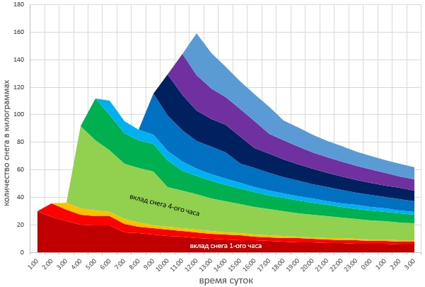
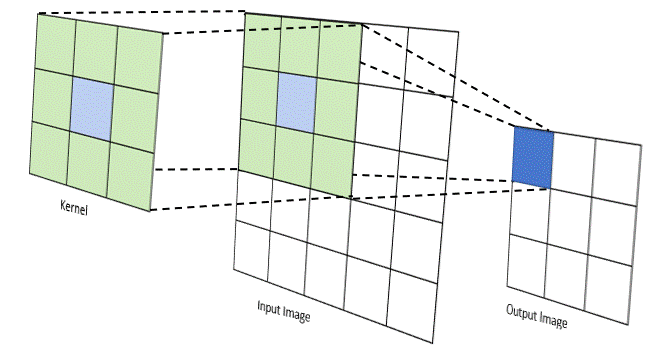

# Обработка изображений с помощью глубокого обучения

## Понятие домена в глубоком обучении

На первой лекции мы познакомились с основными идеями и понятиями, которые стоят в основе глубокого обучения. Теперь в течение нескольких следующих лекций мы рассмотрим глубокое обучение применительно к конкретным **доменам**. Под **доменом** мы будем иметь в виду тип (структуру, природу, источник) входных данных и множество практически полезных задач их обработки.

Первый домен, который мы рассмотрим – **обработка изображений** (также известный как **машинное зрение**, computer vision)

## Что такое изображение

Этому понятию можно дать три разные по сложности и практической полезности определения:

1. *Изображение – визуальное представление какого-либо объекта. Изображение может быть двумерным, например, рисунок, картина или фотография, или трёхмерным, например, барельеф или скульптура* – очевидное и понятное объяснение, но не очень полезное при поиске ответа на вопрос “как обработать изображение с помощью компьютера?”
2. *Изображение – это распределенная амплитуда цветов*  – подобно тому, как звуковая волна представляет собой распределенную амплитуду давления в пространстве (воздушной среде), каждую точку изображения можно рассматривать как пространственную выборку амплитуды цветовой интенсивности в конкретной координате (точке) изображения. Это уже более “физическое” определение, только  … нужно понять, как прийти к цифровому представлению изображения
3. *Изображение – упорядоченный набор пикселей, где каждый пиксель — это вектор из трех «каналов»: интенсивность красного, интенсивность зелёного, интенсивность синего*. – это знакомое многим из нас определение растрового цифрового изображения, с которым мы будем работать.

В рамках PyTorch изображение можно представить как трехмерный тензор размерности `3 x H x W`, где 3 – количество каналов,  `H` – высота изображения, а `W` – его ширина.

## Обработка изображений с помощью многослойного персептрона

Допустим, мы хотим классифицировать объект на изображении с помощью многослойной нейронной сети (последовательности линейных слоев и функций активаций). Такая сеть принимает на вход векторы (одномерные тензоры).

Для того, чтобы подать на вход такой сети изображение, мы можем его развернуть, то есть представить как одну длинную строку. В таком случае у нас возникнут проблемы.

1. Огромное количестве параметров – допустим, мы развернули цветное изображение разрешением 1920 на 1080 пикселей, таким образом, у нас получается вектор длиной 3 * 1920 * 1080 = 6 220 800. Если первый слой сети будут возвращать вектор, например, в два раза меньший (3 110 400), то в нем будет 6 220 800 * 3 110 400 = 19 349 176 320 000 параметров – это *очень* много.
2. Многослойный персептрон таким образом никак не учитывает “пространственную структуру” изображения;
3. Многослойный персептрон чувствителен к различным преобразованиям, который визуально изменяют изображения, но не меняют классифицируемый объект (см. иллюстрацию ниже).

Получается, использовать персептрон для обработки изображений – не самая лучшая идея. Есть ли альтернативы?

## Операция свертки

Такая альтернатива есть – применение сверточных слоев, в основе которых лежит идея применять к изображению операцию *свертки*. Мы познакомимся с этой операцией последовательно, начиная с математического определения.

### Определение из математического анализа

!!! note "Приведем определение из Википедии"

    **(def) Свертка, конволюция** – операция в функциональном анализе, которая при применении к двум функциям $f$ и $g$ возвращает третью функцию, соответствующую взаимнокорреляционной функции $f(x)$ и $g(-x)$.

    Операцию свёртки можно интерпретировать как «схожесть» одной функции с отражённой и сдвинутой копией другой. Понятие свёртки обобщается для функций, определённых на произвольных измеримых пространствах, и может рассматриваться как особый вид интегрального преобразования. В дискретном случае свёртка соответствует сумме значений$f$ с коэффициентами, соответствующими смещённым значениям $g$, то есть $( f ∗ g ) ( x ) = f ( 1 ) g ( x − 1 ) + f ( 2 ) g ( x − 2 ) + f ( 3 ) g ( x − 3 ) + …$

#### Пример

Приведем оттуда же хороший иллюстративный пример.

!!! note "Пример использования свертки"

    Пусть стот задача вычислить, как будет изменяться количество снега на каком-либо участке земли в зависимости от времени. Решение этой задачи можно разделить на два этапа:

    1. построить модель выпадения снега и модель таяния снега.
    2. каким-то образом соединить эти две модели в одну.

    Задачи первого этапа решаются путём наблюдений и опытов, а задачи второго этапа — свёрткой получившихся на первом этапе моделей.

    

    *График функции $\color{Red}g(x)$ — количество выпавшего снега в килограммах на начало часа.*

    

    *График $\color{Blue}f(x)$ зависимости количества нерастаявшего снега от времени прошедшего с момента его выпадения.*

    Пусть в результате решения задачи на первом этапе было построено две зависимости (математические модели):

    - зависимость количества выпавшего снега от текущего времени g$\color{Red}g(t)$,
    - зависимость доли нерастаявшего снега от времени, прошедшего с момента его выпадения $\color{Blue}f(\tau)$.

    Если бы снег не начинал таять, количество всех выпавших осадков$G$ можно было бы посчитать путём сложения в дискретном случае:

$$
G=\sum_{t=0}^{T}g(t),
$$

    или путём интегрирования в случае непрерывном:

$$
G=\int \limits_{0}^{T}g(t)dt.
$$

    Но в данном случае таяние снега имеет место и, более того, оно зависит не только от текущего общего количества снега, но и от того, в какой момент времени выпал этот конкретный объём снега. Так снег, выпавший две недели назад, может уже испариться, в то время как снег, выпавший полчаса назад, ещё будет лежать и даже не начнёт подтаивать.

    Получается, что для снега, выпавшего в разное время, нужно построить свою модель таяния и как-то сложить все эти модели вместе.

    Для этих целей и можно использовать понятие математической свёртки. Пусть в момент времени$t$ рассматривается снег, который выпал в момент времени $\tau$, тогда

    -$\tau$ — время выпадения снега. Например, 13:00;
    - $\color{Red}g(\tau)$ — количество выпавшего в момент $\tau$ снега. Например, 7 кг;
    - $t$ — момент времени, для которого нам нужно узнать состояние выпавшего в $\tau$ снега. Например, 15:00;
    - t − $\tau$ — количество времени, прошедшее с момента выпадения до момента расчёта оставшейся доли снега. То есть 15:00 − 13:00;
    - $\color{Blue}f(t-\tau )$ — доля снега, которая не растаяла после того, как пролежала $t-\tau$ часов.

    Нужно для каждого количества$\color{Red}g(\tau)$ снега, выпавшего в момент времени $\tau$, сложить множество моделей $f(t-\tau)$ в одну функцию. Если это сделать, получится сумма в дискретном случае:

$$
w(t)=\sum \limits_{\tau=0}^{t}g(\tau )f(t-\tau )
$$

    или интеграл в непрерывном:

$$
w(t)=\int \limits _{\tau =0}^{t}g(\tau )f(t-\tau )d\tau
$$

    Графически функция$w(t)$ изображена ниже, где разными цветами представлены вклады каждой кучи снега из графика $\color {Red}g(x)$.

    
    *График функции $w(t)$, где разным цветом представлен вклад каждой кучи снега (цвета вкладов соответствуют цветам куч выпавшего снега на графике $\color {Red}g(x)$ выше)*

    Функция$w(t)$ полностью моделирует поведение снега, выпавшего согласно модели $\color{Red}g(x)$. Так, на графике выше видно, что общее количество снега увеличивается тремя скачками, но снег начинает таять сразу, не дожидаясь выпадения других осадков.

### Фильтры в классическом машинном зрении

!!! note "Маленькое разъяснение"
    Под *классическим машинным зрением* имеется в виду теория и технология создания алгоритмов обработки изображений, не включающая в себя машинное и глубокое обучение.

Здесь будет полезно ввести еще одно, вспомогательное **четвертое** определение понятия изображения – это функции вида $f(x, y)$, которые отображают координату на изображении в интенсивность красного, синего и зеленого цвета (в пиксели).

Пусть теперь мы вводим ещё одну функцию, $g(x) = h(f(x))$, которая принимает на вход значения пикселей и изменяет их, но не меняет их местоположения на изображении. Такая функция $g(x)$ называется **фильтром**.

Классическое машинное зрение предлагает большое количество фильтров, которые делают разные полезные операции над изображением: удаление шума, сглаживание, определение контуров объектов и др. Эти фильтры используют операцию двумерной свертки над изображением и заранее определенным ядром свертки. Выглядит это следующим обазом.

Механизм свертки можно представить как процесс "скольжения" небольшной матрицы-ядра по всему изображению. На каждом шаге мы накладываем ядро на соответствующую область исходного изображения, перемножаем покомпонентно значения в совпадающих ячейках и суммируем результат. Полученное число записывается в соответствующую позицию выходного изображения. Таким образом, каждое положение ядра порождает один пиксель на выходе.

Разные ядра выполняют разные задачи благодаря своим уникальным числовым паттернам. Например, ядро размытия Гаусса имеет значения, образующие плавный холм, что усредняет пиксели и подавляет шум. А ядро детектора краев Собеля содержит противоположные по знаку значения по разные стороны от центра, что усиливает резкие перепады яркости — границы объектов.

Мы видим, что заранее определенные значения ядер свертки задают определенное полезное преобразование над изображением. Они эффективны, но ограничены: каждый фильтр извлекает лишь один, заранее задуманный тип признаков.

Если на этом месте остановиться и немного подумать, то в голову может прийти хорошая идея:

!!! question "А можно ли с помощью глубокого обучения найти такие ядра свертки, чтобы сверточный фильтр возвращал скрытые признаки?"

## Двумерный сверточный фильтр

### Визуализация

Следующая картинка поможет разобраться с устройством двумерного сверточного слоя:

Каждый «кубик» на картинке — это число. Большой тензор слева — это изображение котенка. Фиолетовым цветом на нем выделено окно, которое в настоящий момент участвует в операции свертки с некоторым ядром. Результатом этой операции будет новое число, которое на картинке отмечено голубым (*важное замечание – результат вычисления свертки проходит через функцию активации*). Для того, чтобы получить новое число на новом “голубом” изображении, окно нужно сдвинуть на один шаг вправо. Вычисляя свертку со сдвигом, мы сформируем один канал в новом изображении, которое называется **картой признаков.**

Если мы хотим, чтобы в промежуточной карте признаков было больше одного канала, мы должны подготовить несколько ядер свертки, каждое из которых будет отвечать за свой канал в карте признаков

### Параметры операции

Основными параметрами, определяющими работу двумерного сверточного слоя, являются:

- **`stride`** – величина шага, с которым ядро свертки перемещается по входному изображению. Страйд, равный 1, означает, что окно смещается на один пиксель за раз, сохраняя высокую детализацию. Увеличение страйда (например, до 2) уменьшает разрешение выходной карты признаков вместе с вычислительными затратами.
- **`padding`** – добавление пикселей (обычно нулевых) по границам входного изображения. Это позволяет контролировать размер выходной карты признаков. _Valid_-padding (без дополнений) приводит к уменьшению размера, а _Same_-padding (с определенным количеством пикселей по краям) сохраняет исходный размер, что часто является желаемым результатом.
- **`dilation`** – параметр, который "разрежает" ядро свертки, добавляя промежутки между его элементами. Это позволяет увеличить рецептивное поле(receptive field) нейрона без увеличения количества параметров или потери разрешения, помогая сети найти более глобальные контексты и зависимости.

По этой [ссылке ](https://github.com/vdumoulin/conv_arithmetic)можно увидеть иллюстрации того, как разная комбинация значений этих параметров меняет вид операции свертки.

### Рецептивное поле

(def) **Рецептивное поле (Receptive field)** — это размер области входного изображения, которая участвует в вычислении одного элемента выходной карты признаков.

Ключевой способ увеличить рецептивное поле, не меняя размер ядра, — это последовательное наложение многих сверточных слоев. Каждый следующий слой "смотрит" на все большую область исходного изображения. Например, композиция двух сверток 3x3 дает рецептивное поле 5x5, а трех — 7x7. Это позволяет нейронам на глубоких слоях охватывать **глобальный контекст**, одновременно сокращая количество параметров по сравнению с полносвязными сетями. Альтернативный способ увеличить рецептивное поле — использование **dilated-сверток**, которые увеличивают зону охвата за счет разреженного ядра с промежутками между элементами.

### Формальное определение

На картинке ниже приведена формальная математическая запись вычисления нового значения в карте признаков с помощью свертки:

#### Полезные формулы

**Высота выходной карты признаков**

$$
H_{out}=\Big\lfloor \frac{H_{in}+2p−d(k−1)−1}{s} \Big\rfloor+1,
$$

**Ширина выходной карты:**

$$
W_{out}= \Big\lfloor \frac{W_{in}+2p−d(k−1)−1}{s} \Big\rfloor+1,
$$

где:

- $H_{in}$, $W_{in}$ — высота и ширина входа
- $k$ — размер ядра свертки
- $s$ — stride (шаг)
- $p$ — padding (дополнение)
- $d$ — dilation (коэффициент расширения)
- $\lfloor \cdot \rfloor$ — операция округления вниз

## Пулинг

Мы можем задавать любое количество каналов в промежуточных картах признаков – чем больше, тем лучше. Однако чем их больше, тем больше общее число параметров в нейронной сети, особенно в случае обработки изображений с высоким разрешением.

Для того, чтобы уменьшить число параметров, сохранив число внутренних каналов, можно использовать операции пулинга, под которой подразумевается **кратное уменьшение разрешени карты признаков**.

Как это можно сделать? Например, можно оставлять только пиксели с четными индексами, но в таком случае мы рискуем потерять ценную информацию. Тогда по какому принципу отбрасывать пиксели, чтобы минимизировать риск потери информации?

### Max pooling

Пусть у нас есть окно небольшого размера, например, `2 х 2`, и в новую карту признаков мы будем отбирать только те пиксели, которые имеют максимальное значение в данном окне. Этот способ называется Max Pooling.

### Average Pooling

Если мы выбираем не максимальное, а среднее значение – это будет Average Pooling.

### Global Average Pooling

Решая задачу регрессии или классификации, нам в конце концов нужно из многоканальной выходной карты признаков сформировать вектор, чтобы подать его на вход линейному слою, отвечающего ему за финальное отображение скрытых признаков в пространство целевой переменной (таргета). Как это сделать?

**Первый способ**. Можно подобрать параметры последовательности слоев так, чтобы входное изображение в конце концов “сжалось” в тензор размерности `1 х 1 х С`, который представляет из себя вектор длиной C. Однако у такого способа есть недостаток – мы жестко фиксируем разрешение выходного изображения. Если мы хотим использовать другое разрешение, то нам придется создавать и обучать новую сеть.

**Второй способ**. После скольких-то свёрточных слоёв мы будем брать среднее вдоль пространственных осей тензора последней карты признаков и усреднять их значения, а уже после этого строить многослойный персептрон. Это и есть Global Average Pooling. У такого подхода есть несколько преимуществ:

1. радикально меньше параметров;
2. теперь мы можем применять нейронную сеть к картинку любого размера;
3. мы сохраняем «магию» инвариантности предсказаний к различным преобразованиям изображения.

### Аугментации

Если мы располагаем малым объемом обучающих данных с картинками, либо они не отражают возможного разнообразия изображений, мы можем прибегнуть к искусственным изменениям изображений для расширения “разнообразия” датасета. Эти искусственный преобразования называются **аугментациями.**

К числу таких преобразований относят:

1. сдвиги, повороты и отражения;
2. добавление случайного гауссового шума;
3. вырезание случайной части картинки (cutout);
4. перспективные преобразования;
5. случайное изменение оттенка\насыщенности\яркости для всей картинки;
6. и многое другое.

## Одномерный сверточный слой

Одномерная свертка (1D convolution) применяется для обработки последовательностей и временных рядов, где данные имеют структуру `(значения измерений, каналы)`. В отличие от двумерного слоя, где ядро скользит по высоте и ширине, одномерное ядро размера `k` перемещается только вдоль временной оси.

Формула размерности выходной последовательности:

$$
L_{out}=\Big\lfloor \frac{L_{in}+2p−d(k−1)−1}{s} \Big\rfloor+1,
$$

где:

- $L_{in}$, $L_{out}$ — длина входной и выходной последовательности
- $k$ — размер ядра
- $s$ — stride
- $p$ — padding
- $d$ — dilation

Популярные области применения:

- Обработка временных рядов;
- Цифровая обработка сигналов (в первую очередь – аудиосигнала).

## Задачи машинного зрения

В начале этого конспекта мы познакомились с понятием домена. Простыми словами – это тип данных и множество задач их обработки.
Мы рассмотрели, что из себя представляют изображения и как они обрабатываются с помощью глубокого обучения. Теперь мы рассмотрим несколько популярных прикладных задач, включенных в домен машинного зрения, и архитектуры сверточнных нейронных сетей, спроектированных для их решения.

(def) **Архитектура нейронной сети** – это структурная организация её элементов, определяющая, как через нее проходят данные, какие операции выполняются, и как эти элементы связаны между собой.

### Классификация

**Суть задачи**: отнесение объекта на изображении к одному из рассматриваемых классов. Это фундаментальная задача, часто называемая распознаванием образов: модель отвечает на вопрос "**Что** находится на изображении?". Ответом является одна метка из конечного набора, например, "кошка", "собака" или "автомобиль".

**Применяемые метрики**: для оценки качества классификации чаще всего используются:

- **Accuracy**— доля правильных ответов модели от общего числа примеров. Простая и интуитивная понятная метрика, но может вводить в заблуждение на несбалансированных наборах данных.
- **Precision и Recall** — используются вместе для более детальной оценки. Precision показывает, насколько мы можем доверять положительному прогнозу модели, а Recall — какую долю нужных объектов мы вообще нашли.
- **F1-мера (F1-score)** — гармоническое среднее между Precision и Recall, единая метрика, которая балансирует оба аспекта.

**Известные архитектуры**: эволюция архитектур для классификации во многом определяла прогресс в компьютерном зрении:

- **LeNet-5** — одна из первых сверточных сетей, созданных для распознавания цифр.
- **AlexNet** — архитектура, которая в 2012 году доказала мощь глубокого обучения, показав высокие результаты с большим отрывом от остальных участников на конкурсе ImageNet.
- **VGGNet** — показала возможность использования глубоких сетей с использованием последовательных слоев 3x3.
- **GoogLeNet/Inception** — представила модуль Inception, позволяющий эффективно вычислять карты признаки на разных масштабах.
- **ResNet** — революционная архитектура, предложившая т.н. skip connections, что позволило обучать очень глубокие сети (сотни слоев) без затухающего градиента.

### Детекция объектов

**Суть задачи**: решить более сложную проблему – не только определить, **что** находится на изображении, но и **где** именно. Модель должна найти все объекты рассматриваемых классов на изображении и для каждого нарисовать ограничивающую рамку (bounding box).

**Применяемые метрики**: помимо упомянутых выше метрик классифкации, в этой задаче оценивают то, как хорошо модель справилось с поиском местоположения объекта на изображении. К таким метрикам относится **Intersection over Union**: $\text{IoU}(B_p, B_a)= \frac{B_p \cap B_a}{B_p \cup B_a}$, где:

- $B_p$ – это предсказанная рамка,
- $B_a$ – это реальная рамка,
- в числителе $B_p \cap B_a$ – пересечение двух рамок,
- в знаменателе $B_p \cup B_a$ – это объединение двух рамок

Известные архитектуры – современные детекторы часто строятся по принципу "анкоров" (anchor boxes) и имеют одно- или двухэтапную архитектуру:

- **R-CNN, Fast R-CNN, Faster R-CNN** — семейство двухэтапных детекторов, где сначала предлагаются области-кандидат, а затем они классифицируются.
- **YOLO (You Only Look Once)** — знаменитая одноэтапная архитектура, которая предсказывает ограничивающие рамки и классы напрямую за один проход по сети, что делает её быстрой по сравнению с R-CNN и её ускоренными версиями.

### Семантическая сегментация

**Суть задачи**: присвоить **каждому пикселю изображения** метку класса, ответив на вопрос "**Что это?**" для каждой точки картинки.

**Применяемые метрики**: рассмотрим ранее рассмотренные метрики в контексте новой задачи:

- $\text{IoU}=\frac{TP}{TP + FP + FN}$, где для конкретного класса
  - $TP$ — количество пикселей, правильно предсказанных как этот класс.
  - $FP$ — пиксели, ошибочно предсказанные как этот класс.
  - $FN$ — пиксели этого класса, пропущенные моделью.
- $\text{Dice} = \frac{2 \times TP}{2 \times TP + FP + FN}$ – это метрика, более мягкая, чем IoU

**Известные архитектуры**:

- **U-Net** — классическая и очень влиятельная архитектура, имеющая симметричный "U-образный" вид, где encoder извлекает признаки, а decoder восстанавливает пространственное разрешение для точного позиционирования масок.
- **FCN (Fully Convolutional Network)** — одна из первых сетей, адаптировавших классические CNN для сегментации, заменив полносвязные слои на сверточные.
- **DeepLab** — семейство архитектур, использующих такие методы, как Atrous (Dilated) Convolutions и ASPP (Atrous Spatial Pyramid Pooling) для точного учета контекста на нескольких масштабах.

# Список использованных источников

1. Учебник Яндекс ШАД. [Сверточные нейронные сети.](https://education.yandex.ru/handbook/ml/article/svyortochnye-nejroseti)
2. Computer Vision Tutorial.[ Tutorial 1: Image Filtering](https://ai.stanford.edu/~syyeung/cvweb/tutorial1.html)
3. CS 230 - Deep Learning. [Convolution Networks cheatsheet](https://stanford.edu/~shervine/teaching/cs-230/cheatsheet-convolutional-neural-networks#).
4. Dive Into Deep Learning. [7. Convolution Neural Networks.](https://d2l.ai/chapter_convolutional-neural-networks/index.html)
