## Что такое последовательные данные и какие они бывают?

### Неформальное определение

Представьте себе данные, где важен не только сам факт наличия информации, но и порядок её поступления. Это и есть последовательные данные. В отличие от статичного изображения, где все значения пикселей можно получить "одномоментно", здесь мы имеем дело с цепочкой элементов, которые появляются один за другим. Смысл часто проявляется не в одном элементе, а в том, как элементы связаны между собой: предыдущие значения создают контекст, который помогает интерпретировать последующие.

Ключевая особенность таких данных — переменная длина. Один текст может состоять из 5 слов, другой — из 500; один аудиофрагмент длится 1 секунду, другой — минуту. Поэтому задача глубокого обучения в этом контексте — научиться извлекать закономерности из упорядоченных последовательностей, учитывая их контекст и то, что длина последовательности заранее не фиксирована.

### Формальное определение

Последовательность длины $T$ можно определить как упорядоченный набор векторов признаков, обычно зависящих от времени. Пусть каждый элемент последовательности представляет собой вектор $x_t \in \mathbb{R}^n$, где $n$ — размерность признакового пространства, а $t$ — индекс позиции (времени). Тогда вся последовательность записывается как

$$
X = (x_1, x_2, \ldots, x_T).
$$

В наборе данных мы обычно имеем дело с множеством таких последовательностей $\{X^{(1)}, X^{(2)}, \ldots, X^{(N)}\}$, где $N$ — число примеров. При этом длина каждой последовательности может быть своей: $T^{(i)}$ не обязана совпадать для разных объектов.

### Временные ряды

**(def)** Временной ряд — это значения некоторого признака (или набора признаков), изменяющегося во времени, измеренные в дискретные моменты. Формально можно сказать так: пусть $(y_t,\, t \in \mathbb{N})$ — временной ряд, и нам известны значения $y_1, \ldots, y_T$. Во многих задачах цель заключается в том, чтобы предсказать значение ряда в некоторый будущий момент времени, например $y_{T+1}$ или вообще $y_{t_j}$ для заданного $t_j$.

Основное интуитивное предположение последовательных данных заключается в том, что по будущее состояние определяется его прошлым: в данных могут быть тренды, сезонности, циклы и шум, и модель должна научиться использовать прошлый контекст, чтобы прогнозировать будущее.

#### Примеры временных рядов

Классические примеры временных рядов — это цены и объёмы торгов на бирже, потребление электроэнергии по часам, температура воздуха по дням, число обращений в поддержку по неделям, число поездок в такси по минутам и т.п. Во всех этих случаях данные устроены как последовательность измерений, и порядок наблюдений принципиально важен: перемешивание элементы местами влечет за собой нарушения внутренней закономерности.

### Сигналы и их связь с временными рядами

В контексте анализа данных термины "сигнал" и "временной ряд" иногда используют как взаимозаменяемые, но между ними есть важное различие. Сигнал — более общее понятие: это физическая величина, изменяющаяся во времени (или в пространстве). Изначально сигнал обычно непрерывен по своей природе, например звуковая волна или электромагнитные колебания.

Временной ряд, напротив, чаще понимают как дискретную запись сигнала: мы измеряем сигнал через равные промежутки времени и получаем набор чисел. Поэтому можно сказать, что временной ряд — это "оцифрованное" представление непрерывного сигнала.

#### Примеры сигналов

Типичные примеры сигналов — аудиосигнал (речь, музыка), ЭКГ и другие медицинские измерения, данные с акселерометра и гироскопа в смартфоне, радиосигналы, показания датчиков в IoT. Эти данные могут быть одномерными или многоканальными, но в любом случае это последовательности, в которых важна динамика и форма изменения во времени.

### Текст как последовательность

Текст — это тоже последовательные данные, но особого типа. Он представляет собой упорядоченную последовательность символов. В отличие от сигналов и временных рядов, элементы текстовой последовательности дискретны: это не числовое значение измеряемой величины или характеристики объекта, а условные символы, которым мы должны научиться приписывать смысл.

Ключевое отличие текста от других последовательностей в том, что здесь смысл кодируется не физическими измерениями, а абстрактными знаками, организованными по правилам языка, естественного или формального (например, программный код). Поэтому главная сложность обработки текста — научиться переводить дискретные токены в численное представление так, чтобы оно отражало семантику и контекст.

## Задачи обработки последовательностей

Последовательные данные встречаются в очень разных областях, но типовые задачи можно сгруппировать по двум большим направлениям: обработка сигналов/временных рядов и обработка текста. В обоих случаях модель должна научиться использовать контекст: то, что было раньше, влияет на то, как интерпретировать то, что происходит сейчас.

### Задачи обработки сигналов и временных рядов

Для временных рядов и сигналов чаще всего решают задачи прогноза и распознавания. Например, мы можем предсказывать будущие значения ряда, классифицировать целый сигнал (что это за звук или состояние пациента), либо детектировать события внутри сигнала — моменты, когда произошло что-то важное. Сюда же относятся задачи фильтрации и восстановления: убрать шум, заполнить пропуски, восстановить “чистый” сигнал по наблюдениям.

Важно, что в этих задачах последовательность обычно числовая, и модель должна уметь работать с длительными зависимостями: события на далёком прошлом могут влиять на то, что происходит сейчас.

#### Задачи обработки текста

В тексте задачи обычно формулируются как понимание или порождение. К "пониманию" относятся:

- классификация текста (тональность, тема);
- извлечение сущностей;
- разметка последовательности;
- поиск ответов в тексте. 

К "порождению" относятся:

- машинный перевод;
- суммаризация;
- генерация текста и диалоговые системы.

Особенность текста в том, что смысл часто определяется не отдельными словами, а их взаимным расположением и контекстом. Поэтому в текстовых задачах модели нужно научиться представлять значение токенов с учётом окружения.

### Типы отображений между входом и выходом

Многие задачи обработки последовательностей удобно описывать через определение вида входных и выходных данных:

- **Many-to-One**: на вход подаётся последовательность, на выходе одно значение. Пример: классификация текста или целого аудиофрагмента.
- **One-to-Many**: на вход один объект, на выходе последовательность. Пример: генерация текста по теме или описанию.
- **Синхронизированный Many-to-Many**: вход и выход — последовательности одинаковой длины, и каждому элементу входа соответствует элемент выхода. Пример: разметка каждого слова в предложении или классификация каждого кадра сигнала.
- **Несинхронизированный Many-to-Many**: вход и выход — последовательности разной длины, и явного соответствия по позициям нет. Пример: машинный перевод, где число слов в предложениях разных языков отличается.

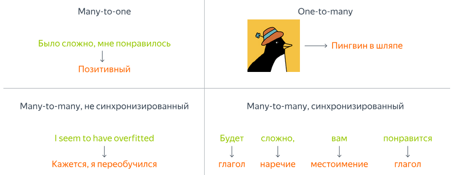

Эта классификация задач полезна тем, что позволяют заранее понимать, какой тип архитектуры нам потребуется и как будет выглядеть обучение модели.

### Векторизация последовательных данных

#### Векторизация временных рядов и сигналов

Векторизация временных рядов и сигналов обычно не вызывает фундаментальных сложностей, потому что эти данные изначально являются числовыми. На вход модели можно подавать последовательность значений напрямую: например, окно сигнала длины $T$ как матрицу $X \in \mathbb{R}^{T \times n}$, где $n$ — число каналов (для моно-аудио $n=1$, для многоканальных датчиков — больше).

Благодаря непрерывной природе таких данных мы можем использовать линейные слои, сверточные слои и рекуррентные архитектуры без предварительной обработки: смысл уже зашит в самих измерениях. Основная инженерная задача здесь обычно связана не с векторизацией как таковой, а с выбором масштаба (нормализация), длины окна и способа разбиения на фрагменты.

#### Текстовые эмбеддинги

С текстом ситуация принципиально иная: текст состоит из дискретных символов и слов, поэтому его нельзя подать в нейросеть напрямую в исходном виде. Нам нужно построить его численное представление, которое одновременно выполняет две функции: идентифицирует каждый элемент текстовой последовательности и отражает его смысл так, чтобы семантически близкие элементы текста располагались близко в векторном пространстве. Эту идею можно визуализировать следующим образом:

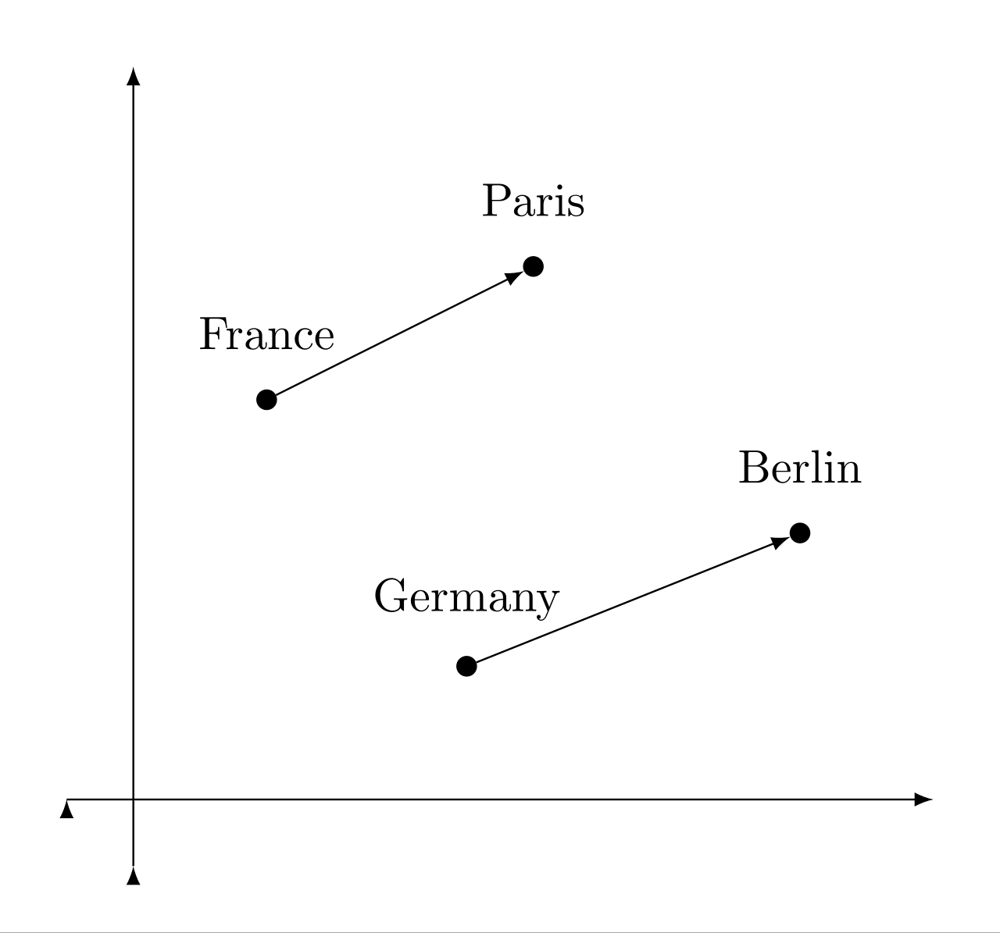

Поэтому в NLP почти всегда появляется стандартная цепочка преобразований: текст разбивается на **токены**, затем каждый токен превращается в целое число (индекс словаря), а после этого индексы преобразуются в **векторы-эмбеддинги**. На выходе получается последовательность векторов $X = (x_1, x_2, \ldots, x_T)$, где каждый $x_t \in \mathbb{R}^d$ — уже "понятный" для модели носитель смысла.

### Разбиение текста на токены

#### Что такое токенизация?

**(def)** Токенизация — это процесс разбиения исходного текста на элементы, с которыми дальше работает модель. Эти элементы называются токенами: ими могут быть слова, части слов или даже отдельные символы. После токенизации каждому уникальному токену сопоставляется номер в словаре, и именно этот номер затем используется для получения эмбеддинга.

Важно понимать, что токенизация — это не просто техническая деталь. То, как именно мы режем текст на токены, напрямую влияет на размер словаря, устойчивость к ошибкам и способность модели работать с редкими словами.

#### Уровни токенизации: слова, морфемы, символы

Если токенизировать по словам, всё выглядит интуитивно, но появляется проблема редких и новых слов: словарь быстро разрастается, а незнакомые слова не могут быть обработаны и превращаются в так называее out-of-vocabulary (OOV) и обозначаются одним общим токеном. Символьная токенизация решает проблему неизвестных слов, но сильно увеличивает длину последовательности и усложняет обучение, потому что модели приходится выделять смысл из слишком мелких единиц.

### Искомый алгоритм токенизации

В идеале хочется получить токенизацию, которая даёт небольшой словарь, но при этом оставляет токены достаточно "осмысленными". Ещё одно важное требование — универсальность: токенизация должна работать не только для одного языка и одного домена. Наконец, желательно нивелировать проблему out-of-vocabulary, чтобы модель не ломалась на новых словах.

Эти требования конфликтуют между собой, поэтому в реальных системах токенизация — это компромисс между компактностью словаря, длиной последовательностей и качеством представления текста.

### От морфем к субсловам

Идея субсловной токенизации близка к морфемному анализу, но не требует полноценного лингвистического анализа. Вместо достоверных и заранее определенных морфем используются частотные фрагменты текста, из которых можно собирать слова. Такие фрагменты называются **субсловами**. Это особенно важно для языков со сложной морфологией: модель получает возможность переиспользовать общие части слов и лучше обобщаться на новые формы слов.

### BPE: идея, encoding и decoding

**BPE (Byte Pair Encoding)** — один из самых популярных алгоритмов субсловной токенизации. Его основная идея проста: мы начинаем с элементарных единиц (часто это символы или байты, кодирующие эти символы), а затем итеративно объединяем самые частые пары, постепенно формируя устойчивые субслова. В результате получается словарь, который хорошо покрывает наиболее частые паттерны языка и при этом остаётся относительно компактным.

**Encoding** в BPE — это разбиение нового текста на токены из полученного словаря, обычно жадным образом: мы стараемся покрыть строку максимально длинными известными фрагментами. 

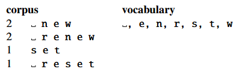
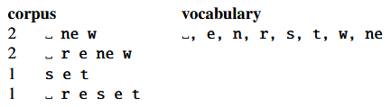
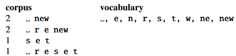
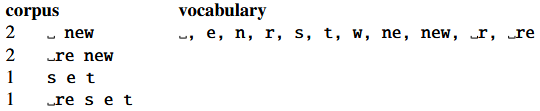
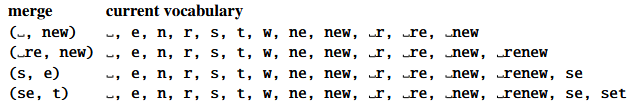

**Decoding** — обратная операция: склейка токенов обратно в исходную строку. Эта обратимость важна: токены должны быть удобны для модели, но при этом мы должны уметь вернуться к читаемому тексту.

## Текстовые эмбеддинги

### Эмбеддинг как числовое представление токена

**(def)** Эмбеддинг — это результат преобразования токена в вектор в некотором непрерывном векторном пространстве. Идея состоит в том, чтобы сопоставить каждому токену такой вектор, чтобы геометрическая близость между векторами отражала семантическую или синтаксическую близость между соответствующими словами. На практике эмбеддинги позволяют нейросети работать с текстом так же естественно, как она работает с числовыми признаками: на вход поступает уже последовательность векторов фиксированной размерности.

### One-hot и его ограничения

Самый прямолинейный способ представить токен — это one-hot вектор размерности словаря. В таком представлении токен однозначно идентифицируется, но оно не несёт никакой информации о смысле: любые два разных слова оказываются одинаково "далёкими" друг от друга. Кроме того, one-hot представление крайне неэффективно по памяти и вычислениям: словарь может быть огромным, а вектор -- разреженным, то есть почти весь состоит из нулей.

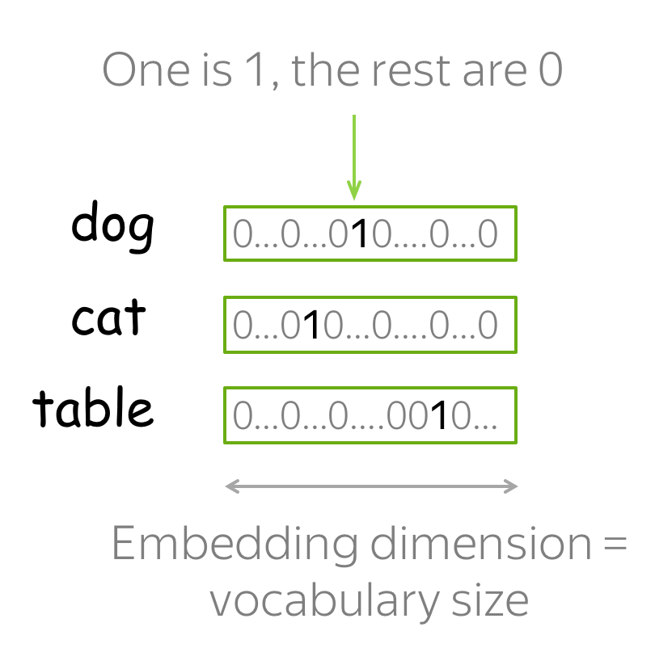

### В поисках смысла: дистрибутивная гипотеза

Чтобы эмбеддинги действительно отражали смысл, нужно опираться на идею, которая связывает значение слова с его употреблением.

!!! note "Дистрибутивная гипотеза"

    Дистрибутивная гипотеза утверждает, что слова, встречающиеся в похожих контекстах, как правило, имеют схожие значения. 

В этом смысле слово характеризуется своим окружением: не самим по себе, а тем, с какими другими словами оно появляется рядом.

Хорошая иллюстрация — фраза **"Эти типы стали есть в цехе"**. В зависимости от контекстного значения слов "типы" и "есть" смысл фразы может сильно отличаться. В одном варианте речь может идти о стали как о металле, несколько типов которых есть в цеху. В другом под "типами" мы можем понимать рабочих завода, которые принимают пищу в цеху.

### Частотные методы получения эмбеддингов

Исторически первые методы построения смысловых представлений были основаны на статистике: они подсчитывали, как часто слова встречаются в документах и в каких контекстах появляются. Из таких частотных таблиц можно получить простые векторные представления, где каждая координата отражает связь слова с каким-то признаком контекста.

Один из ключевых шагов в эту сторону — построение матрицы совместной встречаемости слов. Обычно выбирается окно контекста в виде фиксированного количество слов слева и справо от анализируемого,  и для каждого анализируемого слова считается, какие другие лова встречаются рядом и как часто. В результате получается матрица, где строка соответствует целевому слову, а столбец — слову из контекста. Такая матрица уже несёт информацию о значениях, но она получается очень большой и разреженной, а частоты в ней сильно перекошены в пользу самых популярных слов.

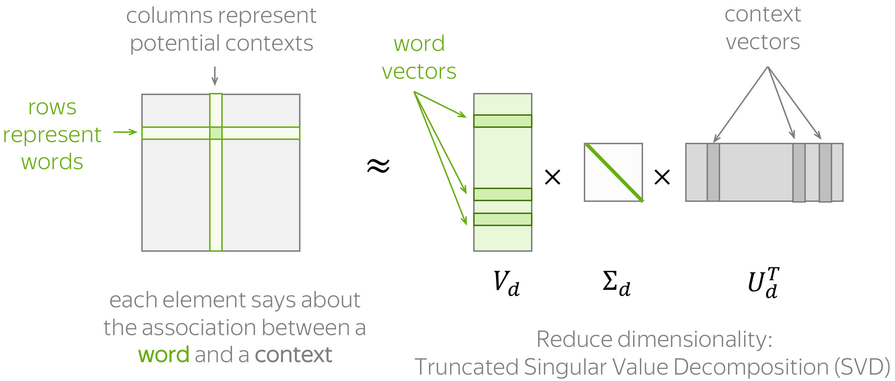

Один из ключевых шагов в эту сторону — построение **матрицы совместной встречаемости** слов. Пусть у нас есть словарь размера $|V|$, а корпус представлен как последовательность токенов $w_1, w_2, \ldots, w_M$. Мы фиксируем размер окна контекста $c$ и для каждого вхождения слова $w_t$ рассматриваем его окружение $w_{t-c}, \ldots, w_{t-1}, w_{t+1}, \ldots, w_{t+c}$. Тогда матрица совместной встречаемости $C \in \mathbb{R}^{|V| \times |V|}$ определяется как количество совместных появлений целевого слова $i$ и контекстного слова $j$ в пределах окна:

$$
C_{ij} = \sum_{t=1}^{M} \mathbf{1}[w_t = i]\sum_{\substack{k=-c \\ k\neq 0}}^{c}\mathbf{1}[w_{t+k}=j],
$$

где $\mathbf{1}[\cdot]$ — индикатор. Такая матрица уже несёт информацию о значениях, но она получается очень большой и разреженной, а частоты в ней сильно перекошены в пользу самых популярных слов.

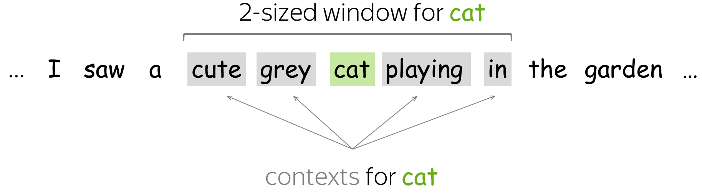

### PPMI и LSA

Чтобы сделать матрицу совместной встречаемости более информативной, применяют нормализации, которые уменьшают влияние частотных слов и усиливают значимые связи. Для этого удобно перейти от “сырых” счётчиков к вероятностям. Обозначим

$$
p(i,j)=\frac{C_{ij}}{\sum_{a,b} C_{ab}}, \quad 
p(i)=\frac{\sum_j C_{ij}}{\sum_{a,b} C_{ab}}, \quad
p(j)=\frac{\sum_i C_{ij}}{\sum_{a,b} C_{ab}}.
$$

Тогда **PMI** (pointwise mutual information) измеряет, насколько совместное появление пары $(i,j)$ “неожиданно” по сравнению со случаем независимости:

$$
\mathrm{PMI}(i,j) = \log \frac{p(i,j)}{p(i)p(j)}.
$$

А **PPMI** (positive PMI) отбрасывает отрицательные значения, оставляя только статистически “усиленные” связи:

$$
\mathrm{PPMI}(i,j) = \max\big(\mathrm{PMI}(i,j), 0\big).
$$

Дальше часто делают ещё один шаг: применяют понижение размерности к матрице PPMI (или к матрице совместной встречаемости) через SVD. Пусть $M$ — выбранная матрица (например, $M=\mathrm{PPMI}$). Тогда её разложение имеет вид

$$
M \approx U_k \Sigma_k V_k^\top,
$$

где мы оставляем только первые $k$ компонент. Этот подход называют **LSA**: мы сжимаем исходное разреженное представление в компактное пространство, где начинают проявляться скрытые факторы тематики и смысла. В качестве векторного представления слова $i$ часто берут строку матрицы $U_k \Sigma_k$ (или $U_k \Sigma_k^\alpha$ с некоторым $\alpha \in (0,1]$), то есть

$$
e_i = (U_k \Sigma_k)_{i,:}.
$$

Именно в этот момент появляется важная идея: смысл можно искать как структуру в большом наборе наблюдений, а понижение размерности помогает выделить эти скрытые “направления” в данных.

### Косинусная близость векторов

Когда у нас есть векторные представления слов, возникает вопрос, как измерять их близость. Одна из самых распространённых мер — косинусная близость. Она вычисляется как нормализованное скалярное произведение векторов и по смыслу измеряет угол между ними:

$$
\cos(v, w) = \frac{\langle v, w \rangle}{\|v\|_2 \cdot \|w\|_2}.
$$

Интуитивно косинусная близость хороша тем, что она меньше зависит от длины векторов и больше отражает их направление. Именно направление в эмбеддингах часто несёт семантический смысл.

### Word2Vec

Частотные методы вроде хорошо показывают идею дистрибутивной семантики, но они опираются на явное построение больших матриц и последующую линейную алгебру. Word2Vec делает шаг в другую сторону: он предлагает учить эмбеддинги как параметры простой нейросетевой модели классификатора, которая решает вспомогательную задачу предсказания контекста. В итоге мы получаем плотные векторы небольшой размерности, а "смысл" слова возникает как побочный продукт оптимизации — ровно в духе дистрибутивной гипотезы.

В классическом Word2Vec есть две симметричные постановки: **CBOW** и **Skip-gram**.

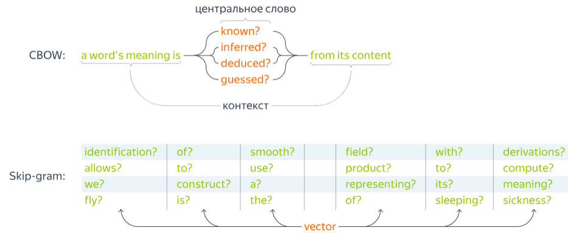

В CBOW модель по контексту предсказывает центральное слово, а в Skip-gram — наоборот, по центральному слову предсказывает слова контекста. Пусть $w_t$ — токен в позиции $t$, а окно контекста имеет ширину $c$. Тогда контекст можно записать как набор индексов $w_{t-c}, \ldots, w_{t-1}, w_{t+1}, \ldots, w_{t+c}$. В Skip-gram мы хотим максимизировать вероятность наблюдаемого контекста при фиксированном центральном слове:

$$
\max \sum_{t=1}^{M}\sum_{\substack{k=-c \\ k\neq 0}}^{c} \log p\big(w_{t+k}\mid w_t\big).
$$

Чтобы задать вероятности, Word2Vec вводит две матрицы параметров: входные эмбеддинги $E \in \mathbb{R}^{|V|\times d}$ и выходные эмбеддинги $E' \in \mathbb{R}^{|V|\times d}$. Для слова $w$ его вектором служит строка $v_w = E_{w,:}$, а для контекстного слова $u_w = E'_{w,:}$. Тогда вероятность слова контекста задаётся через softmax:

$$
p(o \mid i)=\frac{\exp(u_o^\top v_i)}{\sum_{w \in V}\exp(u_w^\top v_i)}.
$$

Эта формула очень понятна по смыслу: если скалярное произведение $u_o^\top v_i$ большое, то слово $o$ считается "хорошим" контекстом для слова $i$. Однако в таком виде обучение становится дорогим: знаменатель требует суммирования по всему словарю $V$, а он может быть огромным. Поэтому на практике используют приближения, самое известное из которых — **negative sampling**. Вместо полного softmax мы учим модель отличать "правильные пары" (наблюдаемые в корпусе) от "случайных" (сэмплированных негативов). Тогда для положительной пары $(i,o)$ оптимизируют:

$$
\log \sigma(u_o^\top v_i) + \sum_{j=1}^{K} \mathbb{E}_{w_j\sim P_n}\Big[\log \sigma(-u_{w_j}^\top v_i)\Big],
$$

где $\sigma(\cdot)$ — сигмоида, $K$ — число негативных примеров, а $P_n$ — распределение для сэмплирования негативных слов (часто это частоты, возведённые в степень $3/4$). Интуитивно это означает: модель должна давать большое скалярное произведение для реальных соседей и маленькое — для случайных слов.

После обучения возникает практический вопрос: какие векторы считать эмбеддингами слова — $v_w$ или $u_w$? Часто берут входные эмбеддинги $v_w$, иногда используют сумму $v_w + u_w$ или их конкатенацию. Важно другое: геометрия этого пространства начинает отражать смысловые отношения. Слова, встречающиеся в похожих контекстах, получают близкие векторы, а некоторые направления в пространстве начинают соответствовать устойчивым семантическим признакам. Именно поэтому Word2Vec стал исторически важным шагом: он показал, что смысл можно получить не вручную, а как результат оптимизации простой предиктивной задачи на больших текстовых данных.

## Рекуррентные нейронные сети

### Основная идея и формальное определение

Рекуррентные нейронные сети (RNN) — это класс моделей, предназначенных для обработки последовательностей переменной длины. Их ключевая идея состоит в том, что модель обрабатывает последовательность шаг за шагом и хранит внутреннее состояние, которое переносит информацию о прошлом в будущее. На каждом шаге сеть получает текущий элемент последовательности $x_t$ и обновляет скрытое состояние $h_t$:

$$
h_t = f(h_{t-1}, x_t).
$$

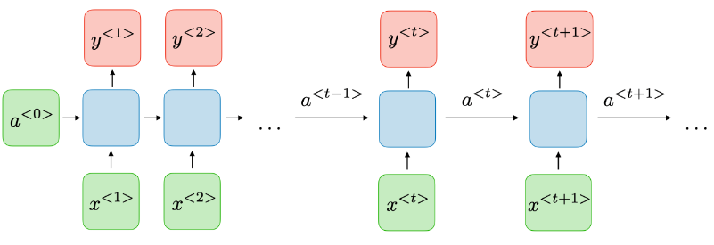

Таким образом, скрытое состояние играет роль “памяти”: оно аккумулирует контекст и позволяет модели учитывать то, что было раньше.

### Обучение и инференс

Обучение RNN происходит по тем же принципам, что и обучение других нейросетей: мы задаём функцию потерь и минимизируем её градиентными методами. Пусть на каждом шаге сеть обновляет скрытое состояние и выдаёт выход

$$
h_t = f(h_{t-1}, x_t), \qquad \hat y_t = g(h_t),
$$

где $x_t$ — вход на шаге $t$, $h_t$ — скрытое состояние, а $\hat y_t$ — предсказание модели. Тогда суммарная функция потерь по последовательности часто записывается как

$$
\mathcal{L} = \sum_{t=1}^{T} \ell(\hat y_t, y_t),
$$

или, если задача many-to-one, как $\mathcal{L}=\ell(\hat y, y)$, где $\hat y = g(h_T)$. Отличие RNN состоит в том, что градиент распространяется через последовательность во времени, поэтому этот процесс называют backpropagation through time: при вычислении производных параметров учитывается цепочка зависимостей $h_1 \to h_2 \to \ldots \to h_T$. На инференсе RNN проходит по последовательности слева направо, последовательно обновляя состояние и выдавая выход в нужной форме — одно значение, последовательность или генерацию токенов. Если последовательность генерируется автогрессивно, то часто используется схема

$$
x_t = \text{Embed}(\hat y_{t-1}), \qquad \hat y_t = g(h_t),
$$

то есть предыдущее предсказание становится входом на следующий шаг.

### Многослойная и двунаправленная RNN

Чтобы увеличить вычислительные способности модели, RNN часто делают многослойной. В многослойной RNN скрытое состояние каждого слоя получает на вход состояние предыдущего слоя на том же временном шаге. Для $L$ слоёв это можно записать так:

$$
h_t^{(1)} = f^{(1)}(h_{t-1}^{(1)}, x_t),
$$

$$
h_t^{(\ell)} = f^{(\ell)}(h_{t-1}^{(\ell)}, h_t^{(\ell-1)}), \qquad \ell=2,\ldots,L,
$$

а выход обычно строится по верхнему слою: $\hat y_t = g(h_t^{(L)})$. Такая архитектура позволяет верхним слоям извлекать более абстрактные признаки последовательности.

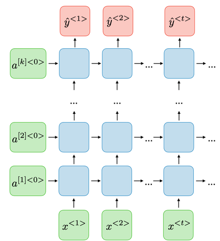

Двунаправленная RNN  обрабатывает последовательность сразу в двух направлениях — слева направо и справа налево. Формально строятся два набора состояний:

$$
\overrightarrow{h}_t = f(\overrightarrow{h}_{t-1}, x_t), \qquad
\overleftarrow{h}_t = f(\overleftarrow{h}_{t+1}, x_t),
$$

после чего объединяются (например, конкатенацией)

$$
h_t = [\overrightarrow{h}_t;\overleftarrow{h}_t],
$$

и уже по $h_t$ строится предсказание $\hat y_t = g(h_t)$. Это полезно в задачах, где важен контекст с обеих сторон, например для разметки текста, но такая модель не подходит для онлайн-сценариев, где “будущее” ещё неизвестно.

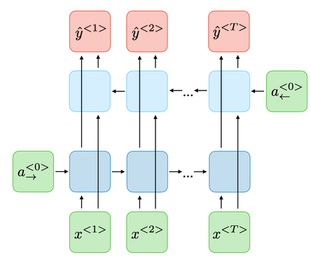

### Проблемы обучения рекуррентных нейронных сетей

При обучении рекуррентных сетей градиент "протекает" через множество шагов времени, и на каждом шаге он умножается на матрицу Якоби перехода состояния, поэтому по правилу цепочки получается произведение вида:

$$
\frac{\partial \mathcal{L}}{\partial h_t} = \frac{\partial \mathcal{L}}{\partial h_T}\prod_{k=t+1}^{T}\frac{\partial h_k}{\partial h_{k-1}}.
$$

Если нормы этих матриц в среднем меньше 1, произведение быстро стремится к нулю — возникает затухающий градиент, и модель перестаёт учить "дальние" зависимости; если же нормы больше 1, произведение раздувается — получается взрывной градиент, обучение становится нестабильным и может расходиться. Именно поэтому для RNN важно контролировать динамику градиентов (например, клиппингом) и использовать архитектуры с механизмами управления внутренней памятью (LSTM и GRU), которые облегчают перенос информации на большие расстояния по времени.

### LSTM и GRU

LSTM и GRU — модификации RNN, которые вводят механизмы управления памятью через "вентили" (от англ. gates). Эти вентили регулируют, какую информацию сохранять, какую забывать и какую добавлять, благодаря чему модель лучше переносит информацию на большие расстояния по времени.

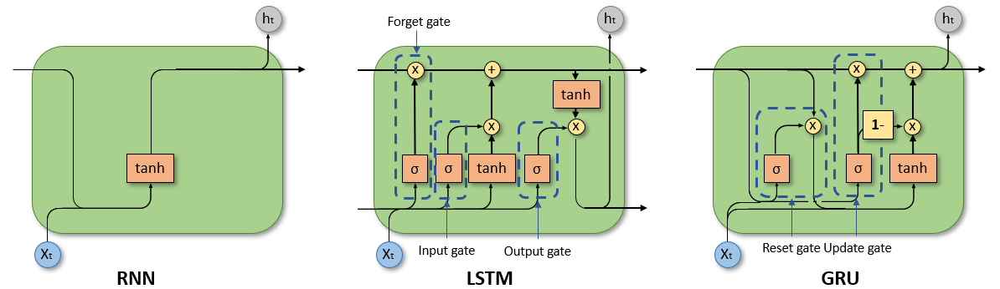

В **LSTM** состояние разделено на скрытое состояние $h_t$ и “память” $c_t$. Обновление задаётся следующими уравнениями:

$$
f_t = \sigma(W_f x_t + U_f h_{t-1} + b_f),
\qquad
i_t = \sigma(W_i x_t + U_i h_{t-1} + b_i),
$$

$$
o_t = \sigma(W_o x_t + U_o h_{t-1} + b_o),
\qquad
\tilde c_t = \tanh(W_c x_t + U_c h_{t-1} + b_c),
$$

$$
c_t = f_t \odot c_{t-1} + i_t \odot \tilde c_t,
\qquad
h_t = o_t \odot \tanh(c_t),
$$

где $f_t$ — forget gate, $i_t$ — input gate, $o_t$ — output gate, а $\odot$ — поэлементное умножение. Интуитивно: $f_t$ решает, что забыть из старой памяти, $i_t$ — что добавить нового, а $o_t$ — что показать наружу.

В **GRU** используется более компактная схема без отдельного $c_t$. Вводятся два “ворота” — reset и update:

$$
r_t = \sigma(W_r x_t + U_r h_{t-1} + b_r),
\qquad
z_t = \sigma(W_z x_t + U_z h_{t-1} + b_z),
$$

$$
\tilde h_t = \tanh(W_h x_t + U_h (r_t \odot h_{t-1}) + b_h),
$$

$$
h_t = (1 - z_t)\odot h_{t-1} + z_t \odot \tilde h_t.
$$

Здесь $z_t$ управляет тем, сколько старого состояния сохранить, а $r_t$ — тем, насколько учитывать прошлое при вычислении нового кандидата $\tilde h_t$.

На практике LSTM и GRU стали стандартом для многих задач обработки последовательностей до появления трансформеров, и даже сегодня они остаются полезными в задачах, где важна простота, скорость и последовательная обработка данных.

### Seq2Seq модели и генерация последовательностей произвольной длины

Вы могли заметить, что до этого момента мы почти не обсуждали задачи, связанные с порождением последовательностей (синхронизированные варианты many-to-many — не в счёт). Действительно, многие рассмотренные выше модели применимы в задачах, где длина входной и выходной последовательности фиксирована или заранее известна, но в практических задачах это часто не так. Например, в машинном переводе мы не знаем заранее, какой длины получится перевод, и между словами исходного предложения и его перевода обычно нет однозначного соответствия.

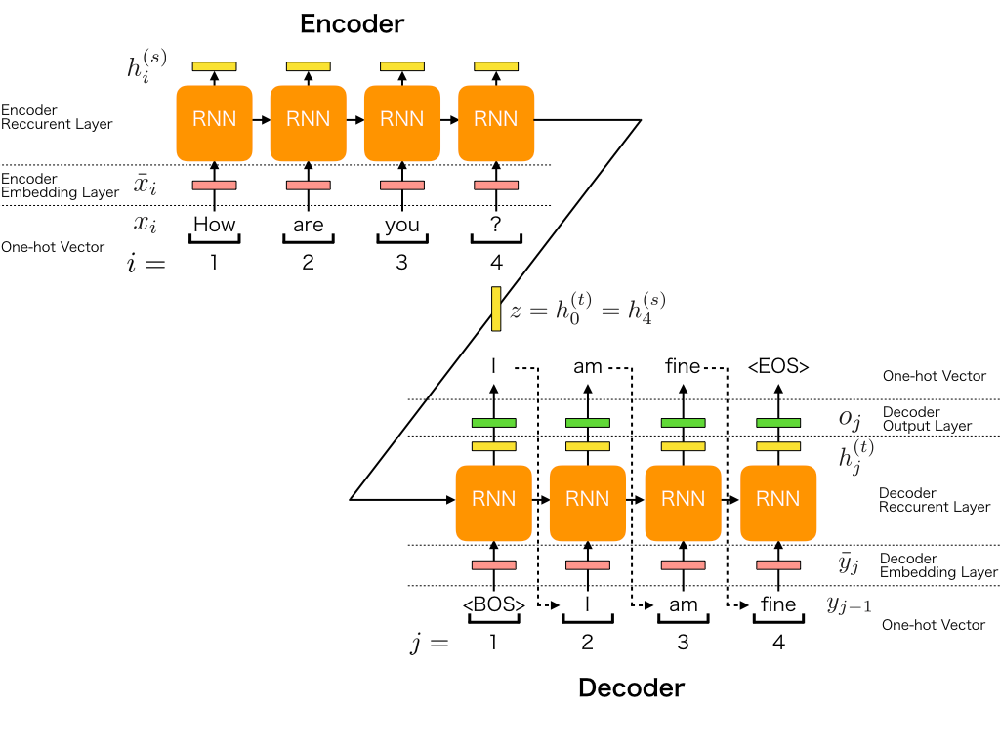

Естественным решением для задач **sequence-to-sequence (seq2seq)** является архитектура **энкодер–декодер**. Энкодер читает входную последовательность токен за токеном и сжимает информацию о ней в контекстное представление (context vector) — обычно это последнее скрытое состояние: $c = h_T$. Декодер, в свою очередь, получает это представление и порождает новую последовательность по одному токену, фактически работая как языковая модель с дополнительным условием на вход (исходную фразу). Часто энкодер читают в обратном порядке: тогда последние токены входа оказываются ближе к первым шагам генерации, и декодеру проще "стартовать" с нескольких правильных предсказаний.

Процесс генерации устроен так: начальное состояние декодера инициализируется контекстным вектором, например $s_0 = c$. На первый шаг подаётся специальный токен начала последовательности $\langle BOS \rangle$, далее декодер выдаёт распределение следующего токена и выбранный токен подаётся на следующий шаг:

$$
s_t = f(s_{t-1}, y_{t-1}, c), \qquad p(y_t \mid y_{<t}, c) = \mathrm{softmax}(W s_t).
$$

Эта процедура повторяется до появления токена конца последовательности $\langle EOS \rangle$ или до достижения максимальной длины. На обучении чаще всего используют **teacher forcing**: вместо собственного предсказания $y_{t-1}$ на вход подают правильный токен, что делает обучение стабильнее и ускоряет сходимость; на инференсе же модель вынуждена опираться на собственные предыдущие ответы. Именно здесь становится понятным, почему “простого” контекстного вектора часто недостаточно — и почему следующий шаг в эволюции seq2seq-моделей связан с механизмом attention.

## Список использованных источников

1. Учебник Яндекс ШАД. [6.2. Нейросети для работы с последовательностями](https://education.yandex.ru/handbook/ml/article/nejroseti-dlya-raboty-s-posledovatelnostyami)
2. [Speech and Language Processing](https://web.stanford.edu/~jurafsky/slp3/). Главы 2 и 3.
3. [NLP курс от Lena Voita](https://lena-voita.github.io/nlp_course.html)
4. [Deep Learning Book.](https://www.deeplearningbook.org/) [Sequence Modeling: Recurrent and Recursive Nets.](https://www.deeplearningbook.org/contents/rnn.html)
5. [Understanding LSTM Networks](https://colah.github.io/posts/2015-08-Understanding-LSTMs/)
6. [Recurrent Neural Networks](https://stanford.edu/~shervine/teaching/cs-230/cheatsheet-recurrent-neural-networks/)