## Языковая модель 

### Что такое языковая модель?

Языковая модель -- это модель машинного обучения, которая предсказывает следующие слова входной текстовой последовательности.

Для интутивного понимания этой идеи можно провести мысленный эксперимент и самому выступить в роли языковой модели. Попробуйте продолжить эти фразы:

- "Без труда не выловишь и рыбку ..."
- "Семь раз отмерь, один раз ..."
- "Беда никогда не приходит ..."
- "Береги платье смолоду, а честь ..."
- "Игра не стоит ..."

Скорее всего, вы смогли особо не задумываясь подставить нужное последнее слово в представленные поговорки и крылатые фразы. При этом эти слова не являются единственно возможными и правильными (например, "без труда не выловишь и рыбку из реки"). **Из всего множества подходящих слов вы выбрали те, которые подходят наилучшим образом исходя из контекста вашего жизненного, читательского и зрительского опыта.**

Более формально, языковая модель присваивает вероятность каждому возможному следующему слову или, что эквивалентно, дает распределение вероятностей по возможным следующим словам, то есть если текст представлен как последовательность токенов $x_1, x_2, \ldots, x_T$, то языковая модель задаёт вероятность появления всей последовательности $p(x_{1:T})$. На практике почти всегда используют авторегресcивную факторизацию:

$$
p(x_{1:T}) = \prod_{t=1}^{T} p(x_t \mid x_{<t}),
$$

Таким образом модель учится на каждом шаге предсказывать следующий токен по всем предыдущим. Языковая модель не "понимает" смысл текста так, как это делает человек, но хорошо умеет предсказывать, какие продолжения текста статистически правдоподобны.

### Зачем нужны языковые модели?

Языковые модели наделяют машину способностью взаимодействовать с текстом подобно тому, как это делает человек. Если модель умеет предсказывать следующий токен, то на основе этого можно строить генерацию текста, машинный перевод, суммаризацию, ответы на вопросы, диалоги и многие другие применения. 

Языковые модели дают возможность взаимодействовать с машиной с помощью текста на естественном языке. В настоящее время они предоставляют возможность транслировать человеческое намерение в форму, понятную вычислительной системе: сформулировать задачу словами, уточнить требования, привести примеры, а затем получить результат в том же текстовом интерфейсе. По сути, естественный язык становится универсальным “протоколом” управления: вместо того чтобы писать код или настраивать сложные формы, мы описываем, что хотим, и модель превращает это описание в план действий, объяснение, черновик документа, программный фрагмент или структурированный ответ.

Кроме того, большие языковые модели часто выступают как “прослойка” между человеком и специализированными инструментами. Они могут принимать на вход не только вопрос, но и контекст: фрагменты документов, переписку, данные, техническое задание. На выходе модель помогает сформировать запрос к базе знаний, подготовить резюме, извлечь факты, составить письмо, предложить гипотезы или набросать решение. Важно, что в таком сценарии LLM не заменяет остальные системы, а делает их доступнее: она снижает порог входа и ускоряет работу там, где раньше требовались специфические навыки или длительная “ручная” обработка текста.

### Языковые модели на основе трансформера

Современные языковые модели чаще всего строятся на архитектуре **трансформера**, потому что она эффективно обрабатывает длинные последовательности и хорошо масштабируется. В отличие от RNN, которые читают текст в одном направлении, **трансформер может учитывать связи между любыми парами токенов** в последовательности за счёт механизма **внимания** **(attention)**. Это делает его особенно подходящим для языка, где значение слова сильно зависит от контекста, а важные связи могут быть "на расстоянии".

Когда мы говорим "языковая модель на основе трансформера", мы обычно имеем в виду модель, которая получает на вход токены, переводит их в эмбеддинги, добавляет информацию о позиции в последовательности и затем много раз применяет блоки **self-attention** и нелинейных преобразований. В результате модель выдаёт распределение вероятностей по словарю для следующего токена, то есть оценивает $p(x_t \mid x_{<t})$. Именно такой класс моделей лежит в основе современных LLM.

## 2. Attention и self-attention

### 2.1 Что такое attention?

**(def)** Attention (механизм внимания) — это способ выделить наиболее релевантную и важную для решения задачи информацию из набора элементов, когда для текущего запроса важны разные части входа в разной степени.

В классическом варианте генеративной Seq2Seq модели attention запрос формируется из текущего состояния декодера, а "память", по которой мы делаем выбор, — это состояния энкодера. Пусть энкодер обработал входную последовательность и выдал скрытые состояния $h_1,\ldots,h_T$, а декодер на шаге $t$ имеет состояние $s_t$. Тогда веса внимания вычисляются как нормализация оценок “соответствия” между $s_t$ и каждым $h_i$:

$$
e_{t,i} = \mathrm{score}(s_t, h_i), \qquad
\alpha_{t,i} = \frac{\exp(e_{t,i})}{\sum_{j=1}^{T}\exp(e_{t,j})}.
$$

После этого строится контекстный вектор как взвешенная сумма выходов энкодера:

$$
c_t = \sum_{i=1}^{T}\alpha_{t,i}\,h_i,
$$

и уже он используется для предсказания следующего токена (например, через объединение $[s_t; c_t]$). В additive attention (Bahdanau attention) функция score часто берётся в виде небольшой нейросети:

$$
e_{t,i} = v^\top \tanh(W_s s_t + W_h h_i),
$$

что интуитивно означает: декодер "смотрит" на разные части входа и каждый раз собирает ровно тот контекст $c_t$, который нужен именно на этом шаге генерации.

Этот классический вариант attention в seq2seq-моделях удобно понимать как механизм поиска нужного фрагмента во внутренней памяти энкодера. Однако у такого подхода есть естественное ограничение: внимание применяется как отдельный модуль вокруг рекуррентной модели, а сами последовательности по-прежнему обрабатываются шаг за шагом, что усложняет параллелизацию и затрудняет работу с очень длинными зависимостями.

В трансформере идея внимания сохраняется, но меняется её роль и организация вычислений. Вместо того чтобы иметь отдельный декодер, который обращается к памяти энкодера, трансформер делает внимание базовой операцией обработки последовательности: каждый токен может напрямую обмениваться информацией с другими токенами через **self-attention**. 

В трансформерах почти всегда используется scaled dot-product attention. Если собрать запросы, ключи и значения в матрицы $Q \in \mathbb{R}^{T \times d_k}$, $K \in \mathbb{R}^{T \times d_k}$, $V \in \mathbb{R}^{T \times d_v}$, то вычисления записываются так:

### Что такое self-attention?

Идея проста: мы формируем вектор запроса $q$ и сравниваем его с набором ключей $k_1,\ldots,k_T$, получая весовые коэффициенты, опредляющие релевантность токенов, после чего строим ответ как взвешенную сумму значений $v_1,\ldots,v_T$. В результате модель не обязана сжимать весь контекст в один фиксированный вектор: она может каждый раз выбирать, на какие элементы обращать большее внимание.

Формально пусть входная последовательность после эмбеддингов — это матрица $X \in \mathbb{R}^{T \times d}$. Тогда запросы, ключи и значения строятся линейными преобразованиями:

$$
Q = XW^Q,\quad K = XW^K,\quad V = XW^V,
$$

где $W^Q, W^K \in \mathbb{R}^{d \times d_k}$ и $W^V \in \mathbb{R}^{d \times d_v}$. После этого вычисляется:

$$
\mathrm{Attention}(Q,K,V) = \mathrm{softmax}\Big(\frac{QK^\top}{\sqrt{d_k}}\Big)V.
$$

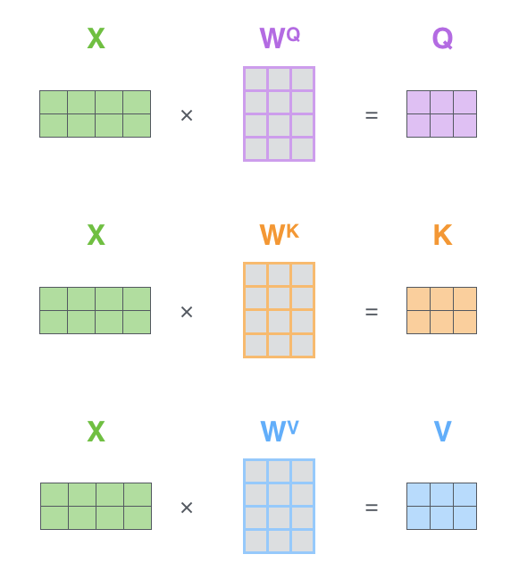
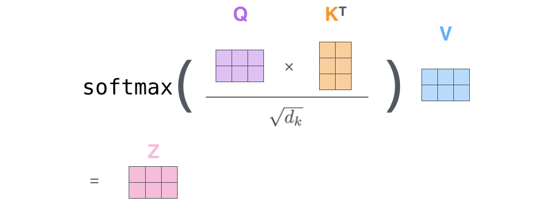

### Multi-head self-attention

Multi-head self-attention расширяет идею self-attention: вместо одного набора $Q,K,V$ мы строим несколько "голов", каждая из которых смотрит на последовательность по-своему. Интуитивно это похоже на то, как модель учится параллельно отслеживать разные типы зависимостей: синтаксические, семантические, дальние связи, локальные паттерны и тому подобное.

Формально для головы $h$ считаем:

$$
Q_h = XW_h^Q,\quad K_h = XW_h^K,\quad V_h = XW_h^V,
$$

$$
\mathrm{head}_h = \mathrm{Attention}(Q_h,K_h,V_h).
$$

Далее результаты всех голов конкатенируются по признаковому измерению и проецируются обратно:

$$
\mathrm{MHSA}(X) = \mathrm{Concat}(\mathrm{head}_1,\ldots,\mathrm{head}_H)W^O.
$$

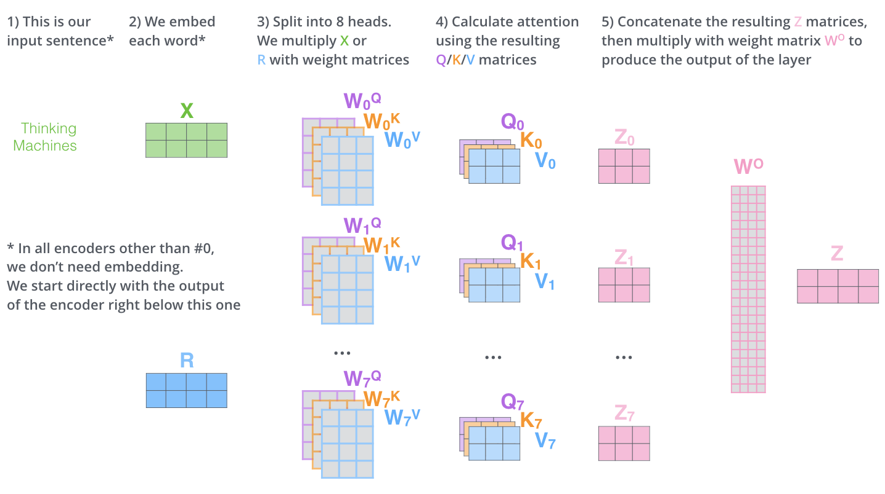

### Позиционное кодирование

В отличие от RNN, трансформер сам по себе не "знает" порядок токенов: если просто подать набор эмбеддингов, модель увидит их как множество без временной оси. Поэтому к эмбеддингам добавляют информацию о позиции токена в последовательности — позиционное (временное) кодирование. Обычно это делается просто: к вектору токена прибавляется позиционный вектор той же размерности, чтобы на вход поступало $X = E + P$, где $E$ — эмбеддинги токенов, а $P$ — позиционные эмбеддинги.

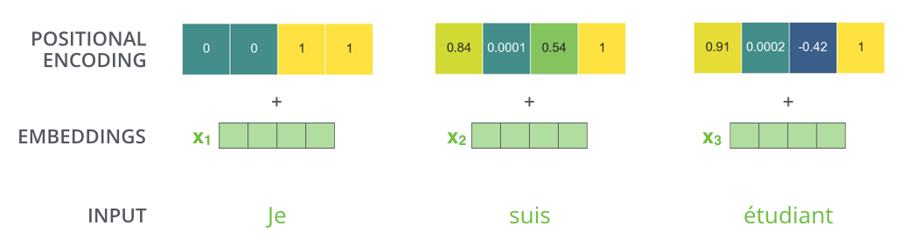

Один из классических вариантов — синусоидальное кодирование, где для позиции $t$ и компоненты $2i$ используется:

$$
P_{t,2i} = \sin\Big(\frac{t}{10000^{2i/d}}\Big),\qquad
P_{t,2i+1} = \cos\Big(\frac{t}{10000^{2i/d}}\Big).
$$

В современных моделях часто используют и обучаемые позиционные векторы.

## Трансформер

Трансформер — это архитектура для обработки последовательностей, в которой основным механизмом определения взаимосвязей между элементами входной последовательности является self-attention. В отличие от RNN, трансформер не обрабатывает последовательность строго по шагам времени, а обновляет представления всех токенов параллельно: на каждом слое каждый токен может собрать контекст из всех остальных токенов. Это делает модель удобной для работы с длинными зависимостями и хорошо масштабируемой на больших данных.

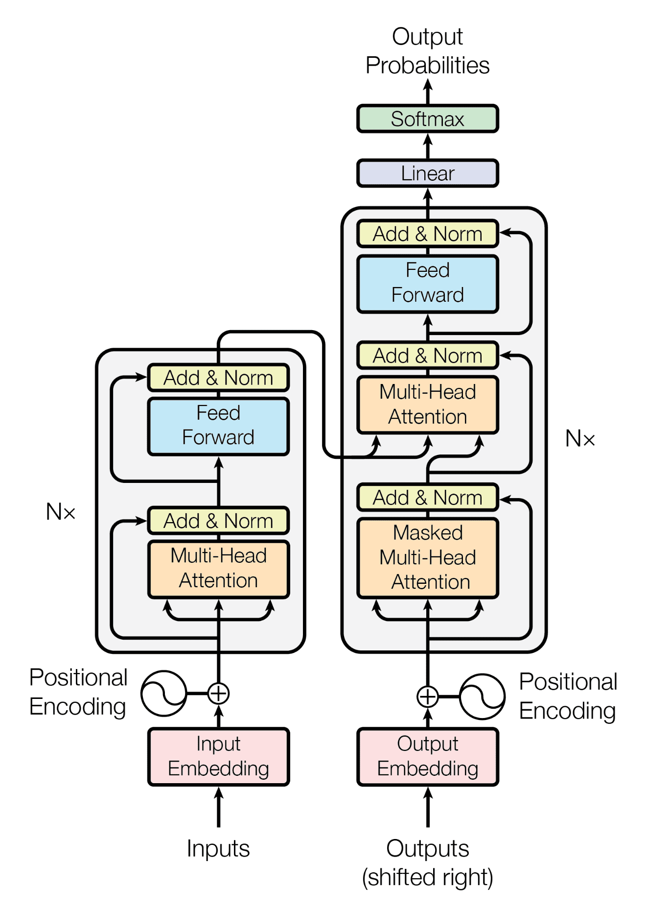

### Энкодер трансформера

Энкодер трансформера — это стек одинаковых блоков, каждый из которых получает на вход матрицу представлений $X \in \mathbb{R}^{T \times d}$ и возвращает матрицу той же формы. Один блок энкодера состоит из двух основных подслоёв: multi-head self-attention и позиционно-независимой feed-forward сети, а также из residual-связей и нормализации.

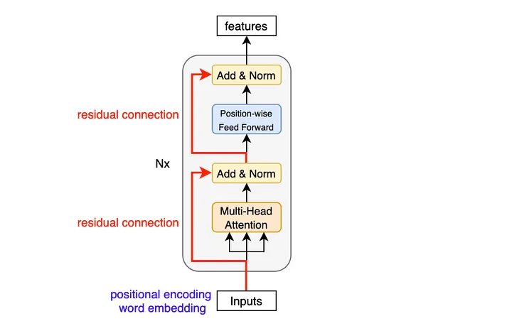
Если обозначить вход в блок как $X$, то вычисления можно записать в стандартном виде:

$$
\tilde X = \mathrm{LN}\big(X + \mathrm{MHSA}(X)\big),
$$

$$
Y = \mathrm{LN}\big(\tilde X + \mathrm{FFN}(\tilde X)\big),
$$

где $\mathrm{LN}$ — LayerNorm, $\mathrm{MHSA}$ — multi-head self-attention, а $\mathrm{FFN}$ — двухслойная MLP, применяемая независимо к каждому токену.

### Декодер трансформера

Декодер по структуре похож на энкодер, но содержит дополнительный механизм внимания, который позволяет декодеру обращаться к выходам энкодера.

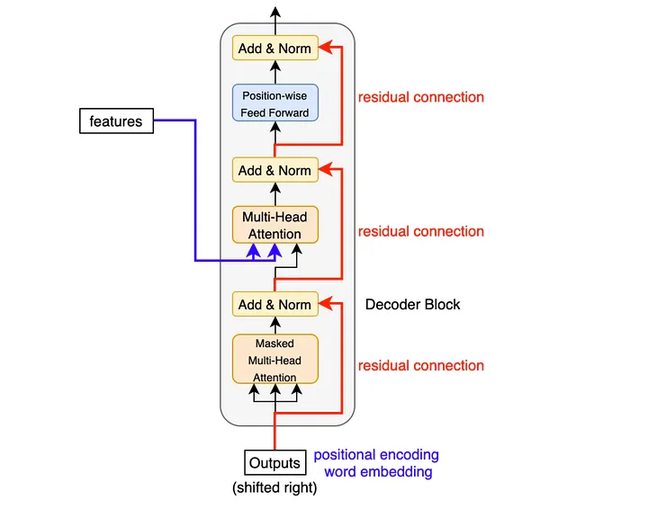

В классическом, "полном" трансформере (применимый, например, для решения задачи машинного перевода) блок декодера включает три подслоя:

1) masked self-attention по уже сгенерированным токенам (чтобы не подглядывать в будущее);  
2) encoder–decoder attention (cross-attention), где запросы берутся из декодера, а ключи/значения — из энкодера;  
3) feed-forward сеть.

Если $X$ — представления токенов на входе декодера, а $H$ — выход энкодера, то схематично:

$$
\tilde X = \mathrm{LN}\big(X + \mathrm{MaskedMHSA}(X)\big),
$$

$$
\hat X = \mathrm{LN}\big(\tilde X + \mathrm{CrossAttn}(\tilde X, H)\big),
$$

$$
Y = \mathrm{LN}\big(\hat X + \mathrm{FFN}(\hat X)\big).
$$

### Пошаговое описание вычислений в трансформере

Ниже -- описание последовательности вычислений в трансформере:

1) **Токены → индексы → эмбеддинги.**   Текст преобразуется в последовательность индексов $x_1,\ldots,x_T$, затем каждый индекс переходит в вектор эмбеддинга. Получаем матрицу $E \in \mathbb{R}^{T \times d}$.

2) **Добавление информации о позиции.**  К эмбеддингам прибавляется позиционное кодирование $P$:

$$
X^{(0)} = E + P.
$$

3) **Прогон через $L$ блоков.** Для слоя $\ell=1,\ldots,L$ выполняется:

$$
\tilde X^{(\ell)} = \mathrm{LN}\big(X^{(\ell-1)} + \mathrm{MHSA}(X^{(\ell-1)})\big),
$$

$$
X^{(\ell)} = \mathrm{LN}\big(\tilde X^{(\ell)} + \mathrm{FFN}(\tilde X^{(\ell)})\big).
$$

В decoder-only моделях $\mathrm{MHSA}$ заменяется на masked self-attention.

4) **Выходной слой и распределение по словарю.**  
Для языковой модели из финальных представлений $X^{(L)}$ строятся логиты по словарю:

$$
\mathrm{logits}_t = X^{(L)}_t W_{\text{vocab}} + b,
$$

$$
p(x_{t+1}\mid x_{\le t}) = \mathrm{softmax}(\mathrm{logits}_t).
$$

5) **Генерация.**  На инференсе модель выдаёт распределение следующего токена, затем выбирается токен по выбранной стратегии декодирования (greedy, sampling и т.д.), и процесс повторяется, пока не будет получен конец последовательности или лимит длины.

## Энкодерные и декодерные языковые модели

Архитектура трансформера допускает разные режимы работы, и поэтому языковые модели часто делят на два больших класса: **encoder-only** и **decoder-only**. Разница между ними заключается в том,  какую задачу они по умолчанию решают и какой вид механизма внимания в них используется.

### Encoder-only модели

Encoder-only модели строятся как стек энкодерных блоков трансформера и используют **двустороннее self-attention**: каждый токен может смотреть и влево, и вправо, то есть учитывать полный контекст последовательности. Это делает такие модели особенно удобными для задач понимания текста, где нам важно получить “смысловое” представление фразы целиком: классификация текста, извлечение сущностей, поиск, ранжирование, сравнение предложений.

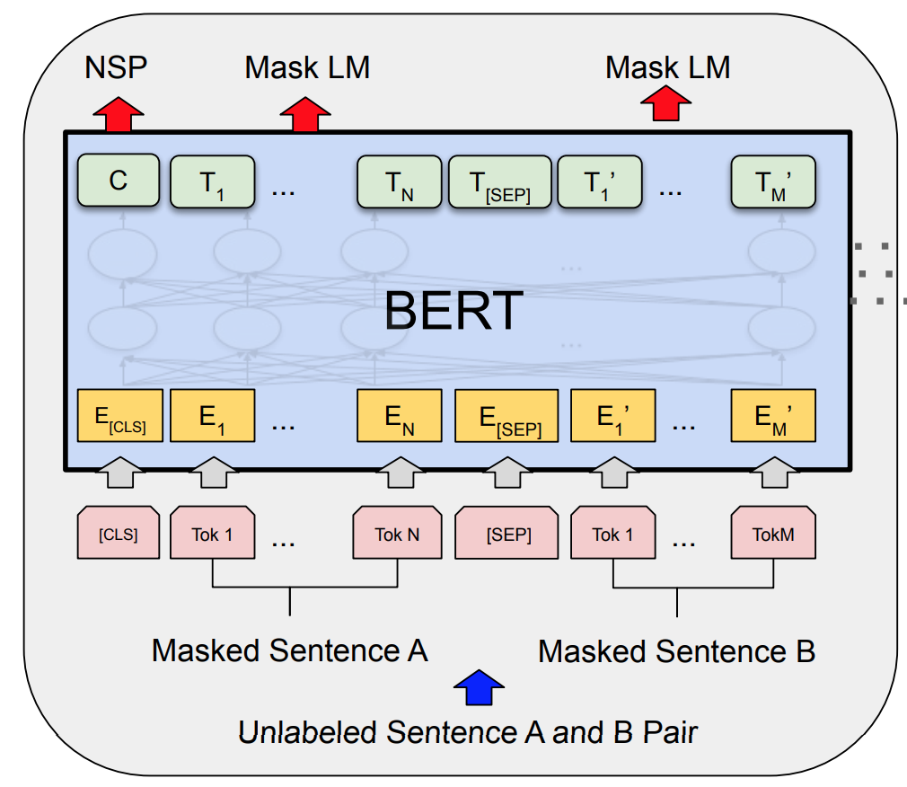

Обычно encoder-only модели обучают на задачах типа **masked language modeling**: мы скрываем часть токенов и просим модель восстановить их по окружению, то есть учим предсказывать пропущенный токен по контексту с обеих сторон. В результате модель хорошо учится строить эмбеддинги текста, но в чистом виде она не является "генератором", потому что не обучена порождать последовательность слева направо.

### Decoder-only модели

Decoder-only модели строятся как стек декодерных блоков, но в режиме языковой модели они используют только **masked self-attention**. Маска запрещает токену обращать внимание на будущие позиции, поэтому каждый шаг предсказывает следующий токен по предыдущим:

$$
p(x_{1:T}) = \prod_{t=1}^{T} p(x_t \mid x_{<t}).
$$

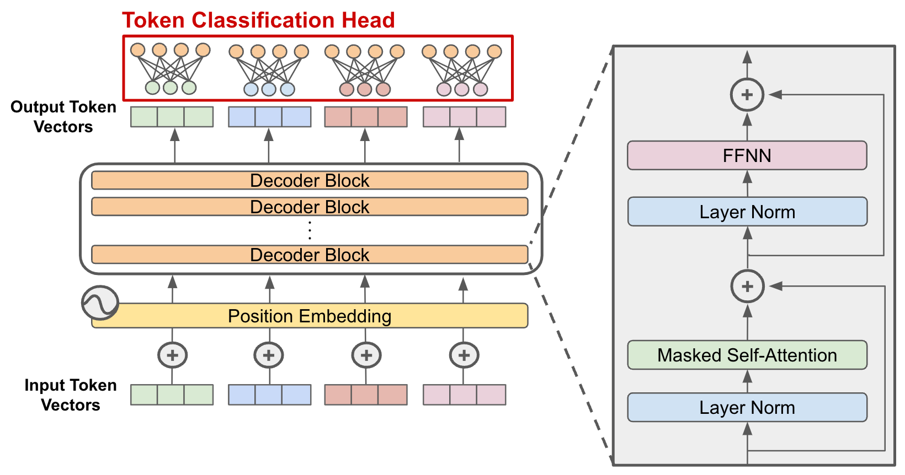

Это делает decoder-only модели естественным выбором для генеративных задач: продолжение текста, диалог, написание кода, суммаризация, а также универсальные LLM, которые работают в формате генерации продолжения текстового запроса -- **промпта**. Важно, что такая модель по своей природе обучается именно как генератор, поэтому весь её интерфейс сводится к тому, чтобы задать начальный контекст и дальше последовательно выбирать токены из предсказанного распределения.

Практический итог можно сформулировать так: encoder-only модели *обычно* сильнее в задачах понимания и извлечения информации, а decoder-only модели — в задачах порождения и универсального текстового взаимодействия.

## Что делает большую языковую модель большой?

Современные языковые модели называются ввиду огромного числа параметров: сотни миллионов, миллиарды и десятки миллиардов весов, которые задают ёмкость модели. В трансформерах число параметров растёт в основном за счёт размерности скрытых представлений $d$, числа слоёв $L$ и размерности внутреннего слоя в MLP-блоке. В грубом приближении можно сказать, что увеличение $d$ и $L$ делает модель способной хранить и комбинировать больше закономерностей, но одновременно требует больше данных и вычислений для обучения.

Вторая составляющая "большой" модели — это **объём данных**, на которых она обучалась. Даже идеальная архитектура не станет сильной языковой моделью без огромного текстового корпуса. Здесь важен не только огромный объем, но и разнообразие: разные жанры, стили, домены, языки, программный код и т.п. Модель учится предсказывать следующий токен, поэтому она фактически впитывает статистику того, как устроен текст в разных контекстах — от бытовых фраз до технической документации.

### Откуда берутся параметры на примере GPT-3 (175B)

Визуализированный подсчет количества параметров в большой языковой модели GPT-3 можно посмотреть вот [здесь](https://www.youtube.com/watch?v=eMlx5fFNoYc&t=1148s) в виде на кале 3blue1brown.

## Что делает большую языковую модель такой впечатляющей?

Впечатляющий эффект LLM возникает не из “магии”, а из сочетания трёх вещей: масштаба модели, масштаба данных и удачной архитектуры. При достаточно большом объёме обучения модель начинает не только продолжать текст грамматически правильно, но и демонстрировать свойства, которые мы воспринимаем как “понимание”: удерживать длинный контекст, следовать инструкции, пересказывать, объяснять, переводить, писать код и решать задачи, похожие на те, что встречались в данных.

Ещё одна важная причина — способность работать в режиме *in-context learning*: модель может подстраиваться под задачу прямо по промпту, не меняя веса. Если в запросе задать формат, несколько примеров и критерии ответа, то модель часто начинает воспроизводить нужное поведение так, как будто “дообучилась” на этих примерах, хотя это лишь эффект работы внимания и представлений.

### Нюансы генерации

Языковая модель на каждом шаге выдаёт распределение вероятностей по словарю:

$$
p(x_t \mid x_{<t}) = \mathrm{softmax}(\mathrm{logits}_t).
$$

Дальше возникает практический вопрос: как именно выбрать следующий токен из этого распределения. От выбора стратегии зависит стиль текста, повторяемость, креативность и число ошибок: одна и та же модель может звучать как "мистер википелдия" или как хаотичный поток сознания — просто из-за различий в декодировании.

#### Greedy decoding

Greedy decoding — это самый прямой вариант: на каждом шаге мы выбираем токен с максимальной вероятностью:

$$
x_t = \arg\max_{w \in V} p(w \mid x_{<t}).
$$

Он даёт детерминированный результат и обычно подходит для коротких, простых ответов, но часто приводит к однообразным формулировкам и иногда "застревает" в повторениях, потому что всегда выбирает локально самый вероятный шаг, не думая о разнообразии продолжений.

#### Random sampling

Sampling выбирает токен случайно по распределению вероятностей:

$$
x_t \sim p(\cdot \mid x_{<t}).
$$

Такой подход даёт разнообразие и иногда находит более удачные продолжения, чем greedy, но при наивном сэмплинге может снижать качество: модель иногда “прыгает” в менее уместные слова просто потому, что они ненулевые по вероятности. Поэтому на практике sampling почти всегда комбинируют с ограничениями вроде top-k или top-p, чтобы отсекать слишком маловероятные варианты.

#### Temperature sampling

Temperature управляет “резкостью” распределения. Если разделить логиты на параметр $\tau > 0$, получим новое распределение:

$$
p_\tau(w \mid x_{<t}) = \mathrm{softmax}\Big(\frac{\mathrm{logits}_t}{\tau}\Big).
$$

При $\tau < 1$ распределение становится более “острым” (модель чаще выбирает самые вероятные токены), при $\tau > 1$ — более “плоским” (больше случайности и креативности, но выше риск ошибок). Это один из самых простых регуляторов баланса между качеством и разнообразием.

## Обучение LLM

Обучение большой языковой модели обычно можно представить как последовательность трех этапов. Сначала модель получает базовое "понимание языка" на огромном текстовом корпусе, затем её учат отвечать в формате инструкций, а затем — приводят поведение к человеческим предпочтениям и ожиданиям: полезность, безопасность, вежливость, отказ от нежелательных действий.

### Три этапа обучения: pretraining, instruction tuning, alignment

1) Во время **Pretraining** модель учится *вообще* предсказывать следующий токен.  
2) Во время **Instruction tuning** учит работать в режиме "запрос -> ответ": следовать формулировке задачи, соблюдать формат, быть полезной.  
3) Во время **Alignment** (или **Preference Learning**) подгоняет поведение под человеческие предпочтения: устраняет грубость и токсичность, галлюцинации, нежелательные ответы, повышает аккуратность и управляемость.

### Self Supervised pretraining

Этап pretraining обычно реализуется с помощью self-supervised обучение (можно грубо перевести как "*самоконтролируемое обучение*").

Идея этой подхода к обучению моделей заключается в том, чтобы реализовать предварительное обучение представлений на большом объеме неразмеченных данных, задав искусственную задачу. "Разметка" для этой задачи берется из самих данных.

Для лучшего понимания стоит привести пример для изображений. Пусть мы хотим решить задачу классификации котят и щенят. Мы располагаем относительно малой размеченной вручную обучающей выборкой, но при этом у нас есть огромная коллекция неразмеченных изображений с котятами и щенятами. 

Желая дать нейронной сети *предварительное представление* о природе классифицируемых объектов, мы можем обучить её, например на восстановление вырезанного случайным образом кусочка из изображения. Научившись решать такую задачу, мы можем далее дообучить нашу модель на конечную задачу классификации. Результаты обучения в таком случае будут значительно лучше, используй мы только размеченные данные.

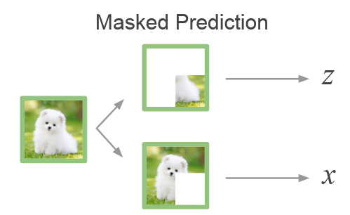

Для decoder-only языковых моделей мы можем провести предварительное обучение схожим образом. Модель видит автоматически сформированную из большого текстового корпуса последовательность $x_{<t}$ и должна восстановить токен $x_t$. Формально оптимизируется отрицательное лог-правдоподобие (кросс-энтропия) по всем позициям формируется так:

$$
\mathcal{L}_{\text{PT}} = -\sum_{t=1}^{T} \log p(x_t \mid x_{<t}).
$$

Важно понимать, чему учится модель в рамках претреининга. После такого обучения модель обретет способность продолжать текст правдоподобным образом, но не гарантирует, что модель будет полезной для пользователя: она может отвечать расплывчато, уходить в продолжение вместо ответа, не соблюдать формат или "фантазировать", потому что модель оптимизируется на другую задачу.

Наконец, на этом этапе критичны обучающие данные и их репрезентативность: они должны быть взяты из разных источников и предварительно очищены от различного рода "мусора" (HTML-код, дубликаты, и т.п.).

### Instruction Fine-Tuning (SFT)

На практике под "дообучением" pretrained-модели последующее дообучение уже обученной языковой модели на работу при конкретном сценарии (чаще всего -- выполнение инструкции), меняя либо все веса, либо лишь небольшую их часть, либо только сами обучающие данные, на которых продолжаем обучение.

Ниже — четыре распространённых подхода, которые удобно держать в голове как разные “режимы” постобучения.

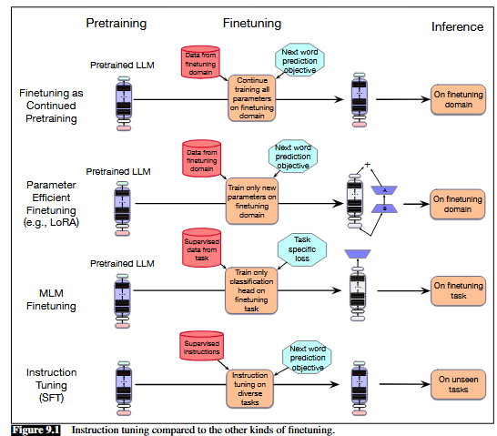

#### Finetuning as Continued Pretraining (дообучение как продолжение предобучения)

Это самый простой и понятный вариант: мы **продолжаем предобучение** на новых данных из нужного домена (например, медицина, юриспруденция) или языка, используя ту же функцию потерь, что и на этапе претреининга. По сути мы просто добавляем новый корпус в обучение, чтобы модель лучше усвоила стиль, терминологию и особенности целевой тематики текста.

Для decoder-only языковой модели оптимизируется стандартный LM-лосс:

$$
\mathcal{L}_{\text{LM}} = -\sum_{t=1}^{T}\log p_\theta(x_t \mid x_{<t}).
$$

Обычно в этом режиме обновляются все (или почти все) параметры модели.

#### Parameter Efficient Fine-Tuning (PEFT) и LoRA

PEFT — это подход, в котором основная часть параметров модели **замораживается**, а обучается лишь небольшой набор добавочных параметров. Это позволяет адаптировать большие модели, резко снижая требования к памяти и вычислениям.

Один из самых популярных методов — **LoRA**. Его идея: вместо полного обновления матрицы весов обучается низкоранговая поправка. Если $W$ — исходная матрица, то после адаптации получаем

$$
W' = W + \Delta W,\qquad \Delta W = BA,
$$

где $A$ и $B$ — обучаемые матрицы малой размерности, а ранг $r$ выбирается маленьким:

$$
\mathrm{rank}(\Delta W)=r\ll \min(m,n).
$$

Интуитивно LoRA “встраивает” в модель компактную настройку под задачу, не переписывая все веса.

#### MLM (masked language modeling)

Для encoder-only моделей (семейства BERT) базовая логика обучения отличается от next-token prediction. Вместо предсказания следующего токена модель учится **восстанавливать замаскированные токены** по контексту слева и справа. Это удобно как для предобучения, так и для доменной адаптации: модель “впитывает” статистику текстов, улучшая качество представлений для задач понимания (классификация, ранжирование, извлечение сущностей).

Типичный лосс MLM:

$$
\mathcal{L}_{\text{MLM}} = -\sum_{t\in M}\log p_\theta(x_t \mid x_{\setminus M}),
$$

где $M$ — множество позиций, которые были замаскированы, а $x_{\setminus M}$ — наблюдаемые токены.

#### Instruction Tuning (в узком смысле — SFT)

В контексте современных LLM чаще всего под SFT подразумевают именно **instruction tuning**: дообучение на парах вида "инструкция/вопрос -> корректный ответ". Технически это всё ещё обучение языковой модели, но данные имеют структуру диалога или запроса, и модель учится **следовать инструкциям** и выдавать ответы в нужном формате.

Если склеить промпт и ответ в одну последовательность $z=[\text{prompt};\text{response}]$, то лосс удобно записать так:

$$
\mathcal{L}_{\text{SFT}} = -\sum_{t\in \text{response}}\log p_\theta(z_t \mid z_{<t}),
$$

то есть мы "штрафуем" модель именно за ошибки в токенах ответа, а не за токены самого промпта.

### Learning from Preferences

На этапе *learning from preferences* модель обучают не по правильным ответам на задачи, а по **человеческим предпочтениям**. Для одного и того же промпта $x$ собирают несколько кандидатных ответов и фиксируют, какой из них лучше. Вместо парных сравнений иногда используют и скалярные оценки по аспектам (helpfulness, correctness и т.д.), которые затем можно агрегировать или преобразовать в пары предпочтений.  

Чтобы превратить такие предпочтения в обучающие данные, удобно ввести скрытую "оценку качества" ответа: пусть каждому промпту $x$ и ответу $o$ соответствует скалярный скор $z=r(x,o)$. Тогда вероятность того, что ответ $o_i$ предпочтительнее $o_j$, можно моделировать логистической формой (Bradley–Terry):

$$
P(o_i \succ o_j \mid x) = \sigma(z_i - z_j) = \sigma(r(x,o_i)-r(x,o_j)).
$$

Идея здесь практичная: нам не нужно абсолютное “качество” по шкале, достаточно научиться воспроизводить **сравнения**.

Дальше обучают **reward model** $r(x,o)$ по данным предпочтений. Если $o_w$ — победитель (preferred), а $o_l$ — проигравший (dispreferred), то reward model можно обучать, минимизируя бинарную кросс-энтропию:

$$
\mathcal{L}_{\mathrm{CE}}(x,o_w,o_l)
= -\log P(o_w \succ o_l \mid x)
= -\log \sigma\!\big(r(x,o_w)-r(x,o_l)\big).
$$

Интуитивно это "подталкивает" модель присваивать больший reward тем ответам, которые люди выбирают чаще.

Когда reward model обучена, ею можно донастраивать саму языковую модель, но тут важна тонкость: preference-данных обычно намного меньше, чем данных предобучения, и если оптимизировать только reward, модель может начать “забывать” полезные свойства базовой модели. Поэтому добавляют KL-регуляризацию: мы максимизируем ожидаемую награду, но штрафуем отклонение политики $\pi_\theta$ от референсной $\pi_{\text{ref}}$ (обычно это instruction-tuned модель):

$$
\pi^*=\arg\max_{\pi_\theta}\ \mathbb{E}\big[r(x,o)\big] - \beta\, D_{\mathrm{KL}}\!\left[\pi_\theta(\cdot|x)\ \|\ \pi_{\text{ref}}(\cdot|x)\right].
$$

Эта KL-склейка отражает общий смысл preference alignment: не переписать модель заново, а **аккуратно "подтолкнут" ** её к более предпочтительному поведению.

Наконец, у preference alignment есть два типовых пути оптимизации. Первый — классический RLHF-пайплайн: preference data → reward model → RL-оптимизация политики (часто PPO). Второй — **Direct Preference Optimization (DPO)**: он избегает явной reward model и переписывает задачу так, чтобы учить саму политику напрямую из пар предпочтений. Для DPO получается loss, который увеличивает вероятность победителя и уменьшает вероятность проигравшего, одновременно удерживая модель рядом с $\pi_{\text{ref}}$:

$$
\mathcal{L}_{\mathrm{DPO}}(x,o_w,o_l)= -\log \sigma\!\left(
\beta \log \frac{\pi_\theta(o_w|x)}{\pi_{\text{ref}}(o_w|x)} -
\beta \log \frac{\pi_\theta(o_l|x)}{\pi_{\text{ref}}(o_l|x)}
\right).
$$

С инженерной точки зрения оба подхода делают одно и то же: учат модель чаще выбирать ответы, которые людям кажутся лучше, и реже — те, которые кажутся хуже.

## Промптинг

Промптинг — это способ формулировать задачу так, чтобы языковая модель выдала продолжение, совпадающее с нужным вам ответом. Поскольку LLM по сути предсказывает следующий токен, промпт играет роль контекста, который задаёт “рамку”: что именно вы хотите получить, в каком стиле, с какими ограничениями и на каком уровне детализации. Хороший промпт снижает неопределённость: он явно задаёт цель, даёт входные данные и описывает формат результата, поэтому модель реже уходит в сторону и чаще попадает в ожидания пользователя.

При работе с промптами полезно держать в голове несколько простых техник. **Zero-shot** — вы просто формулируете задачу словами без примеров (например, “суммируй текст в 5 пунктов”); это быстро, но иногда неоднозначно. **One-shot** и **few-shot** — вы добавляете один или несколько примеров “вход → правильный выход”, тем самым задавая не только смысл задачи, но и формат ответа; модель часто начинает воспроизводить этот шаблон очень точно. Отдельно стоит техника **role prompting**: вы задаёте роль и критерии (например, “объясняй как преподаватель, аккуратно, без лишних списков”), что помогает стабилизировать стиль и структуру.

Ещё один важный класс техник связан с тем, *как* просить модель рассуждать. В задачах, где есть несколько шагов логики, помогает **chain-of-thought prompting**: вы явно просите модель рассуждать пошагово или показываете пример рассуждения. Это часто повышает качество на задачах с вычислениями и логическими переходами, потому что модель “разворачивает” промежуточные шаги вместо того, чтобы угадывать финальный ответ напрямую. Практический компромисс — просить модель сначала сделать черновое рассуждение, а затем выдать короткий итог: так вы получаете и качество, и читаемость. Иногда используют и более “инженерный” подход: попросить сначала составить план решения, затем выполнить его и в конце проверить себя — это снижает число грубых ошибок.

Наконец, промптинг — это способ управлять рисками и качеством. Если важна точность, полезно просить модель отделять факты от предположений, перечислять допущения и указывать, чего не хватает для правильного ответа. Если задача сложная, помогает декомпозиция: разбить запрос на подзадачи или попросить модель сначала задать уточняющие вопросы. Если нужен строгий формат, стоит явно задать шаблон вывода (например, заголовки в Markdown или JSON-схему). В итоге промптинг становится практическим навыком: вы учитесь превращать намерение в понятную задачу, а модель — в инструмент, который эту задачу исполняет.

## Список использованных источников

1. Учебник Яндекс ШАД. [Языковые модели.](https://education.yandex.ru/handbook/ml/article/yazykovye-modeli)
2. [Speech and Language Processing.](https://web.stanford.edu/~jurafsky/slp3/) Главы 7, 8, 9.
3. [The Illustrated Transformer](https://jalammar.github.io/illustrated-transformer/)
4. [Руководство по промпт-инжинирингу](https://www.promptingguide.ai/ru)

