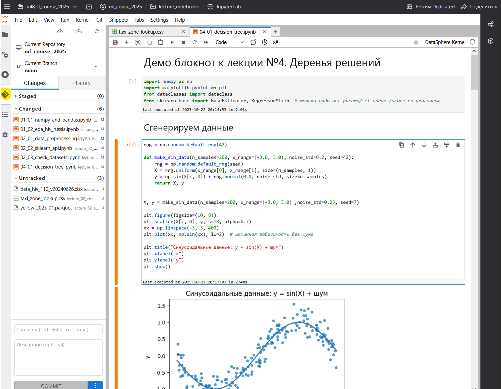
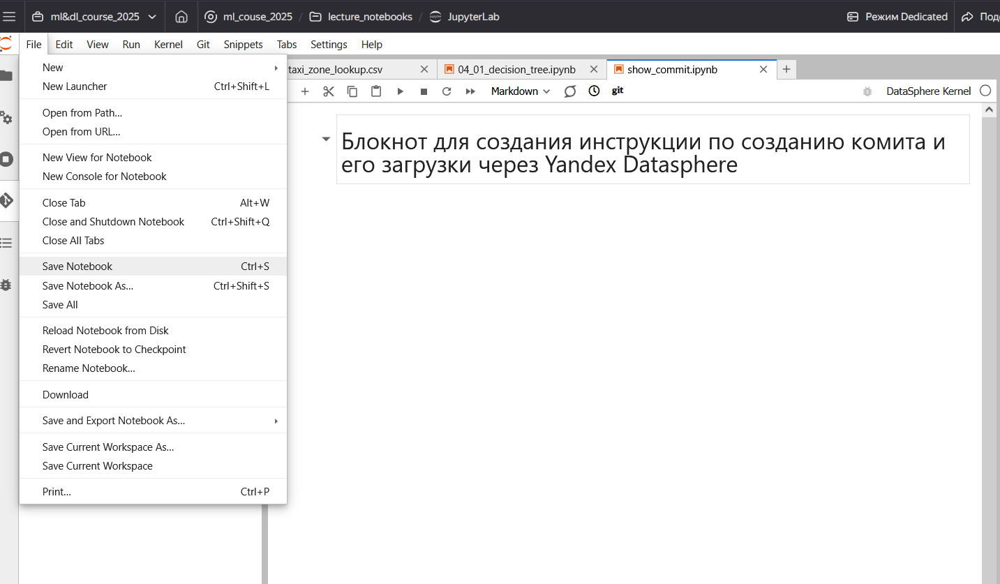
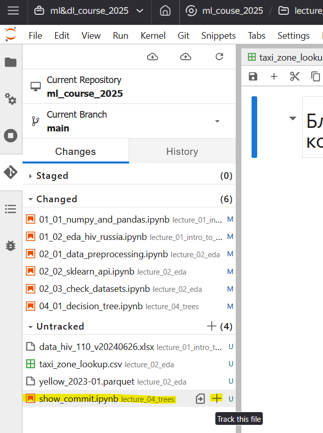
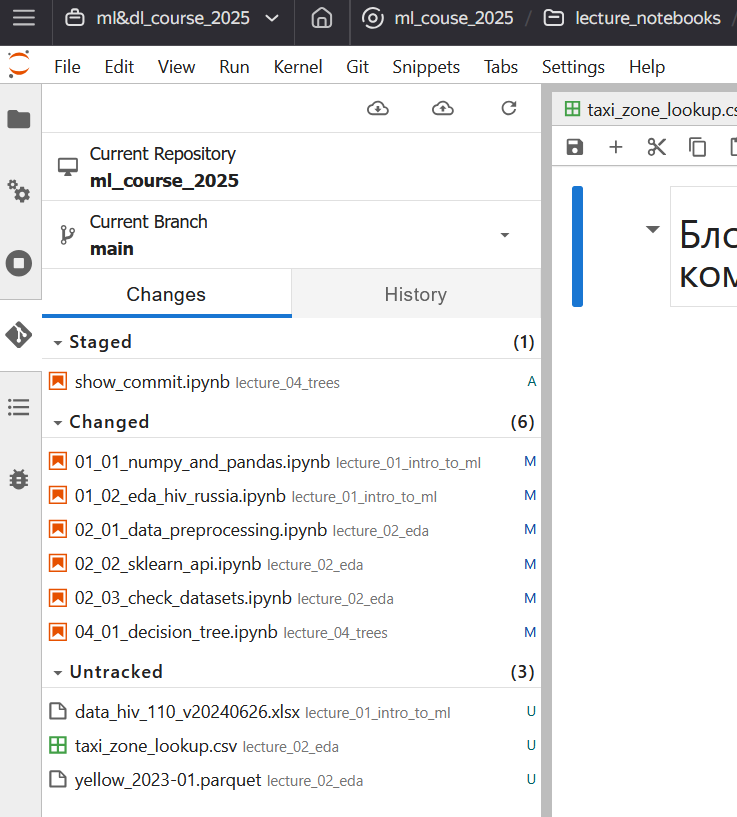
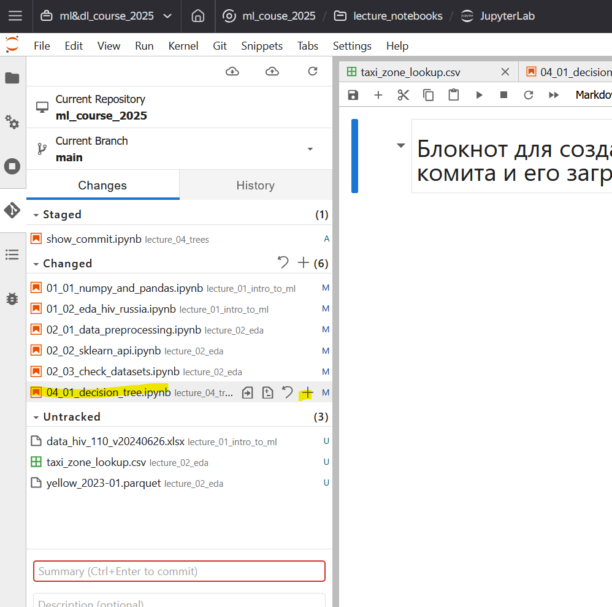
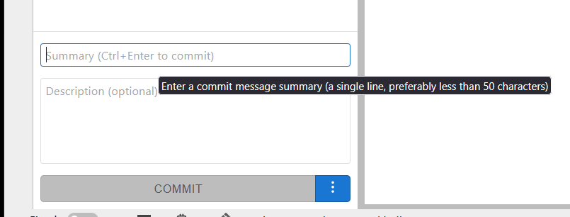
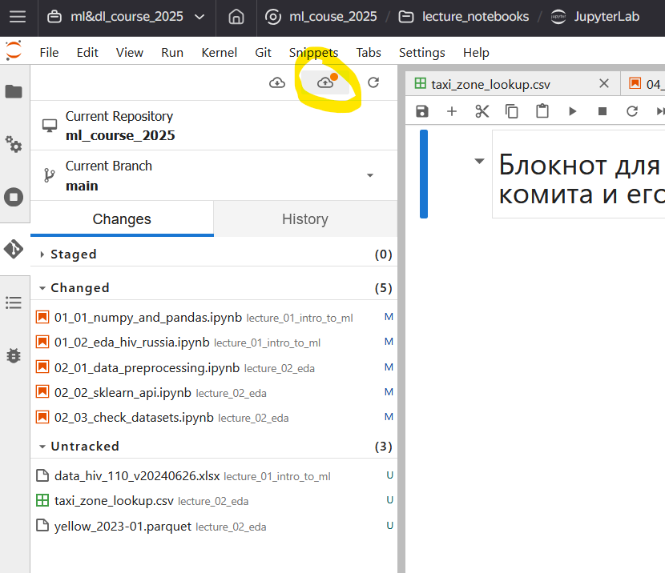
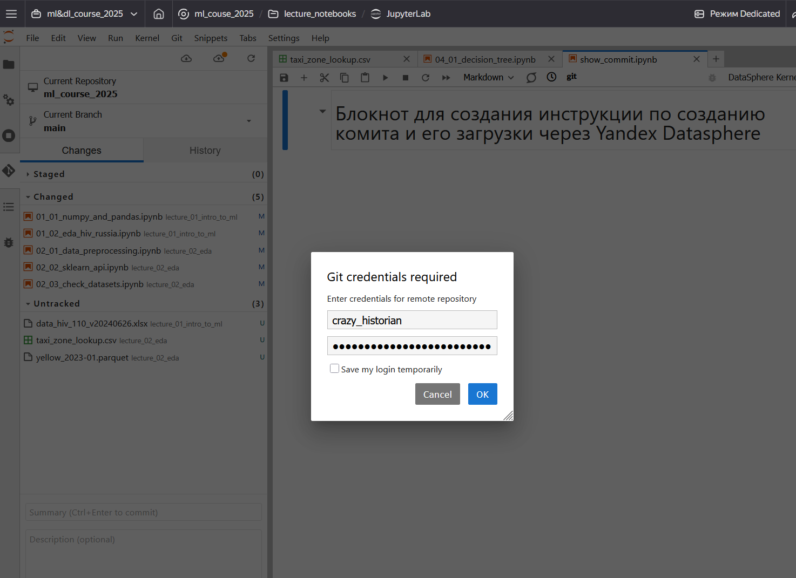
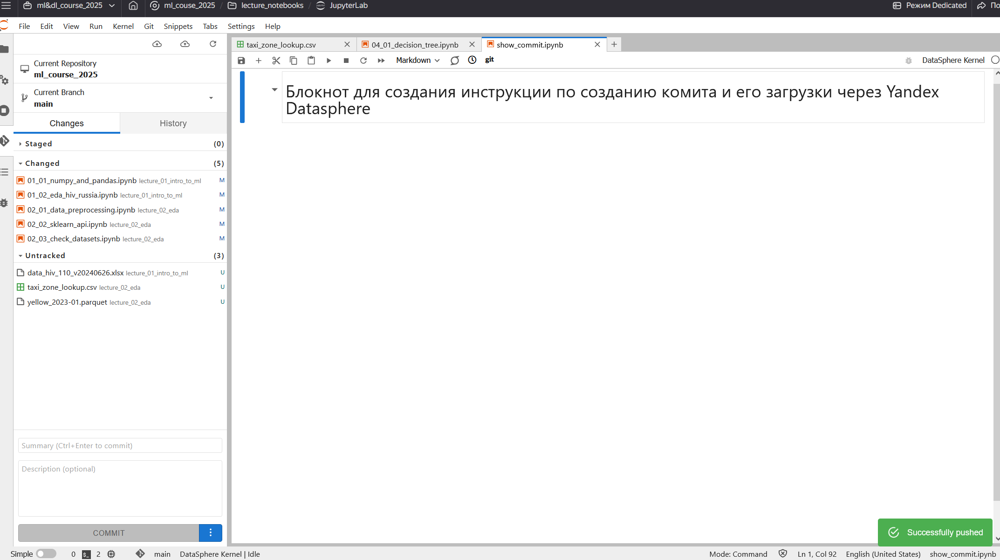

1. **Откройте ваш проект и нажмите на логотип Git на левой панели**. Если вы находитесь в корне директории, где склонирован Git-репозиторий, вы увидите не название репозитория , текущую ветку и секции управления файлами.
   
2. Перед тем, как сделать коммит, перейдите в интересующий вас Jupyter блокнот и сохраните изменения, нажав **Cntrl + S** или через верхнюю панель управления.
   
3. Если вы сохраняете файл впервые, он будет в секции **Untracked**. Нажимаете на значок плюса справа от названия файла. Файл перейдет в секцию **Staged**.
   
   
4. если вы сохраняете изменения в уже отслеживаемом файле, вы должны найти интересующий файл в секции Changed и также нажать на кнопку плюса справа.
   
5. В поле Summary вы пишите осмысленное краткое описание ваших изменений, например, "решена задача №2". Потом нажимаете кнопку Commit (она должна быть синей).
   
6. На первом коммите система спросит ваше имя и e-mail. Это нужно, что авторизовать ваши коммиты.
7. Нажимаете кнопку Commit. Если все хорошо -- в нижнем левом углу высветится зеленый прямоугольник.
8. Вверху панели управления Git есть две иконки с облачком, внутри котрого находится стрелочка. Левое облачко со стрелочкой вниз -- для скачивания актуальной версии кода из репозитория, правое облачко со стрелочкой вверх -- для загрузки ваших изменений в репозиторий. Если все сделано правильно, у правой кнопочки будет светиться оранжевый кружок. Это означает, что в вашем проекте есть не загруженные изменения. Нажимаем на эту иконку.
   
9. Yandex Datasphere попросит указать ваш GitHub юзернейм (с ним вы должны были принять задание и вступить в команду в GitHub classroom) и вставить github_pat токен, который преподаватель курса опубликовал в чате.
   
10. Нажимаем на кнопку ОК, немного ждем, после чего в левом нижнем углу появится приятный зеленый прямоугольник.
    

!!! danger "Не сохраняйте файлы более 100 мб с помощью Git!"

    В противном случае вы не сможете загрузить эти и другие файлы вашего проекта в репозиторий на GitHub.

Подробнее про работу с Git и GitHub в рамках Yandex Datasphere вы можете узнать [на странице официальной документации](https://yandex.cloud/ru/docs/datasphere/operations/projects/work-with-git).
