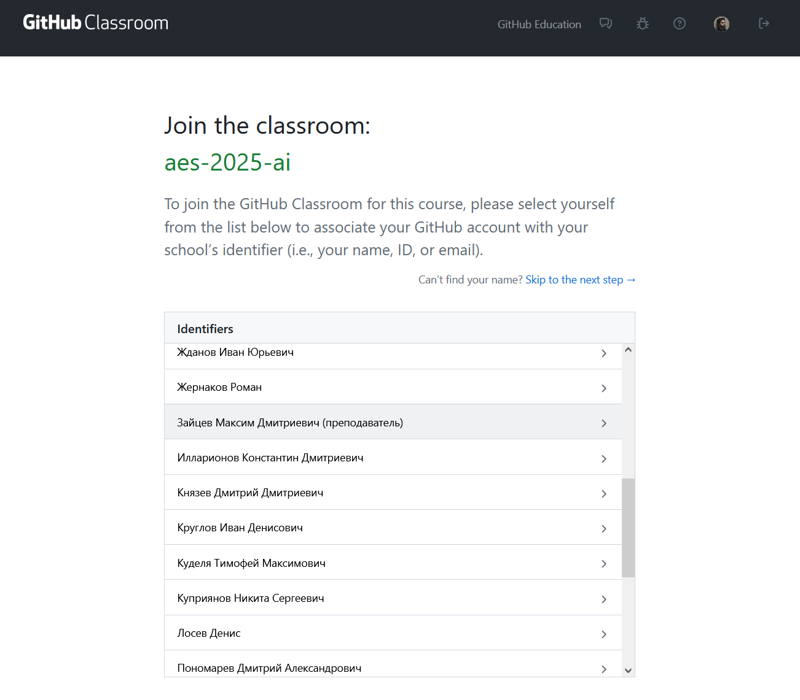
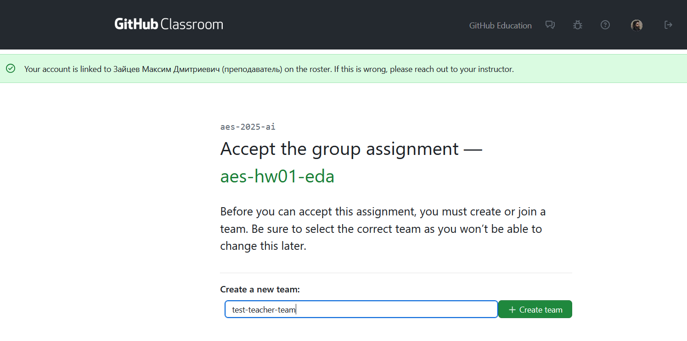
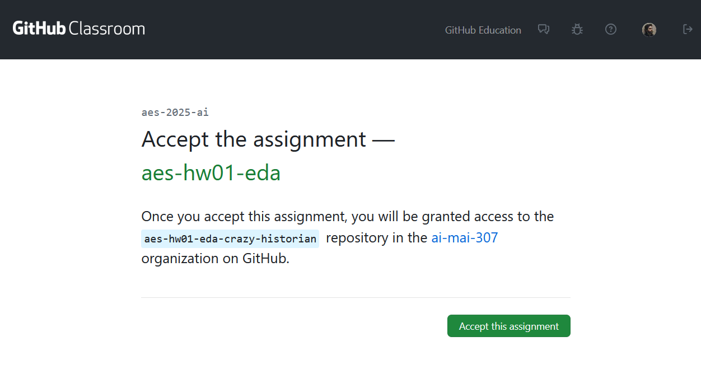
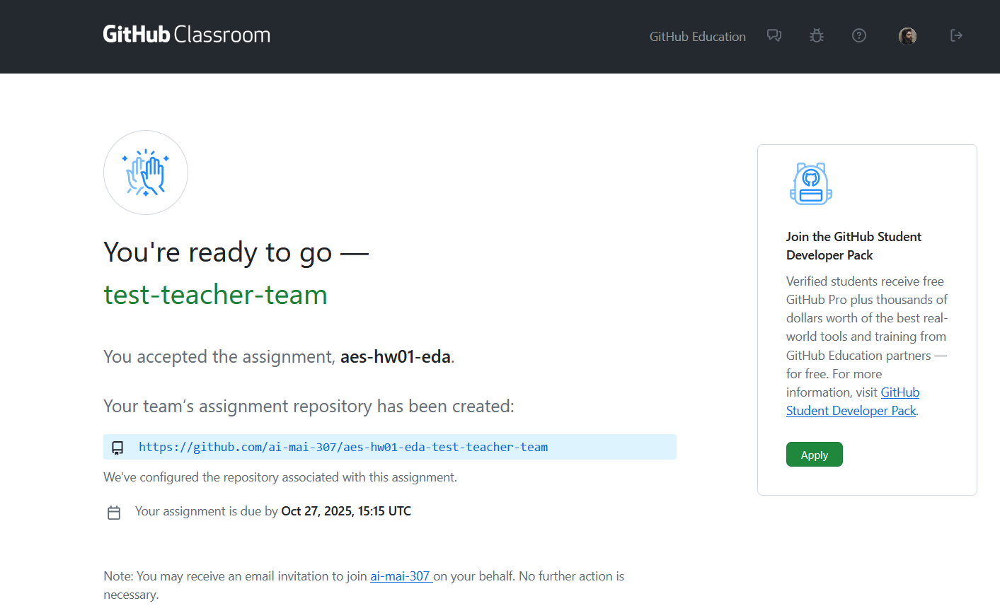
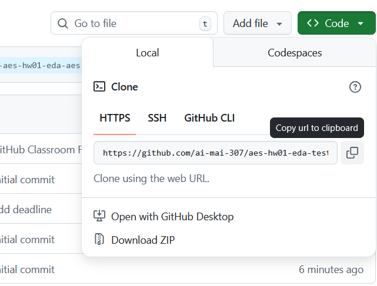

**Git** — это система, которая помогает сохранять и управлять историей вашего проекта: вы сохраняете изменения (коммиты) и при необходимости можете вернуться к любой сохранённой версии. С этим инструментов проще работать в команде и работать над кодом с разных компьютеров. [**Официальный сайт, где вы найдете кнопку установки Git для вашей системы.**](https://git-scm.com/https://git-scm.com/book/ms/v2/Getting-Started-About-Version-Control?utm_source=chatgpt.co)

**GitHub** — это сайт-хранилище для Git-проектов. Здесь удобно держать код, делиться им, работать вместе, смотреть правки и обсуждать их. [**GitHub Docs**](https://docs.github.com/en/get-started/start-your-journey/about-github-and-git)

**GitHub Classroom** — это специальный сервис для организации практики, построенный вокруг GitHub. Преподаватель создаёт т.н. классрумы (классные комнаты), в них публикует задания, а когда студент **принимает** их по ссылке, GitHub Classroom автоматически создаёт для него репозиторий (а для группового задания — общий репозиторий команды).**[Официальная документация.](https://docs.github.com/en/education/manage-coursework-with-github-classroom/teach-with-github-classroom)**

# Как принимать задания

1. Зайдите в свой аккаунт на **github.com** (или зарегистрируйтесь, если у вас нет аккаунта).
2. Откройте **ссылку-приглашение** на задание от преподавателя (она выглядит как `https://classroom.github.com/a/...`).
3. Найдите себя в списке студентов (скрин 1) и нажмите на свое ФИО. Если вас нет в списке - напишите в чат курса.
4. После того, как вы себя нашли, вам будет предложено ввести имя для вашей команды. **Вводите названия только на латинице!!!**
5. Нажмите далее на **"Accept the assignment".**
6. Подождите, пока Classroom **создаст репозиторий** с шаблоном задания. Сайт покажет ссылку на ваш личный репозиторий.
7. Откройте репозиторий: проверьте, что в названии есть имя задания и ива вашей команды.
8. Склонируйте репозиторий себе на компьютер (кнопка **Code** → скопировать ссылку → клонировать в удобную папку любым клиентом Git) или в проект Yandex Datasphere.
