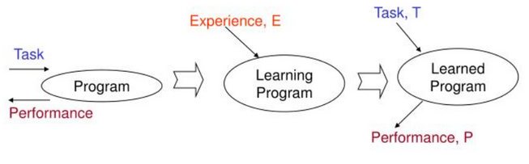
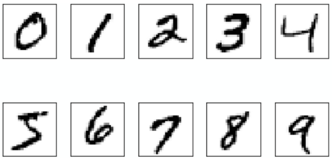

## Интуитивное понимание

Машинное обучение — это особый подход к решению задач с помощью компьютера, который отличается от классического программирования. Обычно программист явно прописывает все правила и инструкции, по которым компьютер должен обрабатывать данные для получения результата. Однако во многих случаях это оказывается практически невозможным. Проведите мысленный эксперимент, попробовав придумать, как написать алгоритм для таких задач:

- автоматический перевод текста с одного языка на другой;
- поиск опухоли на рентгеновском снимке и определение её типа;
- сравнить, какой из двух документов в интернете лучше подходит под данный поисковый запрос;
- распознавание устных команд к колонке умного дома.

Вероятно, вы столкнетесь с существенными трудностями. Это не удивительно – существует класс задач, для которых нет алгоритма в привычном понимании этого слова. Для таких задач используется другой метод решения — мы не программируем инструкции и вычисления напрямую, а позволяем компьютеру самостоятельно выявлять закономерности в данных и постепенно улучшать свои предсказания за счёт накопленного опыта.

## Более формальное определение

Существуют несколько формальных определений машинного обучения. Мы будем пользоваться тем, которое дал [Том Митчелл](https://ru.wikipedia.org/wiki/%D0%9C%D0%B8%D1%82%D1%87%D0%B5%D0%BB%D0%BB,_%D0%A2%D0%BE%D0%BC_(%D1%83%D1%87%D1%91%D0%BD%D1%8B%D0%B9)):

!!! quote "Определение машинного обучения"
    Компьютерная программа считается обучающейся, если её качество решения (P) некоторого класса задач (T) улучшается с ростом опыта (E).

В этой формулировке важно выделить три составляющих:
- задачу (T - Task)
- метрику качества (P - Perfomance)
- и опыт (E - Experience).

Например, если речь идёт о распознавании рукописных цифр, то задачей будет классификация изображений, метрикой качества — доля правильных ответов, а опытом — обучающая выборка изображений с заранее известными метками.

## Виды машинного обучения

В зависимости от природы имеющихся данных и задачи, которую мы должны решить, машинное обучение классифицируются на следующие виды (или парадигмы):
- обучение с учителем;
- обучение без учителя;
- обучение с подкреплением.

Рассмотрим типичные задачи, решаемых в рамках этих парадигм.

### Обучение с учителем

В обучении с учителем мы располагаем данными в виде множества пар $(x_i, y_i), i =\overline{0, \dots, N}$, где $x_i \in \mathbb{R}^n$ – это численное описание объекта, а $y_i \in Y$ – результат решения задачи, (наблюдение, целевая переменная, таргет).

- *Регрессия* – предсказание вещественного числа, т.е. $Y \in \mathbb{R}$. Например, предсказание уровня человека, который выражаются в рублях/долларах
- Классификация – определение категории, класса, к которому принадлежит объект, т.е. $Y \in \{0, 1, \dots, K\}$, где $K$ – количество распознаваемых классов. Это множество всегда дискретно.

### Обучение без учителя

Обучение без учителя возникает тогда, когда в данных отсутствует информация об $Y$. Задача заключается в том, чтобы обнаружить скрытые структуры и взаимосвязи в данных или сжать численное представление данных:

- _Кластеризация_ – разделение множества объектов на группы (кластеры) таким образом, чтобы объекты внутри одного кластера были максимально похожи друг на друга, а объекты из разных кластеров – максимально отличались. Например, сегментация клиентов по истории покупок.
- _Понижение размерности_ – преобразование данных из пространства высокой размерности в пространство низкой размерности с сохранением наиболее важной информации. Это позволяет визуализировать данные или убрать шум. Например, алгоритм PCA.

### Обучение с подкреплением

В обучении с подкреплением мы располагаем агентом, который обучается, взаимодействуя со средой. На каждом шаге агент оказывает в некотором состоянии $s_t$, совершает действие $a_t$, получает от среды награду (reward) $r_t$ и переходит в новое состояние $s_{t+1}$. Цель агента – выработать стратегию (policy) $\pi$, максимизирующую cumulative reward (суммарную награду) за всё время.

## Как решать задачу с помощью машинного обучения?

Решение (практически) любой задачи машинного обучения можно систематизировать, опираясь на шесть ключевых характеристик: три из них описывают саму проблему, а три — стратегию её решения.

**Характеристики проблемы:**

1. **Класс задачи (Problem class):** Первый шаг — это точная постановка задачи. Необходимо определить, какой тип машинного обучения ей соответствует (с учителем, без учителя, с подкреплением или другое), какого вида данные доступны для обучения и какие запросы будут поступать к системе на этапе эксплуатации.
2. **Допущения (Assumptions):** Важно сформулировать гипотезы о природе данных и ожидаемому виду решения. Эти допущения, полученные в ходе предварительного анализа данных, упрощают поиск первоначального решения (например, предположение о линейной зависимости или нормальном распределении признаков).
3. **Критерии оценки (Evaluation criteria):** Необходимо определить, как будет измеряться успех. Это включает выбор метрик для оценки качества предсказаний и общих (бизнес) метрик производительности системы.

**Характеристики решения:**  

1. **Тип модели (Model type):** На этом этапе выбирается общий подход к моделированию. Быть может, нам вообще не нужно никакое машинное обучение и можно обойтись обычными статистическими инструментами для решения бизнес-задачи.
2. **Класс моделей (Model class):** Конкретизируется выбор модели. К какому параметрическому классу моделей мы обратимся (линейная регрессия, решающее дерево, глубокая нейронная сеть)? Какая метрика будет использоваться для выбора наилучшей модели из этого класса?  
3. **Алгоритм (Algorithm):** Определяется вычислительный процесс, который будет применяться для обучения модели (поиска значения её параметров, при котором она будет давать лучшие предсказания). Сюда же входит этап валидации, подбора гиперпараметров и итоговой оценки качества.

Завершающим этапом является **выведение модели в продакшен**. На этом шаге решается, в каком виде модель будет передана заказчику и интегрирована в рабочий процесс для использования в реальных условиях.

## Немного о данных

Машинное обучение невозможно без данных. Важно, чтобы их было достаточно много и чтобы они были достаточно качественными.

Чем сложнее задача, тем больше данных нужно, чтобы её решить. Бороться с проблемой нехватки данных можно двумя способами. Первый – использование краудсорсинга, то есть привлечение людей, готовых разметить много данных. Второй же способ состоит в использовании неразмеченных данных.

Кроме количества данных важно ещё и то, насколько они хороши и удобны для анализа. Для работы с объектом модель должна опираться на какие-то его свойства. Эти свойства обычно называются **признаками**, а совокупность свойств, которые мы выделили у объекта – **его признаковым описанием.**

Разновидности признаков:

- Численные – те, которые могут быть выражены вещественным числом: рост, вес, зарплата, и т.д.
- Категориальные – те, которые принимают значение из конечного множества, например, группа в университете/класс в школе, группа крови, страна происхождения и т.п.
- Бинарные признаки – подмножество категориальных признаков, ими могут быть пол человека, бинарный статус (состоит в браке или нет, есть машина или нет)
- Ординальные – признак, которые принимает значение из упорядоченного множества, например, оценка за соревнование, 

Данные, представленные в таком виде, называются табличными. Табличные данные – один из самых удобных для анализа форматов. Лучше всего, если все признаки являются численными, тогда с таблицей можно работать как с объектом линейной алгебры – матрицей объекты-признаки.

Нужно также следить за качеством полученных данных:
- Пропуски – пропущенные значения в таблице;
- Выбросы (аномалии) – объекты, которые резко отличаются от большинства остальных по статистическим характеристикам, например, зарплата человека в $5 млрд., когда средняя ЗП в компании – тысяч рублей.
- Ошибки разметки – неверно зарегистрированное человеком или измерительным прибором значение таргета
- Дрейф данных – существенное статистическое отличие данных, используемых для обучения модели от тех, которые встречаются в реальном мире. Такое может произойти в ситуации, когда обучающие данные были собраны и размечены несколько лет назад и они перестали быть актуальными сегодня.

## Использованные источники

1. [Курс от MIT](https://openlearninglibrary.mit.edu/courses/course-v1:MITx+6.036+1T2019/course/#block-v1:MITx+6.036+1T2019+type@sequential+block@intro_ml): [1.2 Introduction to ML](https://openlearninglibrary.mit.edu/assets/courseware/v1/2481f8f2964716032b134db99e369b81/asset-v1:MITx+6.036+1T2019+type@asset+block/notes_chapter_Introduction.pdf)
2. К.В. Воронцов. [Математические методы обучения по прецедентам](http://www.machinelearning.ru/wiki/images/6/6d/Voron-ML-1.pdf). 1.1. Основные понятия и определения
3. Курс Себастьяна Рашки: [Introduction to ML](https://sebastianraschka.com/pdf/lecture-notes/stat451fs20/01-ml-overview__notes.pdf)
4. Учебник Яндекс ШАД: [Машинное обучение](https://education.yandex.ru/handbook/ml/article/mashinnoye-obucheniye)