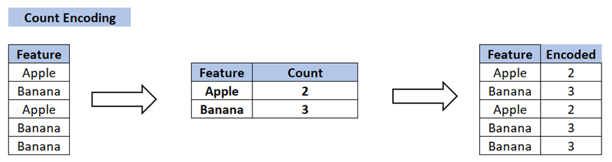
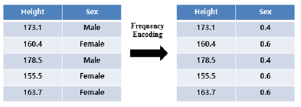
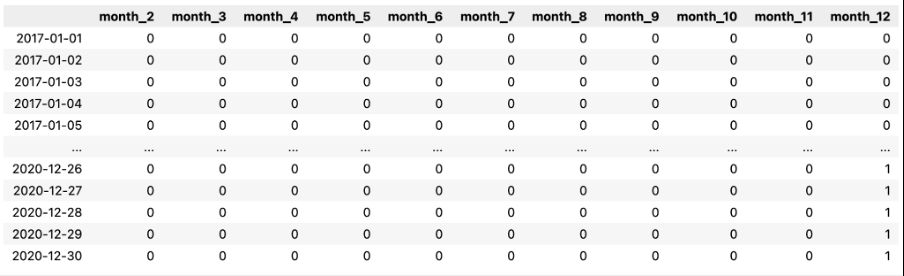
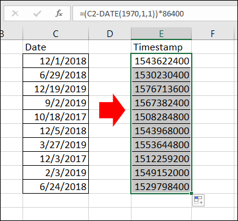
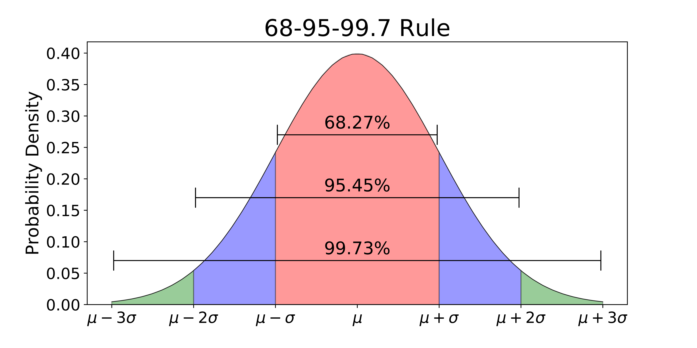
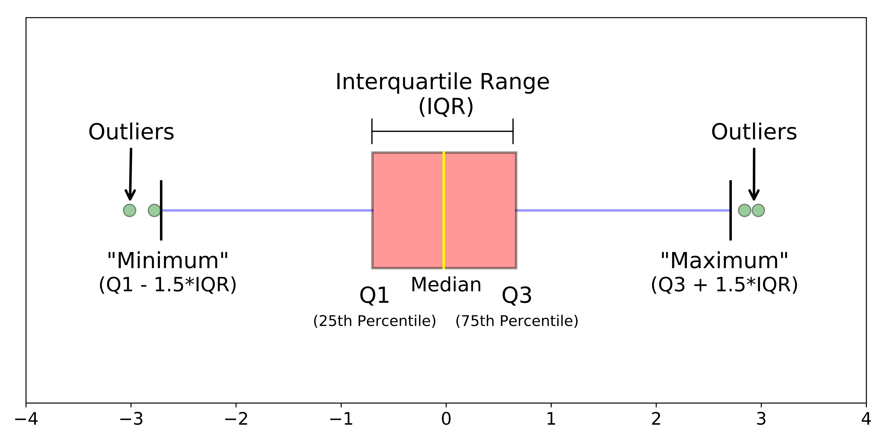
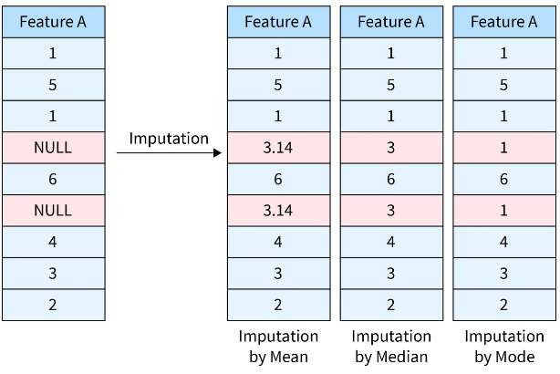
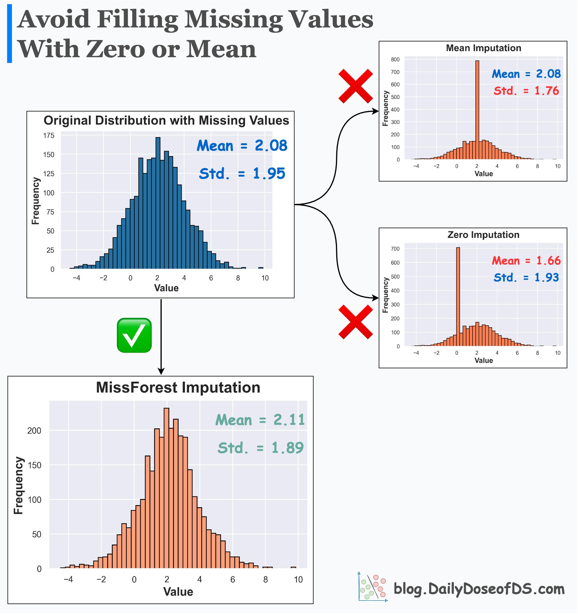
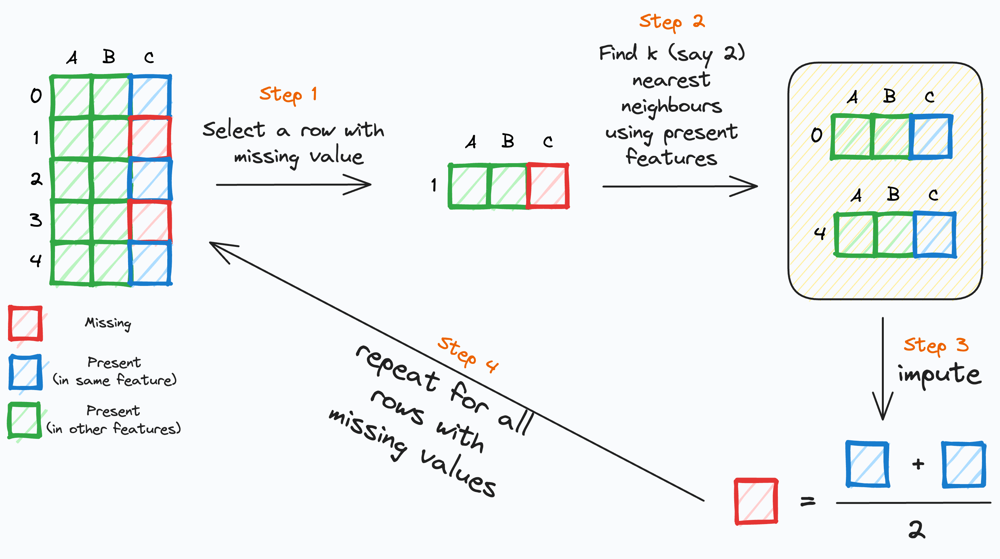
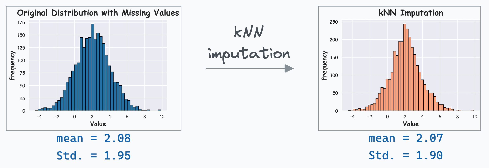

В машинном обучении качество предсказаний, даваемое моделью, во многом определяется качеством подготовки данных. Предварительная обработка данных (data preprocessing) позволяет устранить технические несовершенства данных и выделить их ключевые информативные характеристики, чтобы в дальнейшем построенные модели могли адекватно обобщать закономерности, а не переобучаться на шум. Вторая лекция посвящена основным этапам такой предобработки.

## Масштабирование и нормализация данных

Большинство алгоритмов машинного обучения чувствительны к масштабам (*скейлу*) признаков. Например, градиентный спуск будет сходиться медленнее, если один признак принимает значения от 0 до 5, а другой — от -10000 до 10000. Это объясняется тем, что модели оптимизируют функцию потерь по всем признакам одновременно, и большие различия в масштабе могут нарушать корректное вычисление градиентов и расстояний.

### Основные методы

**Стандартизация (Standardization)**:

Признаки преобразуются так, чтобы иметь нулевое среднее значение и единичную дисперсию:

$$
x_{new}=\frac{x - \mu}{\sigma}
$$

где $\mu$ — среднее значение признака, $\sigma$— стандартное отклонение.

**Масштабирование в интервал [0, 1] (Min-Max Scaling)**:

$$
x_{new}= \frac{x - x_{\min}}{x_{\max} - x_{\min}}
$$

Можно сказать, что при помощи Min-Max-масштабирования, каждое значение превращается в **долю (процент) наблюдённого диапазона** этого признака.

**Когда следует применять одно или другое?**

* доводы в пользу стандартизации:
  * уменьшение обусловленности матрицы, что положительно сказывается на обучении модели градиентным спуском
  * более предпочтительна в случае использования L1 или L2 регуляризации
  * более предпочтительна в случае большого количества выбросов в данных
* доводы в пользу масштабирования в интервал
  * обрабатываемый признак естественно ограничен в диапазоне
  * необходимо сохранить простую интерпретируемость признака % от максимального возможного значения)

## Преобразование категориальных признаков

Категориальные данные необходимо переводить в числовую форму, чтобы алгоритмы машинного обучения могли с ними работать.

### Основные методы

**One-Hot Encoding**: создание бинарных признаков для каждой категории.

Для признака "Цвет" с уникальными значениями ["красный", "синий", "зелёный"] мы создаём три бинарных признака.


**Ordinal Encoding**
Назначение целых чисел каждой категории с учетом отношением порядка. Такой способ кодирования стоит использовать только в том случае, если порядок действительно существует (как в примере ниже).


Но что делать, когда количество уникальных значений для одного признака **слишком** велико? Например, сотни и даже тысячи.

**Count Encoding**


Признак примет такое числовое значение, сколько он раз встречается в выборке, т.е.

$$
CE (x_i) = n_{x_i}
$$

**Frequency Encoding**


Признак числовое значение, равное доле объектов с этим признаков среди всех в выборке.

$$
FE (x_i) = \frac{n_{x_i}}{N}
$$

## Обработка временных признаков

### Время как категориальный признак

**Идея.** Разбиваем сутки на несколько смысловых интервалов — «ночь», «утро», «день», «вечер» — и превращаем их в категориальный признак, который затем обрабатывается с помощью вышеописанных методов (чаще всего используют one-hot).

Недостатком такого подхода является потеря временных зависимостей и закономерностей в данных, которые наблюдаются в масштабе одного значения выбранной категории (например, в рамках одного часа).



### Перевод в timestamp

**Идея.** Перевести дату и время в простое числовое представление — количество секунд (миллисекунд) от фиксированного нулевого момента, чаще всего 1 января 1970 г. UTC.



Недостатком такого подхода является сложности масштабирования: число секунд от 1970-го до 2025-го ≈ **1,7 × 10¹⁰**.

### Циклическое кодирование

**Идея.** Часы, дни недели и месяцы **циклически повторяются**. При one-hot или ординальном кодировании может получиться ситуация, что между полуночью (0 часов) и 23 часами есть существенная разница, но в реальности это не так – разница всего в 1 час. Для того, чтобы отразить циклический характер времени прибегнуть к sin-cos кодированию

**Метод.** Представляем циклический признак как точку на окружности радиуса 1:

$$
x_{\sin} = \sin\!\left(2\pi \tfrac{t}{P}\right),\qquad x_{\cos} = \cos\!\left(2\pi \tfrac{t}{P}\right)
$$

где $t$ — целое значение (час 0…23, месяц 1…12), $P$ — период.


## Выявление и выбросов аномалий в данных

(def) **Аномалии (выбросы)** — это экстремальные значения во входных данных, которые находятся далеко за пределами других наблюдений. Выбросы во входных данных могут исказить и ввести в заблуждение процесс обучения алгоритмов машинного обучения.

Важно понимать, что выбросы (в большинстве случаев) – это **реальные** наблюдения, которые имели место в действительности.

### Способы определения выбросов

Рассмотрим наиболее простых способа найти выбросы в данных.

#### Правило трех сигм

Если рассматриваемый признак распределен нормально, т.е. $x\sim\mathcal N(\mu,\sigma^2)$, то ~99.7% наблюдений лежат в $\mu-3\sigma,\,\mu+3\sigma$. Значения за пределами с большой вероятностью являются выбросами.



#### Межквартильный размах (IQR-правило)

Если распределение рассматриваемого признака не похоже на нормальное, то стоит воспользоваться методом межквартильного расстояния.
Выбросом считаются все значения, которые выходят за пределы диапазона:$[Q_1 - 1.5 × IQR, Q_3 + 1.5 × IQR]$, где $Q_1$ – первый квартиль, $Q_2$ – второй, а $IQR = Q_3 - Q_1$



## Обработка пропущенных значений

### **Удаление строк или столбцов**

Мы удаляем объект из выборки с пропущенным признаком или весь признак целиком по какому-то критериями, например:

* процент пропусков в столбце < 5 % для числовых признаков;

- строка содержит > 50 % NA или наблюдается дубликаты в других колонках.

Однако есть риск потерять потенциально важный информативный признак для подгруппы объектов в выборке.

**Заполнение простыми статистиками**

- **Для числовых признаков**:
  - медиана (устойчива к выбросам),
  - среднее,
  - константа
- **Для категориальных**:
  - мода (самое частое значение)
  - константа (например "missing”), таким образом мы говорим, что отсутствие значение признака  и есть сам признак.



Однако у такого просто подхода есть проблема: мы можем существенно искажать реальное распределение данных, что потенциально может привести к искаженным предсказаниям модели.



Перед рассмотрением альтернативного способа обработать пропущенные значения введем их классификацию:

1. missing competely at random (MCAR): вероятность пропуска вообще не зависит от наблюдаемых данных
2. missing at random (MAR): вероятность пропуска зависит от наблюдаемых (непропущенных) величин
3. missing not at random (MNAR): вероятность зависит от ненаблюдаемых (пропущенных) величин

Первый тип легко обрабатывается методом простых импутаций, третий является сложным случаем и его обработка выходит за рамки этого лекционного курса.

Со вторым типом пропусков можно эффективно работать при помощи метода модельных импутаций. Мы рассмотрим метод, применяющий kNN.



Алгоритм kNN для импутации находит группу наиболее схожих объектов по полным данным и использует их для "достраивания" пропусков.

**Шаги алгоритма: включает:**

1. Выбираем строку с пропущенным значением.
2. Находим **k** ближайших соседей по непропущенным значениям.
3. Импутируем пропущенный признак строки , используя соответствующие пропущенные значения k ближайших соседей.
4. Повторяем для всех строк с пропущенными значениями.



## Sklearn-api

`scikit-learn` часто рассматривают как библиотеку готовых реализаций классический моделей машинного обучения, и это правда. При этом помимо готовых реализаций sklearn предлагает интерфейс для реализации ворклфоу обучения моделей.

Можно выделить основные сущности:

1. **Трансформер данных** , который обязан реализовать
   - `fit(X, y=None) -> None` : вычислить параметры преобразования;
   - `transform(X) -> X_prepared`: применить преобразование к данным;
   - `fit_transform(X, y=None) -> X_prepared`:удобный одновременный вызов двуз предыдущих функций.
2. **Модель** (`Estimator`) реализует
   - `fit(X, y)`: осуществления обучения;
   - `predict(X)`: осуществление предсказания.
3. **Pipeline** — это последовательность преобразований данных перед подачей их на вход модели машинного обучения. При вызове `fit()` преобразования вызываются последовательно в том порядке, при котором был инициализирован пайплайн

Пример собственного трансформера:

```python
from sklearn.base import BaseEstimator, TransformerMixin
import numpy as np
import pandas as pd

class SimpleMinMaxScaler(BaseEstimator, TransformerMixin):
"""
    Масштабирует каждый столбец к интервалу [0, 1]
    x_scaled = (x - min_col) / (max_col - min_col)
"""

    # -------- fit: запоминаем мин и макс по столбцам --------
    def fit(self, X, y=None):
        X_arr = self._to_array(X)
        self.min_   = X_arr.min(axis=0)       # вектор: минимум по КАЖДОМУ столбцу
        self.max_   = X_arr.max(axis=0)       # то же для максимума
        self.range_ = self.max_ - self.min_

    # если весь столбец константный, range == 0 -> чтобы не делить на 0
        self.range_[self.range_ == 0] = 1
        return self

    # -------------- transform: применяем преобразование --------------
    def transform(self, X):
        X_arr = self._to_array(X)
        X_scaled = (X_arr - self.min_) / self.range_
        return X_scaled

    # вспомогательное преобразование DataFrame -> ndarray
    def _to_array(self, X):
        return X.values if isinstance(X, pd.DataFrame) else np.asarray(X)
```

Пример собственного эстиматора (модели, которая будет возвращать константу, среднее значение таргета из обучающей выборки):

```python
from sklearn.base import BaseEstimator, RegressorMixin
import numpy as np

class MeanModel(BaseEstimator, RegressorMixin):
    """
    на fit запоминает среднее y,
    на predict выдаёт его для любой X.
    Полезна как бенчмарк (baseline).
    """
    def fit(self, X, y):
        self.mean_ = np.mean(y)
        return self


    def predict(self, X):
        n_samples = X.shape[0]
        return np.full(shape=(n_samples,), fill_value=self.mean_, dtype=float)

```

Пример элементарного пайплайна:

```python
from sklearn.pipeline import make_pipeline
import numpy as np

# обучающие данные
X_train = np.random.randn(100, 4) * 10 + 50
y_train = np.random.randn(100) * 5 + 42

pipe = make_pipeline(
    SimpleMinMaxScaler(), # наш трансформер
    MeanModel() # простейший эстиматор
)

pipe.fit(X_train, y_train)
print("Первые 3 предсказания:", pipe.predict(X_train[:3]))
```
