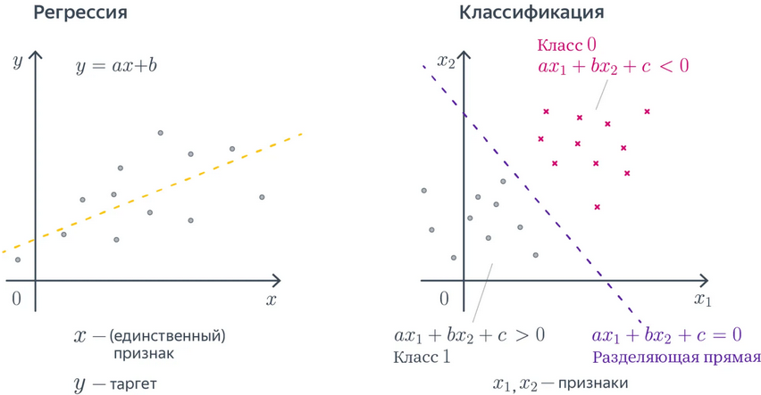
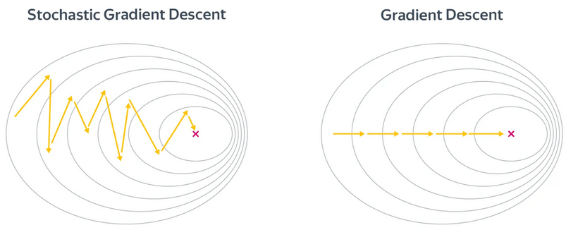
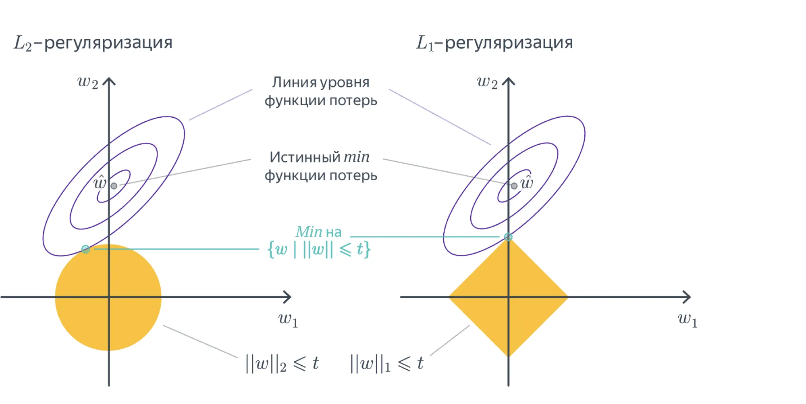
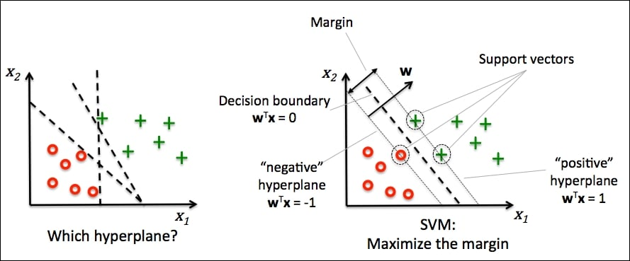
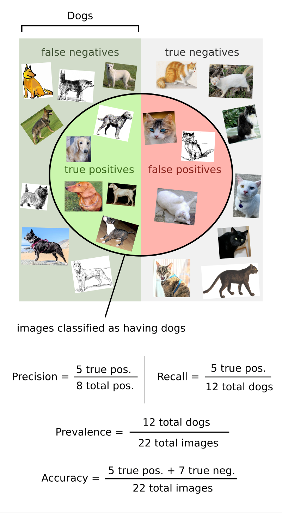
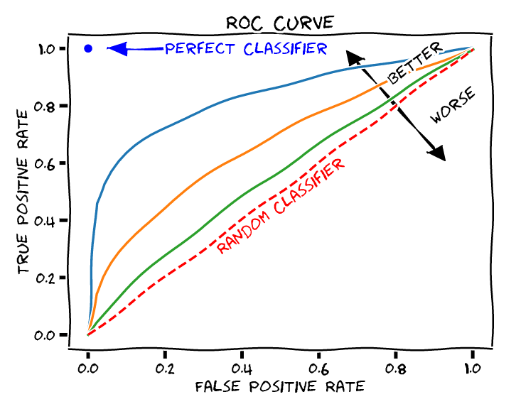
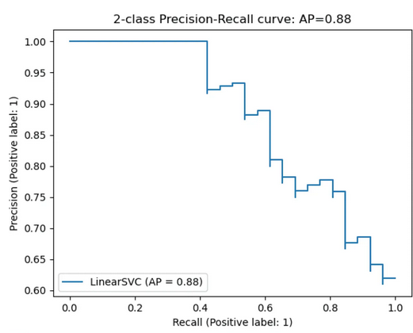

# Что такое обучение с учителем (обучение по прецедентам)

Напомним, в чем заключается задача обучения **с учителем**.
Предположим, что:

- Существует множество объектов $X$ (объекты, данные, примеры).
- Существует множество допустимых ответов, решений задачи $Y$  (метки, целевые значения).
- Существует некая неизвестная нам **целевая зависимость** (target function) $y^* : X \to Y$, которая идеально связывает объекты с их ответами.

Значения этой целевой функции $y_i = y^*(x_i)$ нам известны только для конечного числа объектов ${x_1, \dots , x_l} \subset X$. Пары "объект-ответ" $(x_i, y_i)$ называются **прецедентами**. Совокупность таких пар $\mathbb{X}^l = (x_i, y_i)_{i=1}^l$ называется **обучающей выборкой** (training sample).

**Задача** заключается в том, чтобы по обучающей выборке $\mathbb{X}^l$ восстановить зависимость $y^*$, то есть построить **алгоритм** (решающую функцию, модель) $a: X \to Y$, которая приближала бы целевую функцию $y^*(x)$.

При этом мы хотим, чтобы алгоритм работал хорошо не только на объектах из обучающей выборки, но и на всех возможных объектах множества $X$.

#### Задачи обучения с учителем

В зависимости от природы множества ответов $Y$, задачи обучения с учителем делятся на основные типы:

- **Классификация (Classification):**
  - *Чем является* $Y$?: $Y$ — конечное множество категорий (классов). ${\text{"спам"}, \text{"не спам"}}$ или $Y = {0, 1, \dots, K}$, где $0, \dots , K$ – номера классов.
  - *Задача*: отнести объект к одному из классов.
- **Регрессия (Regression):**
  - *Чем является* $Y$? $Y$ — непрерывное числовое множество, $\mathbb{R}$.
  - *Задача*: предсказать числовое значение.

#### Примеры прикладных задач

- **Примеры классификации:**
  - Определение рукописной цифры ($Y = {0, ..., 9}$).
  - Определение спама в письме электронной почты ($Y = {\text{спам}, \text{не спам}}$).
  - Диагностика заболеваний по совокупности симптомов ($Y = {\text{здоров}, \text{болен}}$).
- **Примеры регрессии:**
  - Прогнозирование стоимости дома на основе его характеристик (площадь, район и т.д.).
  - Предсказание спроса на товар в зависимости от сезона и рекламных активностей.
  - Оценка времени доставки заказа.

# Линейные параметрические модели

Cреди каких отображений мы будем искать самое лучшее? Возможных отображений может быть много, но мы можем упростить себе задачу и договориться, что хотим искать решение только в каком-то заранее заданном параметризированном семействе функций.

(def) **Семейством алгоритмов** будем называть параметрическое семейство отображений $A = {g(x, \theta) \mid \theta \in \Theta}$, где $g: X \times \Theta \to Y$ — некоторая фиксированная функция, а $\Theta$ — множество допустимых значений параметра $\theta$, называемое **пространством параметров**.

Предположим, что каждый объект $x$ описывается вектором числовых признаков $\mathbf{x} = (x_1, x_2, \dots, x_n)^T$, где $x_j \in \mathbb{R}$ — значение $j$-го признака.
Тогда **линейная модель** с вектором параметров $\theta = (\theta_0, \theta_1, \ldots, \theta_n) \in \Theta = \mathbb{R}^{n+1}$ выглядит следующим образом:

- **Для задачи регрессии**($Y = \mathbb{R}$): $g(\mathbf{x}, \theta) = \theta_0 + \theta_1 x_1 + \theta_2 x_2 + \dots + \theta_n x_n$
- **Для задачи бинарной классификации** ($Y = {-1, +1}$):
  $g(\mathbf{x}, \theta) = \text{sign} \left( \theta_0 + \theta_1 x_1 + \theta_2 x_2 + \dots + \theta_n x_n \right)$

Таким образом, мы ищем наилучшую функцию не среди всех возможных, а только среди функций вида $g(x, \theta)$, перебирая параметры $\theta$.

**Общий вид линейной модели**

В общем случае линейная модель для объекта $\mathbf{x} = (x_1, \dots, x_n)^T$ имеет вид:

$$
a(x,θ)=θ_0+θ_1x+θ_2x_2+⋯+θ_nx_n
$$

где $\theta_0$ — свободный член (bias, intercept), а $\theta_1, \dots, \theta_n$ — веса (weights), соответствующие каждому признаку. Часто для удобства вводят фиктивный признак $f_0(x) = 1$, чтобы записывать модель в компактной форме:

$$
a(x,θ)=j=\sum_{j=0}^n θ_jx_j=θ^T\mathbf{x}
$$

где $\theta = (\theta_0, \theta_1, \dots, \theta_n)^T$, а $\mathbf{x} = (1, x_1, \dots, x_n)^T$ — расширенный вектор признаков.

# Решение задачи регрессии с помощью линейных параметрических моделей

## Функционал качества

Мы хотим, чтобы на нашем датасете (то есть на множестве пар вида “объект-ответ”, $(x_i, y_i)$) решающая функцию (алгоритм, модель) как можно лучше приближала нашу искомую зависимость $y^*$.

Для решения задачи регрессии необходимо определить функцию, которая измеряет качество модели — **функцию потерь (loss function)**. Эта функция оценивает, насколько сильно модель ошибается на каждом объекте.

Формально, функция потерь $\mathcal{L}(a, x_i, y_i)$ измеряет ошибку модели $a$ на объекте $x_i$ с истинным значением $y_i$. Чтобы оценить качество модели на всей выборке, мы усредняем потери по всем объектам, получая **функционал качества**:

$$
Q(a, X^l) = \frac{1}{l} \sum^l_{i=1} \mathcal{L}(a, x_i)
$$

Для задач регрессии наиболее распространенными являются следующие функции потерь:

#### Mean Squared Error (MSE)

MSE вычисляет среднее значение квадратов разностей между предсказаниями модели и истинными значениями:

$$
MSE(f, X, y) = \frac{1}{N} \sum^N_{i=1} (y_i - \langle x_i, w \rangle)^2
$$

#### Root Mean Squared Error (RMSE)

RMSE является производной метрикой от MSE и вычисляется как корень из MSE:

$$
RMSE(f, X, y) = \sqrt{\frac{1}{N} \sum^N_{i=1} (y_i - \langle x_i, w \rangle)^2}
$$

#### Mean Absolute Error (MAE)

MAE вычисляет среднее значение абсолютных разностей между предсказаниями и истинными значениями:

$$
MAE(f, X, y) = \frac{1}{N} \sum^N_{i=1} |y_i - \langle x_i, w \rangle)|
$$

## Задача оптимизации

Для линейной регрессии с MSE-функцией потерь задача оптимизации принимает вид:

$$
||y - X\theta||^2_2 \rightarrow \min_\theta,
$$

где $X$ — матрица объекты-признаки (каждая строка — вектор признаков одного объекта), $y$ — вектор целевых значений.

## Аналитическое решение

Задачу линейной регрессии с MSE можно решить аналитически. **Что значит "решить аналитически"?** Это значит найти точное решение в виде замкнутой формулы, без итеративных приближений. Говоря совсем просто – вы можете взять бумажку, ручку и решить задачу по формуле.

Как это выглядит для регрессии: минимум функционала $||y - X\theta||^2_2$ достигается при:

$$
\theta=(X^TX)^{−1}X^Ty
$$

Это решение называется **нормальным уравнением**.

**Проблемы аналитического решения:**
Несмотря на свою элегантность, аналитическое решение имеет серьезные ограничения:

1. **Вырожденность матрицы:** Если матрица $X^T X$ является вырожденной (определитель равен нулю), то обратной матрицы не существует. Это происходит когда:
   - Признаки линейно или приближенно линейно зависимы (**мультиколлинеарность**)
   - Количество признаков превышает количество объектов ($n > l$)
2. **Вычислительная сложность:** Операция обращения матрицы имеет сложность $O(n^3)$, где $n$ - количество признаков. Для задач с тысячами признаков это становится вычислительно затратным.
3. **Численная неустойчивость:** Даже если матрица формально обратима, при близких к линейно зависимым признаках вычисления становятся неустойчивыми к малым изменениям данных.

Эти ограничения заставляют нас подумать над поиском **алгоритмов оптимизации**, которые находят не идеальное, приближенное решение, но делают это эффективно и устойчиво.

## Алгоритм оптимизации

Итеративные алгоритмы позволяют находить решение задачи в случае, когда аналитическое это невозможно или неэффективно.

Одним из самых популярных и универсальных алгоритма оптимизации являются **градиентный спуск и его модификации.**

#### Что такое градиент? Свойства градиента

**Градиент** функции — это вектор, состоящий из её частных производных:

$$
\nabla f(\theta_1, \dots, \theta_d) = \left(\frac{\partial f}{\partial \theta_1}, \dots, \frac{\partial f}{\partial \theta_d}\right)^T
$$

**Свойства градиента:**

- Градиент указывает направление наискорейшего роста функции
- Антиградиент ($-\nabla f$) указывает направление наискорейшего убывания функции
- В точке минимума градиент равен нулю

#### 2.6.2 Описание алгоритма градиентного спуска

**(def) Градиентный спуск** — это итеративный алгоритм оптимизации. На каждом шаге мы обновляем параметры в направлении антиградиента:

$$
\theta^{(t+1)} = \theta^{(t)} - \alpha \cdot \nabla Q(\theta^{(t)})
$$

где:

- $\theta^{(t)}$ — значение параметров на шаге $t$
- $\alpha$ — **скорость обучения (learning rate)**, параметр, контролирующий величину шага
- $\nabla Q(\theta^{(t)})$ — градиент функционала качества в точке $\theta^{(t)}$

Для MSE-функции потерь градиент имеет вид:

$$
\nabla Q(\theta) = -\frac{2}{N} X^T (y - X\theta)
$$

## Стохастический градиентный спуск (SGD)

Если функция потерь имеет вид суммы по отдельным парам объект-таргет:

$$
Q(\theta) = \frac{1}{N} \sum_{i=1}^{N} \mathcal{L}(\theta, x_i, y_i)
$$

то градиент записывается как сумма градиентов каждой функции потерь для конкретной пары “объект-ответ”:

$$
\nabla Q(\theta) = \frac{1}{N} \sum_{i=1}^{N} \nabla \mathcal{L}(\theta, x_i, y_i)
$$

В SGD мы используем оценку градиента на небольшой по размеру выборке обучающего множества $B$, которая называется **батч, пакет**. Чем больше величина батча, тем лучше ближе будет наша оценка градиента. Формула записывается следующим образом:

$$
\nabla Q(\theta) \approx \frac{1}{B} \sum_{i \in B} \nabla \mathcal{L}(\theta, x_i, y_i)
$$

Обновление параметров в SGD:

$$
\theta^{(t+1)} = \theta^{(t)} - \alpha \cdot \frac{1}{B} \sum_{i \in B} \nabla \mathcal{L}(\theta^{(t)}, x_i, y_i)
$$

## Обобщающая способность и проблема переобучения

После обучения модели мы можем обнаружить, что на реальных данных (которые модель не видела во время обучения) она демонстрирует плохое качество предсказания. Это означает, что модель не смогла обобщить результаты обучения для новых данных. Такая ситуация называется **переобучением** (overfitting).

Переобучение возникает, когда модель слишком сложна и "запоминает" обучающие данные вместо выявления общих закономерностей. В результате модель показывает отличные результаты на обучающей выборке, но плохо работает на новых данных.

Для предотвращения переобучения необходимо:

1. Научиться оценивать **обобщающую способность** модели
2. Применять методы предотвращения переобучения

### Оценка обобщающей способности

Для оценки обобщающей способности модели мы используем **отложенную выборку** (test set). Идея заключается в разделении данных на две части:

- **Обучающая выборка** (training set) - для обучения модели
- **Тестовая выборка** (test set) - для оценки качества на новых данных

Обычно используется разделение 70/30 или 80/20. Также часто применяется **кросс-валидация** - метод, при котором данные разбиваются на несколько частей, и модель поочередно обучается на разных комбинациях этих частей.

### Регуляризация

Основным методом предотвращения переобучения является **регуляризация**. Идея регуляризации состоит в добавлении к функции потерь дополнительного штрафного члена, который ограничивает сложность модели:

$$
\min_\theta L(f,X,y)=\min_\theta(∣∣Xθ−y∣∣_2^2+\lambda\Omega(θ)
$$

где:

- $\lambda$ - параметр регуляризации, контролирующий силу штрафа
- $\Omega(\theta)$ - регуляризатор, штрафующая функция

#### Основные виды регуляризации:

**L2-регуляризация (Ridge):**

$$
\Omega(\theta) = ||\theta||_2^2 = \theta_1^2 + \ldots + \theta_n^2
$$

- Способствует уменьшению всех весов, но не обнуляет их
- Аналитическое решение: $\theta = (X^T X + \lambda I)^{-1} X^T y$
  **L1-регуляризация (Lasso):**

$$
\Omega(\theta) = ||\theta||_1 = |\theta_1| + \ldots + |\theta_n|
$$

- Способствует обнулению некоторых весов, выполняя отбор признаков

#### Эффекты регуляризации:

1. **Нивелирование мультиколлинеарности** - устранение приближенной линейной зависимости между признаками
2. **Ограничение области допустимых значений** параметров модели
3. **Улучшение обобщающей способности** за счет контроля сложности модели
4. **Повышение устойчивости** решения даже при вырожденной матрице $X^T X$

Регуляризация позволяет найти баланс между точностью на обучающих данных и способностью модели хорошо работать на новых данных, что является ключевым аспектом практического машинного обучения.

## $R^2$ – коэффициент детерминации

$R^2$ — это мера качества регрессионной модели, показывающая, какую долю дисперсии отклика она объясняет.

$$
R2(y,y^)=1−\frac{\sum^n_{i=1} (y_i - \hat{y}_i)}{\sum^n_{i=1} (y_i - \bar{y}_i)}
$$

Где:

- $y_i$ — истинное значение,
- $\hat{y}_i$ — предсказание модели,
- $\bar{y}$ — среднее по всем $y_i$.

**Как интерпретировать $R^2$:**

- $R^2$ ≈ 1: модель объясняет почти всю дисперсию данных, предсказания очень точные
- $R^2$ ≈ 0: модель не лучше простого предсказания средним значением
- $R^2$ < 0: модель работает хуже, чем наивное предсказание средним значением

**Смысл метрики:** $R^2$ измеряет, насколько предсказания модели лучше, чем просто предсказание среднего $\bar{y}$. Числитель дроби представляет собой сумму квадратов ошибок модели (SSE), а знаменатель — общую сумму квадратов (SST), которая характеризует разброс данных относительно среднего.

# Решение задачи классификации с помощью линейных моделей

## Линейная классификация

Теперь таргеты $y$ представляют принадлежность рассматриваемого объекта к тому или иному классу. В простейшем случае классов будет два – это бинарная классификация, таким образом $Y = {-1, 1}$.

Мы можем решить эту задачу, найдя такую гиперплоскость, чтобы положительный класс находился по одну сторону от нее, а отрицательный – по другую. Математически это записывается так:

$$
y = sign \langle w, x_i \rangle
$$

Мы хотим минимизировать число ошибок, тогда функционал ошибок будет выглядеть (в финале) следующим образом:

$$
\sum_i \mathbb{I} [y_i \langle w, x_i \rangle < 0] \rightarrow \min_{w}
$$

Величина $y_i \langle w, x_i \rangle$ называется отступом и он отрицателен тогда, когда таргет и линейная комбинация имеют разные знаки.

От каждого из отступов мы вычисляем функцию:

$$
F(M) = \mathbb[M < 0] = 
\begin{cases} 
1, M < 0\\
0, M \geq 0
\end{cases}
$$

Так как эта функция кусочно-постоянная, то она не дифференцируема и поэтому её мажорировать другой, более гладкой функцией.

### Ошибка персептрона

Следующая функция позволяет считать отступы только на неправильно классифицированных объектах линейно пропорционально их размеру:

$$
F(max) = \max(0, -M)
$$

Чтобы применить стохастический градиентный спуск для поиска решения необходимо прийти к аналитической формуле градиента:

$$
L(w, x, y) = \lambda ||w||^2_2 + \sum_i \max(0, -y_i \langle w, x_i \rangle)
$$

$$
\nabla_wL(w, x, y) = 2\lambda w + \sum_i
\begin{cases}
0, y_i \langle w, x_i \rangle > 0\\
-y_ix_i, \langle w, x_i \rangle \leq  0 \end{cases}
$$

### Hinge loss, SVM, Метод опорных векторов

В некоторых случаях возникает желание найти не только разделяющую прямую, но и равноудалить её от обоих классов, то есть максимизировать минимальный отступ.

Это можно сделать если видоизменить функцию ошибки следующих образом:

$$
F(max) = \max(0, 1-M)
$$

$$
L(w, x, y) = \lambda ||w||^2_2 + \sum_i \max(0, 1-y_i \langle w, x_i \rangle)
$$

$$
\nabla_wL(w, x, y) = 2\lambda w + \sum_i
\begin{cases}
0, 1- y_i \langle w, x_i \rangle > 0\\
-y_ix_i, 1-\langle w, x_i \rangle \leq  0 \end{cases}
$$

## Логистическая регрессия

Пусть теперь для удобства $Y = {0, 1}$. С помощью логистической регрессии мы можем по-другому подойти к задаче классификации, а именно как к задаче оценке вероятностей.

Чтобы линейная модель могла давать предсказания, лежащие в диапазоне от 0 до 1, делается следующий трюк: регрессия будет предсказывать объект, связанный определенный образом с вероятностью. Этим объектом является **логит** – догарифм отношения вероятности положительного события к отрицательного, $\log(\frac{p}{1-p})$, таким образом:

$$
\langle w, x_i \rangle = \log  \left( \frac{p}{1-p} \right) \\
$$

$$
e^{\langle w, x_i \rangle} = \frac{p}{1-p}
$$

$$
p = \frac{1}{1 + e^{-\langle w, x_i \rangle}}
$$

$$
\sigma(z) = \frac{1}{1 + e^{-z}}
$$

таким образом, $p = \sigma(\langle w, x_i \rangle)$

### Оптимизация с помощью метода максимума правдоподобия

#### Распределение Бернулли

Для бинарной классификации удобно моделировать целевую переменную с помощью распределения Бернулли:

$$
P(y|p) = p^y (1-p)^{1-y}, \quad y \in \{0, 1\}
$$

**Функция правдоподобия**

Функция правдоподобия — это способ оценить, насколько вероятны наблюдаемые данные при различных значениях параметров модели. Проще говоря, она показывает, какая модель с какими параметрами лучше всего «объясняет» имеющиеся данные.

Для всей выборки функция правдоподобия имеет вид:

$$
L(\theta) = \prod_{i=1}^{N} P(y_i|x_i, \theta) = \prod_{i=1}^{N} \sigma(\theta^T x_i)^{y_i} (1 - \sigma(\theta^T x_i))^{1-y_i}
$$

**Логарифмическая функция правдоподобия**
Удобнее работать с логарифмом правдоподобия:

$$
\log L(\theta) = \sum_{i=1}^{N} \left[ y_i \log(\sigma(\theta^T x_i)) + (1-y_i) \log(1 - \sigma(\theta^T x_i)) \right]
$$

**Функция потерь**
В задаче оптимизации обычно минимизируют функцию потерь, поэтому возьмем отрицательный логарифм правдоподобия:

$$
\mathcal{L}(\theta) = -\log L(\theta) = -\sum_{i=1}^{N} \left[ y_i \log(\sigma(\theta^T x_i)) + (1-y_i) \log(1 - \sigma(\theta^T x_i)) \right]
$$

Это известная **логистическая функция потерь** или **binary cross-entropy**.

**Градиент логистической функции потерь**
Вычислим градиент для оптимизации:

$$
\nabla_\theta \mathcal{L}(\theta) = \sum_{i=1}^{N} (\sigma(\theta^T x_i) - y_i) x_i
$$

Это удобная форма градиента, которая позволяет применять градиентный спуск.

**Преимущества метода максимального правдоподобия:**

- Получаем вероятностную интерпретацию предсказаний
- Градиент имеет простую аналитическую форму
- Функция потерь выпуклая, что гарантирует нахождение глобального минимума

## Метрики классификации

(def) **Метрика** –

- это критерий качества модели
- количественный показатель, используемый для оценки производительности и эффективности модели машинного обучения

**Метрики бывают**

- **оффлан** – могут быть измерены до введения модели в эксплуатацию, например, по историческим данным или с привлечением специальных людей, асессоров
- **онлайн** – вычисляются по данным, собираемым с работающей системы, могут быть вычислены без людей

Важно понимать разницу между функцией потерь и метрикой качества. Её можно сформулировать следующим образом:

- **Функция потерь** возникает в тот момент, когда мы сводим задачу построения модели к задаче оптимизации. Обычно требуется, чтобы она обладала хорошими свойствами (например, дифференцируемостью).
- **Метрика** — внешний, объективный критерий качества, обычно зависящий не от параметров модели, а только от предсказанных меток.

### Метрики бинарной классификации

**Accuray** – доля объектов, для которых мы правильно предсказали класс:

$$
\text{Accuracy}(y, y_{pred}) = \frac{1}{N} \sum^N_{i=1} \mathbb{I}[y_i = f(x_i)]
$$

Сопряженная с ней метрика – **доля ошибочных классификаций (error rate)**:

$$
\text{Error} \space \text{rate} = 1 - \text{Accuracy}
$$

Проблемы этой метрики:

- нет учета дисбаланса классов (если один класс редко встречается, то модель может выдавать высокий accuracy, просто предсказывая самый част, преобладающий)
- не учета цены ошибки на объектах разных классов: ложноположительное или ложноотрицательной предсказание в конкретной задаче могут иметь разные

Пусть класс, который представляет для нас интерес мы назовем “положительным”, а другой – “отрицательный”.

Для каждого объекта результат бинарной классификации может быть:

- true positive (TP) – верно предсказан положительный класс
- false positive (FP) – положительный класс предсказан неверно
- true negative (TN) – верно предсказан отрицательный класс
- false negative (FN) – отрицательный класс предсказан неверно

Эти четыре числа формируют **матрицу ошибок (confusion matrix)**.

| TP           | FN           |
| ------------ | ------------ |
| **FP** | **TN** |

**В случае ассиметрии (дисбаланса) классов, следует использовать метрики, которые не учитывают TN и ориентируются на TP.**

**Точность(precision)** – доля правильно предсказанных положительных  среди всех объектов, предсказанных как положительно.

$$
\text{Precisoin} = \frac{TP}{TP + FP}
$$

Эта метрика показывает долю релевантных объектов среди всех найденных классификатором
**Полнота (recall)** – доля правильно найденных положительных объектов среди всех положительных объектов.

$$
\text{Recall} = \frac{TP}{TP + FN}
$$

Эта метрика показывает долю релевантных документов среди всех найденных классификатором.

*Например, в задаче предсказания злокачественности опухоли точность показывает, сколько из определённых нами как злокачественные опухолей действительно злокачественные, а полнота — какую долю злокачественных опухолей нам удалось выявить.*

В случае пары Precision-Recall существует популярный способ скомпоновать их в одну метрику - взять их среднее гармоническое. Данный показатель эффективности исторически носит **название F1-меры (F1-measure)**.

$$
F_1 = 2 \cdot \frac{\text{Recall} \times \text{Precision}}{\text{Recall} + \text{Precision}}
$$

### Метрики вероятностной бинарной классификации

В случае вероятностных моделей бинарной классификации (как логистическая регрессия) класс объекта определяется бинаризацией выхода классификатора:

$$
f(x; w, w_o) = \mathbb{I}[g(x, w) > w_0]
$$

Как оценить качество предсказываемых вероятностей в терминах метки класса? Для этого нужно учесть, что в зависимости от порога мы будем получать разные предсказания и разное качество на отложенной выборке.

В таком случае подходящими будут две метрики – **TPR и FPR**.

**TPR (true positive rate)** – это полнота, доля положительных объектов, правильно предсказанных как положительные:

$$
TPR = \frac{TP}{P} = \frac{TP}{TP + FN}
$$

**FPR (false positive rate)** — это доля отрицательных объектов, неправильно предсказанных положительными:

$$
FPR = \frac{FP}{N} = \frac{FP}{FP + TN}
$$

Обе эти величины растут при уменьшении порога. Кривая в осях TPR/FPR, которая получается при варьировании порога, исторически называется ROC-кривой (receiver operating characteristics curve, сокращённо ROC curve).

Чем лучше классификатор разделяет два класса, тем больше площадь (_area under curve_) под ROC-кривой — и мы можем использовать её в качестве метрики. Эта метрика называется **AUC.**

**Average Precision**. Будем постепенно уменьшать порог бинаризации. При этом полнота будет расти от 0 до 1, так как будет увеличиваться количество объектов, которым мы приписываем положительный класс (а количество объектов, на самом деле относящихся к положительному классу, очевидно, меняться не будет).

Про точность же нельзя сказать ничего определённого, но мы понимаем, что скорее всего она будет выше при более высоком пороге отсечения (мы оставим только объекты, в которых модель «уверена» больше всего). Варьируя порог и пересчитывая значения Precision и Recall на каждом пороге, мы получим некоторую кривую примерно следующего вида:

Рассмотрим среднее значение точности (оно равно площади под кривой точность-полнота):

$$
AP =\int_0^1p(r)dr
$$

Это и есть **average precision**.

## Многоклассовая классификация

Теперь пусть каждый объект выборки принадлежит одному из $К$ классов, т.е. $Y = \{1, \dots, K\}$. Для того, чтобы решать задачу многоклассовой классификации с помощью линейных моделей, нужно её свести к набору бинарных. Существует два подхода, как это сделать.

### Один против всех (One-vs-all)

Обучаем K линейных классификаторов $b_1(x), \dots, b_K(x)$, выдающих оценки принадлежности классам $1,…,K$ соответственно. В случае с линейными моделями эти классификаторы будут иметь вид

$$
b_k(x)=sgn(\langle w_k,x \rangle+w_{0k})
$$

Классификатор с номером $k$ будем обучать по выборке $(x_i,2\mathbb{I}[y_i=k]−1)_{i=1}^N$; иными словами, мы учим классификатор отличать $k$-й класс от всех остальных.

Логично, чтобы итоговый классификатор выдавал класс, соответствующий самому уверенному из бинарных алгоритмов.
Уверенность можно в каком-то смысле измерить с помощью значений линейных функций:

$$
a(x)=\arg \max_k(⟨w_k,x⟩+w_{0k})
$$

Говоря простыми словами, эта формула возвращает предсказание с самым большим отступом.

Проблема этого подхода заключается в том, что каждый из классификаторов обучается на своей выборке и в таком случае “выходы классификаторов” будет иметь разный масштаб.

Нормирование векторов весов может быть не самым лучшим решением.

### Все против всех (all-versus-all)

В этом варианте мы обучаем $C^2_K$ классификаторов $a_{i, j}$, таких что $i, j =1, ..., K, i \neq j$.

!!! note ""Вспомним комбинаторику"
	$С^2_K$ – это количество сочетаний из K по 2. По формуле оно будет равно: $C^k_n = \frac{n!}{k! (n-k)!} = \frac{K!}{2(K-2)!}$. Таким образом, если $K=3$, то у нас будет обучить $\frac{6}{2(3-2)}=3$ классификатора, каждый из которых будет различать два конкретных класса.

В случае с линейными моделями это будут:

$$
b_{ij}(x)=sgn(⟨w_{ij},x⟩+w_{0,ij})
$$

Чтобы классифицировать новый объект, подадим его на вход каждого из построенных бинарных классификаторов. Каждый из них проголосует за свой класс; в качестве ответа выберем тот класс, за который наберется больше всего голосов:

$$
a(x)=\arg \max_k \sum_{i=1}^K\sum_{j≠i}\mathbb{I}[a_{ij}(x)=k]
$$

### Многоклассовая логистическая регрессия

Пусть мы построили $K$ линейных моделей вида:

$$
b_k(x) = \langle w_k, x\rangle + w_{0k}
$$

каждая из которых дает оценку принадлежности объекта одному из классов. Для того, чтобы преобразовать вектор оценок $b_1(x), b_2(x), \dots, b_K(x)$ в вероятности можно воспользоваться многопеременной логистической функцией, $\text{softmax}(z_1, \dots, z_K)$:

$$
\text{softmax}(z_1, \dots, z_K) = \left( \frac{\exp(z_1)}{\sum^K_{k=1} \exp(z^k)}, \dots, \frac{\exp(z_K)}{\sum^K_{k=1} \exp(z^k)}\right)
$$

В этом случае вероятность k-го класса будет выражаться как

$$
P(y=k∣x,w) = \frac{\exp(\langle w_k, x\rangle + w_{0, k})}{\sum^K_{j=1} \exp(\langle w_j, x\rangle + w_{0, j})}
$$

Обучать эти веса предлагается с помощью метода максимального правдоподобия: так же, как и в случае с двухклассовой логистической регрессией:

$$
∑_{i=1}^N \log ⁡P(y=y_i∣x_i,w)→\max_{⁡w_1,…,w_K}
$$

#### Метрики многоклассовой классификации

При количестве классов K больше двух, расчет метрик усложняется. Рассмотрим задачу Один-Против-Всех, т.е. где обучаются К классификаторов (решается K задач классификации от отделении i-го класса от всех прочих, рассмотренных как один другой).

В каждой задаче считается своя матрица ошибок. Затем есть два варианта получения итогового значения метрики из KK матриц ошибок:

1. Усредняем элементы матрицы ошибок (TP, FP, TN, FN) между бинарными классификаторами (например $TP = \frac{1}{K} \sum^K_{i=1} TP_i$. Затем по одной усреднённой матрице ошибок считаем Precision, Recall, F-меру. Это называют **микроусреднением**.
2. Считаем Precision, Recall для каждого классификатора отдельно, а потом усредняем. Это называют **макроусреднением**.

Макроусреднее более предпочтительно в ситуации несбалансированного распределения классов, потому что усреднение происходит по нормализованным величинам.
