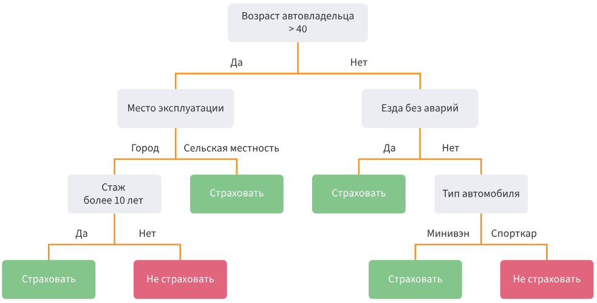

## Решающие деревья

### Интуиция

Мы рассмотрели линейные модели, которые обладают рядом важным достоинств:

- они быстро обучаются
- они способны работать с большим количеством объектов и признаков
- они имеют небольшое количество параметров
- они легко регуляризуются

Однако они могут эффективно восстанавливать только линейные зависимости между целевой переменной и признаками.

Существует семейство моделей, которые позволяют восстанавливать нелинейные зависимости произвольной сложности – **решающие деревья.**

Решающие деревья хорошо описывают процесс принятия решения во многих жизненных ситуациях. Например, вы – страховой агент и вам необходимо принять решение, страховать ли автомобиль клиента или нет. Вы проверяете, соответствует ли клиент установленным критериям:

Такой алгоритм, как и многие другие, очень хорошо описывается решающим деревом

### Формальное определение решающего дерева

(def) Рассмотрим бинарное дерево, в котором:

- каждой внутренней вершине $v$ приписана функция (или предикат) $β_v := X → {0, 1}$;
- каждой листовой вершине v приписан прогноз $c_v \in Y$ (в случае с классификацией листу также может быть приписан вектор вероятностей).

#### Как осуществляется предсказание?

Напомним, $a(x)$ – это алгоритм предсказания, “решающая функция”. Для каждого элемента выборки $x$ он стартует от корня и движется к некоторому листу. В очередной внутренней вершине $v$ проход продолжится вправо, если $B_v(x)=1$, и влево, если $B_v(x)=0$. Проход продолжается до момента, пока не будет достигнут некоторый лист, и ответом алгоритма на объекте $x$ считается прогноз $c_v$​, приписанный этому листу.

Предикат $B_v(x)$, строго говоря, может быть любой функцией, но на практике используют сравнение с порогом $t$ $\in \mathbb{R}$ по какому-то $j$-му признаку.
$$
B_v(x, j, t) = [x_j \leq t]
$$
#### Свойства решающих деревьев

- выученная функция — кусочно-постоянная, из-за чего производная равна нулю везде, где задана. Следовательно, о **градиентных методах при поиске оптимального решения можно забыть**;
- дерево решений (в отличие от, например, линейной модели) н**е сможет экстраполировать зависимости за границы области значений обучающей выборки**;
- дерево решений способно идеально приблизить обучающую выборку и ничего не выучить (то есть такой классификатор будет обладать низкой обобщающей способностью): для этого достаточно построить такое дерево, в каждый лист которого будет попадать только один объект. Следовательно, **при обучении нам надо не просто приближать обучающую выборку как можно лучше, но и стремиться оставлять дерево как можно более простым, чтобы результат обладал хорошей обобщающей способностью**.
### Построение деревьев

В идеальной ситуации мы хотим получить оптимальное дерево решений. Это такое дерево, которое демонстрирует минимальную ошибку при минимально возможной глубине. Проблема в том, что это задача является NP-полной, то есть не существует такого алгоритма, который бы решил её за полиномиальное время

!!! question "Что такое P и NP полные задачи простыми словами?"
    >**P-задачи** — это класс задач, которые можно _решить_ "быстро", то есть за полиномиальное время (например, $O(n^2)$) на обычном компьютере.
    >
    >**NP-задачи** — это класс задач, для которых можно "быстро" *проверить* правильность предложенного решения  (за полиномиальное время), но на поиск этого решения может уйти много времени (возможно, мы найдем его за экспоненциальное время).
    >
    >**NP-полные задачи** — это самые сложные задачи в классе NP. Если бы для какой-то одной NP-полной задачи нашли быстрый алгоритм решения, то и для всех остальных задач в классе NP его тоже можно было бы найти. Задача построения оптимального (самого маленького и точного) решающего дерева как раз относится к этому классу.

Тем не менее, мы все еще хотим находить “хорошие” решающие деревья, что можно сделать с помощью **жадного алгоритма**.

!!! question "Что такое жадный алгоритм?"
    >**Жадный алгоритм** — это алгоритм, который на каждом шаге принимает **локально оптимальное решение**, надеясь, что в итоге получится **глобально оптимальное** решение. Он выбирает наилучший вариант "здесь и сейчас", не задумываясь о глобально оптимальном решении.
    > В контексте построения решающего дерева это означает, что на каждой вершине мы выбираем такой признак и такое пороговое значение для предиката, при котором получается наилучшее в моменте разделение данных, попавших в данную вершину, без возможности “перестроить” её в дальнейшем.
#### Жадный алгоритм построения решающего дерева

Пусть $X$ — исходное множество объектов обучающей выборки, а $X_m$— множество объектов, попавших в текущий лист (в самом начале $X_m=X$). Тогда жадный алгоритм можно верхнеуровнево описать следующим образом:

1. Создаём вершину $v$.
2. Если выполнен *критерий остановки* $Stop(X_m)$, то останавливаемся, объявляем эту вершину листом и ставим ей в соответствие ответ $Ans(X_m)$, после чего возвращаем её.
3. Иначе: находим предикат (иногда ещё говорят *сплит*) $B_j$,$t​$, который определит наилучшее разбиение текущего множества объектов $X_m$​ на две подвыборки $X_l$​ и $X_r$​, **==максимизируя==** *критерий ветвления* $Branch(X_m, j, t)$
4. Для $X_l​$ и $X_r$​ рекурсивно повторим процедуру.

Рассмотрим ряд вспомогательных функций этого алгоритма, которые надо выбрать так, чтобы итоговое дерево было способно минимизировать $L$:

- $Ans(X_m)$ – вычисляет ответ для листа по попавшим в него объектам;
	- в случае задачи классификации — это может быть метка самого частого класса или оценка дискретного распределения вероятностей классов для объектов, попавших в этот лист;
	- в случае задачи регрессии — это может быть среднее , медиана или другой статистическая характеристика таргета;
- $Stop(X_m)$ – функция, которая решает, нужно ли продолжать ветвление или пора остановиться. Это может быть какое-то тривиальное правило: например, остановиться только в тот момент, когда объекты в листе получились достаточно однородными и/или их не слишком много.
- $Branch(X_m, feature, value)$ – функция, измеряющая, насколько хорошо предлагаемое разбиение. Чаще всего эта функция оценивает, насколько улучшится некоторая финальная метрика качества дерева в случае, если получившиеся два листа будут терминальными, по сравнению с ситуацией, когда сама исходная вершина — это лист. Выбирается такое разбиение, который даёт наиболее существенное улучшение.

Таким образом, конкретный метод построения решающего дерева определяется набором из четырёх ключевых компонент:

1. **Функция потерь ($L$):** Глобальная цель, которую дерево должно минимизировать (например, log-loss для классификации, MSE для регрессии).
2. **Критерий ветвления ($Branch$):** Локальный критерий, который на каждом шаге выбирает наилучшее разбиение, служащее прокси для минимизации $L$.
3. **Критерий остановки ($Stop$):** Правило, предотвращающее переобучение и определяющее момент прекращения роста дерева.
4. **Ответ для листа ($Ans$):** Алгоритм формирования итогового предсказания в терминальном узле.

Именно вариации этих компонент (особенно критерия ветвления $Branch$) порождают всё многообразие алгоритмов построения решающих деревьев, таких как CART, ID3, C4.5.
#### Критерии информативности

Пусть $X_m$ – множество объектов, попавших в вершину, разбиваемую на данном шаге. $X_l$ и $X_r$ – объекты, попадающие в левое и право поддерево соответственно при заданном предикате. Также у нас определена функция потерь $L(y_i, c)$, где $c \in \mathbb{R}$ – ответ дерева.

В момент, когда мы ищем оптимальное разбиение $X_m=X_l ⊔X_r$​, мы можем вычислить для объектов из $X_m$​ тот константный таргет $c$, которые предсказало бы дерево, будь текущая вершина терминальной, и связанное с ними значение исходного функционала качества $L$. А именно — константа c должна минимизировать среднее значение функции потерь:
$$
\frac{1}{|X_m|} \sum_{(x_i, y_i) \in X_m} L(y_i, c)
$$

Оптимальное значение этой величины называют **информативностью** или **impurity**.
$$
H(X_m) = \min_{c \in Y} \frac{1}{|X_m|} \sum_{(x_i, y_i) \in X_m} L(y_i, c)
$$
Она показывает, насколько хорошо объекты можно приблизить константным значением. Иными словами её значение отвечает на вопрос: как бы хорошо текущий лист предсказывал значения для элементов из X_m, будь он терминальным (т.е. последним?). Чем **меньше** это значение, тем **лучше**.

Дальше мы делаем разбиение и хотим узнать: стал ли результат более информативным? Для этого мы можем посчитать следующую разность (подробный вывод опущен):
$$
H(X_m) - \frac{|X_l|}{|X_m|}H(X_l) - \frac{|X_r|}{|X_m|} H(X_r)
$$

которую для симметрии умножают на |X_m| и получают:
$$
Branch(X_m, j, t) = |X_m| ⋅ H(X_m) - |X_l|⋅ H(X_l) - |X_r|⋅H(X_r) 
$$
Получившаяся величина не отрицательна и чем она **больше**, тем **лучше**.

##### Информативность в задаче регрессии

###### MSE

Пусть мы решаем задачу регрессии с помощью решающего дерева и в качестве функции потерь используем MSE. В таком случае информативность будет выглядеть так:
$$
H(X_m) = \min_{c \in Y} \frac{1}{|X_m|} \sum_{(x_i, y_i) \in X_m} (y_i - c)^2
$$

Зная, что для константного регрессора для минимизации MSE лучше всего возвращать среднее значение  (т.е. $c = \frac{\sum y_i}{|X_m}$), то при подстановке в формулу информативности выше имеем:

$$
H(X_m) = \min_{c \in Y} \frac{1}{|X_m|} \sum_{(x_i, y_i) \in X_m} (y_i - \overline{y})^2
$$
То есть при жадной минимизации MSE информативность — это оценка дисперсии таргетов для объектов, попавших в лист. Получается очень стройная картинка: оценка значения в каждом листе — это среднее, а выбирать сплиты надо так, чтобы сумма дисперсий в листьях была как можно меньше.
##### Информативность в задаче классификации

В задаче классификации с $K$ классами мы можем определить информативностm вершины $X_m$ через неоднородность распределения классов в этой вершине. Пусть $p_k = \frac{|X_m^{(k)}|}{|X_m|}$ — доля объектов $k$-го класса в вершине $X_m$. Тогда мы можем определить несколько критериев информативности.
###### Энтропия

Представьте, что вы тянете шары из мешка. Если в мешке шары только одного цвета, вы абсолютно уверены в результате — неопределенность равна нулю. Если цвета перемешаны равномерно, предсказать цвет следующего шара — неопределенность максимальна. Энтропия — это мера этой самой неопределенности.

Энтропия Шеннона для распределения классов в узле определяется как:
$$
H(X_m) = -\sum_{k=1}^K p_k \log_2 p_k
$$
**Свойства и пояснения к выражению:**

- Энтропия **максимальна**, когда все классы равновероятны ($p_k = 1/K$ для всех $k$). В этом случае $H_{max} = \log_2 K$. Это ситуация, при которой вершина максимально неинформативна.
- Энтропия **равна нулю**, когда все объекты в вершине принадлежат одному классу ($p_k = 1$ для какого-то $k$). Неопределенность отсутствует.
- Основание логарифма 2 обусловлено исторически (информационная теория) и дает измерение в **битах**. Можно использовать и натуральный логарифм, это не повлияет на процесс оптимизации, так как изменит значения лишь на постоянный множитель.
- С точки зрения теории вероятностей, минимизация энтропии тесно связана с **максимизацией правдоподобия** для модели, в которой метки в листе генерируются из категориального распределения. Чем чище лист, тем выше вероятность (правдоподобие) наблюдать в нем именно те метки, которые там есть.

Таким образом, используя энтропию в качестве $H(X_m)$, мы стремимся к такого рода разбиениям, которые максимально уменьшают неопределенность в дочерних узлах.
###### Критерий Джини (Gini Index)

Критерий Джини можно представить как вероятность ошибки, если мы случайным образом выберем два объекта из узла и они окажутся разных классов. Мы хотим минимизировать эту вероятность.
$$
H(X_m) = \sum_{k=1}^{K} p_k (1 - p_k) = 1 - \sum_{k=1}^{K} p_k^2
$$
**Свойства и пояснения к выражению:**

- Критерий Джини **максимален**, когда распределение классов равномерно ($p_k = 1/K$).
- Он **равен нулю** в чистой вершине ($p_k=1$ для какого-то $k$).
- На практике критерий Джини и энтропия часто приводят к очень похожим результатам. Критерий Джини вычисляется немного быстрее, так как не требует вычисления логарифмов. Энтропия же сильнее "штрафует" неоднородные, но не чистые выершины, и может порождать немного более сбалансированные деревья.
###### Ошибка классификации (Classification Error)

Это самый простой критерий, который измеряет долю неверно классифицированных объектов, если бы мы предсказывали в узле самый частый класс.
$$
H(X_m) = 1 - \max_k p_k
$$
**Свойства и пояснения к выражению:**

- Этот критерий менее чувствителен к изменениям в распределении классов по сравнению с энтропией и Джини. Например, для бинарной классификации в узле с распределением [0.6, 0.4] и [0.6, 0.4] ошибка классификации будет одинаковой (0.4), в то время как энтропия и Джини уловят разницу в "чистоте".
- Из-за этой слабой чувствительности он редко используется для построения деревьев, так как хуже направляет процесс оптимизации (жадный алгоритм может "застрять").

Независимо от выбора конкретного критерия $H$ (Энтропия, Джини), процесс ветвления остается единым: мы ищем разбиение, которое **максимизирует** величину
$$
Branch(X_m, j, t) = |X_m| \cdot H(X_m) - |X_l| \cdot H(X_l) - |X_r| \cdot H(X_r)$$
Эту величину называют **приростом информации (Information Gain)** в случае энтропии или **уменьшением примеси (Impurity Reduction)** в общем случае.
### Работа с признаками

#### Категориальные признаки

Хотя деревья могут работать с категориальными признаками, создавая сплиты вида "принадлежит ли значение множеству $C_r$", перебор всех $2^{M-1}-1$ возможных разбиений для признака с $M$ категориями вычислительно затратно. Решение этой проблемы — **упорядочивание категорий**, что позволяет работать с ними как с вещественными признаками, используя бинарные сплиты "$\leq$ порога".

Для этого в задаче **бинарной классификации** категории упорядочивают по возрастанию доли положительного класса, а в **регрессии** — по среднему значению целевой переменной. Доказано, что оптимальный сплит, найденный таким образом, будет оптимальным и среди всех возможных разбиений.

#### Работа с пропусками

Деревья могут эффективно обрабатывать пропущенные значения без необходимости предварительной импутации. **На этапе обучения** при выборе наилучшего сплита по признаку объекты с пропусками временно игнорируются. После выбора сплита эти объекты направляются в **оба дочерних узла** с весами, пропорциональными размерам этих подмножеств.

**На этапе применения** модели, если при проходе по дереву встречается пропуск в признаке, по которому нужно сделать сплит, объект аналогично отправляется по обеим ветвям. Итоговый прогноз формируется как взвешенное среднее прогнозов от всех листьев, в которые попал объект, что позволяет полноценно использовать всю доступную информацию.
## Ансамблевые модели

Прежде чем перейти к рассмотрению так называемых **ансамблей** или композиций моделей, рассмотрим математический инструмент декомпозиции ошибки предсказания модели на три состаляющие: смещение, разброс и шум.
### Bias-Variance Decomposition

Пусть:

- $X$ — обучающая выборка
- $x$ — элемент из тестового множества
- $y = f(x) + \epsilon$ — целевая зависимость ($f$ — истинная функция, $\epsilon$ — шум с дисперсией $\sigma^2$)
- $a(x, X)$ — предсказание алгоритма $a$, обученного на $X$, в точке $x$
- $\mathbb{E}_{x}$​ — среднее по всем тестовым точкам и $\mathbb{E}_{X, \epsilon}$​ — среднее по всем обучающим выборкам $X$ и случайному шуму $ϵ$

Тогда ожидаемая ошибка по всем возможным выборкам $X$ и шуму $\epsilon$ равна:

$$
% Ожидаемая ошибка
Q(a) = \mathbb{E}_{x} \mathbb{E}_{X, \epsilon} \left[ y(x, \epsilon) - a(x, X) \right]^2
$$

Эту ошибку можно разложить на три компоненты:

$$
% Bias-Variance Decomposition
Q(a) = \underbrace{\mathbb{E}_{x} \left[ \text{bias}_X^2 a(x, X) \right]}_{\text{Смещение}} + \underbrace{\mathbb{E}_{x} \left[ \mathbb{V}_{X} \left[ a(x, X) \right] \right]}_{\text{Разброс}} + \underbrace{\sigma^2}_{\text{Шум}}
$$

где:

- **Смещение**: $\text{bias}_X a(x, X) = f(x) - \mathbb{E}_{X} \left[ a(x, X) \right]$ — среднее отклонение предсказаний от истинного значения
- **Разброс**: $\mathbb{V}_{X} \left[ a(x, X) \right] = \mathbb{E}_{X} \left[ \left( a(x, X) - \mathbb{E}_{X} \left[ a(x, X) \right] \right)^2 \right]$ — вариативность предсказаний при разных обучающих выборках
- **Шум**: $\sigma^2 = \mathbb{E}_{x} \mathbb{E}_{\epsilon} \left[ (y(x, \epsilon) - f(x))^2 \right]$ — неустранимая ошибка данных

 Шум невозможно устранить, но на две другие компоненты можно повлиять. Часто попытка уменьшить смещение путем усложнения модели увеличивает разброс, и наоборот. Далее мы рассмотрим с вами подход к решению этой задачи.
### Интуиция: от теоремы Кондорсе к ансамблям

**Теореме Кондорсе о присяжных** гласит, что если **каждый** член жюри (коллегии присяжных) имеет **независимое** мнение и вероятность вынести верный вердикт **больше $\frac{1}{2}$**, то коллективное решение большинства будет более точным, чем решение любого отдельного члена.

Следуя этой интуиции, можно прийти к идее объединения алгоритмов машинного обучения в **ансамбли** (композиции). Далее мы рассмотрим, как различные способы объединения моделей помогают уменьшить смещение или разброс предсказаний.

Существует несколько наиболее популярных вариантов объединения алгоритмов в ансамбли: бэггинг, случайный лес и бустинг. Рассмотрим их по порядку.
### Бэггинг

#### Определение

**Бэггинг** (Bagging - Bootstrap Aggregation) — это метод построения ансамблей, направленный на **уменьшение разброса предсказаний без увеличения смещения.**

Алгоритм бэггинга:

1. Из исходной обучающей выборки размера $n$ генерируется $k$ **бутстреп-выборок** $X_1, \dots, X_k$ путем выборки с возвращением (каждая выборка также имеет размер $n$)
2. На каждой бутстреп-выборке $X_i$ обучается **базовая модель** $b_i(x) = b(x, X_i)$ с помощью некоторого алгоритма $b$
3. Итоговое предсказание ансамбля получается **усреднением** предсказаний всех базовых моделей: $a(x) = \frac{1}{k} \sum_{i=1}^{k} b_i(x)$

#### Влияние на смещение и разброс

**Смещение** ансамбля равно смещению отдельной базовой модели

$$
\begin{aligned}
\text{bias}_X a(x,X) &= f(x) - \mathbb{E}_X [a(x,X)] \\
&= f(x) - \mathbb{E}_X \left[ \frac{1}{k} \sum_{i=1}^{k} b(x,X_i) \right] \\
&= f(x) - \frac{1}{k} \sum_{i=1}^{k} \mathbb{E}_X [b(x,X_i)] \\
&= f(x) - \mathbb{E}_X b(x,X) = \color{RED} \text{bias}_X b(x,X)
\end{aligned}
$$

**Разброс** ансамбля зависит от ковариации между базовыми моделями:

$$
\begin{aligned}
\mathbb{V}_X [a(x,X)] &= \frac{1}{k^2} \sum_{i=1}^{k} \mathbb{V}_X b(x,X_i) + \frac{1}{k^2} \sum_{i \neq j} \text{cov}(b(x,X_i), b(x,X_j)) \\
&= \frac{1}{k} \mathbb{V}_X b(x,X) + \frac{k-1}{k} \cdot \text{cov}(b(x,X_i), b(x,X_j))
\end{aligned}
$$

Если базовые модели **некоррелированы**, разброс уменьшается в $k$ раз:

$$
\mathbb{V}_X [a(x,X)] = \color{RED} \frac{1}{k} \mathbb{V}_X b(x,X)
$$

Таким образом:

- Бэггинг **не уменьшает смещение** — оно остается таким же, как у базового алгоритма
- Бэггинг **уменьшает разброс** за счет усреднения предсказаний множества моделей
- Максимальное уменьшение разброса достигается при **независимости** базовых моделей
- На практике базовые модели часто коррелированы, поэтому реальное уменьшение разброса меньше теоретического максимума

Это делает бэггинг особенно эффективным для **неустойчивых** алгоритмов (например, решающих деревьев), чьи предсказания сильно зависят от обучающей выборки.

### Случайный лес

Случайный лес развивает идею бэггинга, решая его ключевую проблему — **корреляцию между деревьями** в ансамбле. В то время как в обычном бэггинге деревья, обученные на пересекающихся выборках, часто оказываются коррелированными, случайный лес вводит дополнительный источник случайности — **метод случайных подпространств** (Random Subspaces).

Алгоритм построения случайного леса:

1. Для каждого дерева $i$:
    - Генерируется **бутстреп-выборка** $X_i$ того же размера, что и исходная выборка $X$
    - В процессе обучения дерева в каждой вершине **случайно выбирается подмножество признаков** размера $n < N$ (где $N$ — полное число признаков)
    - Среди выбранных признаков ищется оптимальный сплит
2. Предсказание ансамбля получается **усреднением** (регрессия) или **голосованием** (классификация) предсказаний отдельных деревьев

#### Математическое обоснование

В случайном лесу базовый алгоритм зависит от двух источников случайности: обучающей выборки $X_i$ и случайного выбора признаков $\Theta_i$:
$$
b_i(x)=b(x,X_i,Θ_i)
$$
##### Влияние на разброс

Выражение для разброса ансамбля с учетом случайности признаков:

$$
\begin{aligned}
\mathbb{V}[a(x)] &= \mathbb{V}_{X,\Theta} \left[ \frac{1}{k} \sum_{i=1}^{k} b(x, X_i, \Theta_i) \right] \\
&= \frac{1}{k} \mathbb{V}_{X,\Theta}[b(x,X,\Theta)] + \frac{k-1}{k} \cdot \rho \cdot \mathbb{V}_{X,\Theta}[b(x,X,\Theta)]
\end{aligned}
$$

где $\rho$ — средняя корреляция между деревьями.

Случайное подпространство признаков значительно уменьшает ковариацию между деревьями:
$$
\text{cov}(b(x, X_i, \Theta_i), b(x, X_j, \Theta_j)) \ll \text{cov}(b(x, X_i), b(x, X_j))
$$

Это происходит из-за того, что даже при пересекающихся бутстреп-выборках, разные случайные наборы признаков приводят к построению различных деревьев, принимающих решения на основе разных подмножеств признаков.
##### Влияние на смещение

Случайное подпространство может незначительно увеличить смещение:
$$
\text{bias}[a(x)] = f(x) - \mathbb{E}_{X,\Theta}[a(x)] \geq \text{bias}[b(x,X)]
$$

Ограничение доступных признаков в каждом узле может помешать дереву найти оптимальный сплит, делая каждое отдельное дерево "слабее". Однако на практике это увеличение смещения обычно незначительно и перевешивается существенным уменьшением разброса.
#### Ключевые гиперпараметры и их настройка

##### Глубина деревьев

Какой стоит выбрать глубины обучающего дерева? Существует эмпирическое правило:

- **Неглубокие деревья**: низкая дисперсия и высокое смещение
- **Глубокие деревья**: высокая дисперсия и низкое смещение

Поскольку бэггинг уменьшает разброс, в случайном лесу используют **глубокие деревья** — их высокий разброс компенсируется ансамблированием, а низкое смещение сохраняется.
##### Количество признаков для сплита

Сколько признаков мы должны случайно отбирать? Ограничение числа признаков управляет корреляцией между деревьями:

- **Больше признаков** → выше корреляция → слабее эффект ансамблирования
- **Меньше признаков** → отдельные деревья слабее.

Практические рекомендации:

- Для **классификации**: $\sqrt{N}$ признаков
- Для **регрессии**: $N/3$ признаков

##### Количество деревьев

Теоретически увеличение количества деревьев $k$ уменьшает разброс:
$$
\mathbb{V}_X [a(x,X)] = \frac{1}{k} \mathbb{V}_X b(x,X) + \frac{k-1}{k} \cdot \text{cov}(b(x,X_i), b(x,X_j))
$$
На практике количество деревьев выбирают, выполняют следующие действия

- Строят график ошибки от количества деревьев
- Останавливаются, когда ошибка перестает значимо уменьшаться
- Учитывают вычислительные ограничения (хотя алгоритм хорошо распараллеливается)

Случайный лес демонстрирует, что для эффективного ансамблирования достаточно сделать базовые алгоритмы **достаточно разнообразными**, а не строго независимыми.
### Бустинг
#### Основная идея

В отличие от бэггинга, где базовые алгоритмы обучаются **параллельно и независимо**, бустинг использует **последовательный** подход. Каждый следующий базовый алгоритм в бустинге специально обучается для исправления ошибок, сделанных предыдущими алгоритмами ансамбля. Как следствие, **итоговая композиция будет иметь меньшее смещение, чем каждый отдельный базовый алгоритм** (хотя уменьшение разброса также может происходить).

Поскольку основная цель бустинга — уменьшение смещения, в качестве базовых алгоритмов часто выбирают алгоритмы с высоким смещением и небольшим разбросом.

Рассмотрим подробнее, как работает данный вид ансамблирования на примере самого популярной его реализации – **градиентного бустинга**.
## Градиентный бустинг

Для интуитивного понимания идеи, стоящей за градиентным бустингом, можно поразмышлять над двумя аналогиями:

1. Представьте, что гольфист пытается загнать мяч в лунку. Первый удар (первая модель) перемещает мяч из начального положения ближе к цели, но не точно в лунку. Каждый следующий удар (последующая модель) корректирует положение мяча, учитывая ошибки предыдущих ударов. Удары становятся все более аккуратными и целенаправленными, пока мяч не окажется в лунке.
2. Любую сложную функцию можно приблизить суммой более простых функций. Первое слагаемое дает грубое приближение, каждое следующее уточняет его. Аналогично в градиентном бустинге: первая модель грубо приближает целевую зависимость, а каждая последующая корректирует ошибки предыдущих, постепенно улучшая общее предсказание.

#### Неформальное определение

Градиентный бустинг — это метод построения ансамбля моделей, где:

- Модели строятся **последовательно** (в отличие от параллельного построения в бэггинге)
- Каждая следующая модель учится **предсказывавать ошибки** предыдущих моделей
- Общее предсказание является **взвешенной суммой** предсказаний всех моделей
- Процесс *напоминает* **градиентный спуск** в пространстве функций
#### Объяснение на примере задачи регрессии

Рассмотрим задачу регрессии с квадратичной функцией потерь:

$$
L(y, a(x)) = \frac{1}{2} \sum_{i=1}^{N} (y_i - a(x_i))^2 \to \min
$$
Мы строим композицию из $K$ базовых алгоритмов (например, решающих деревьев):

$$
a(x) = a_K(x) = \sum_{k=1}^{K} b_k(x)
$$

**Шаг 1:** Обучаем первую модель $b_1(x)$ для минимизации ошибки на исходных данных:
$$
b_1(x) = \arg\min_{b \in B} L(y, b(x))
$$
**Шаг 2:** Вычисляем ошибку первой модели:

$$
s_i^1 = y_i - b_1(x_i)
$$

**Шаг 3:** Обучаем вторую модель $b_2(x)$ для предсказания этой ошибки:

$$
b_2(x) = \arg\min_{b \in B} L(s^1, b(x))
$$
Теперь композиция двух моделей дает улучшенное предсказание:

$$
a_2(x_i) = b_1(x_i) + b_2(x_i) \approx b_1(x_i) + (y_i - b_1(x_i)) = y_i
$$
**Шаг *k*:** На каждом последующем шаге мы обучаем модель для предсказания ошибки текущей композиции:

$$
s_i^{k-1} = y_i - a_{k-1}(x_i)
$$
$$
b_k(x) = \arg\min_{b \in B} L(s^{k-1}, b(x))
$$
И обновляем композицию:
$$
a_k(x) = a_{k-1}(x) + b_k(x)
$$
Этот процесс продолжается до тех пор, пока не будет построено $K$ моделей или пока ошибка не перестанет существенно уменьшаться.

#### Обобщение на другие функции потерь

##### Интуиция

Для квадратичной функции потерь мы просто предсказывали ошибку. Но как быть с другими функциями потерь? Идея градиентного бустинга заключается в том, чтобы использовать **градиенты** функции потерь по текущим предсказаниям как целевые значения для следующей модели.

Рассмотрим задачу регрессии с квадратичной функцией потерь. Производная функции потерь по предсказанию $z = a_k(x_i)$ равна:

$$
\frac{\partial L(y_i, z)}{\partial z} \bigg|_{z=a_k(x_i)} = \frac{\partial}{\partial z} \frac{1}{2}(y_i - z)^2 \bigg|_{z=a_k(x_i)} = a_k(x_i) - y_i
$$

Таким образом, разность, на которую обучается $k$-й алгоритм, выражается через производную:

$$
s_i^k = y_i - a_k(x_i) = -\frac{\partial L(y_i, z)}{\partial z} \bigg|_{z=a_k(x_i)}
$$

Это наблюдение позволяет обобщить подход на произвольные дифференцируемые функции потерь. Вместо обучения на разности $s_i^k$ мы обучаем на антиградиент функции потерь:

$$
-g_i^k = -\frac{\partial L(y_i, z)}{\partial z} \bigg|_{z=a_k(x_i)}
$$

Такой подход оптимален с точки зрения минимизации функции потерь, поскольку движение в направлении антиградиента обеспечивает наискорейшее уменьшение ошибки.
##### Формальное обоснование

Пусть $L$ — дифференцируемая функция потерь, а наша модель $a(x)$ представляет собой композицию базовых алгоритмов:

$$
a(x) = a_K(x) = \sum_{k=1}^K b_k(x)
$$

Мы строим композицию жадным образом:

$$
a_k(x) = a_{k-1}(x) + b_k(x)
$$

где каждый новый базовый алгоритм выбирается для улучшения текущей композиции:

$$
b_k = \arg\min_{b \in B} \sum_{i=1}^N L(y_i, a_{k-1}(x_i) + b(x_i))
$$

Рассмотрим разложение Тейлора функции потерь до первого порядка:

$$
L(y_i, a_{k-1}(x_i) + b(x_i)) \approx L(y_i, a_{k-1}(x_i)) + b(x_i) \cdot \frac{\partial L(y_i, z)}{\partial z} \bigg|_{z=a_{k-1}(x_i)}
$$

Обозначив $g_i^{k-1} = \frac{\partial L(y_i, z)}{\partial z} \big|_{z=a_{k-1}(x_i)}$, получаем:

$$
b_k \approx \arg\min_{b \in B} \sum_{i=1}^N b(x_i) \cdot g_i^{k-1}
$$

Это выражение минимизируется, когда $b(x_i)$ пропорциональны $-g_i^{k-1}$. Следовательно, на каждом шаге базовый алгоритм обучается приближать антиградиент функции потерь.
##### Особые случаи и примеры

- **Квадратичная потеря**: $g_i = a_k(x_i) - y_i$ (антиградиент совпадает с остатком)
- **Абсолютная потеря**: $g_i = \text{sign}(a_k(x_i) - y_i)$
- **Логистическая потеря**: $g_i = \sigma(a_k(x_i)) - y_i$, где $\sigma$ — сигмоида
- **Poisson loss**: $g_i = \exp(a_k(x_i)) - y_i$
#### Обучение базового алгоритма

На каждом шаге $k$ базовый алгоритм обучается на выборке $(x_i, -g_i^{k-1})$. Для построения решающего дерева используется критерий ветвления:

$$
|R| \cdot S(R) - |R_{\text{right}}| \cdot S(R_{\text{right}}) - |R_{\text{left}}| \cdot S(R_{\text{left}}) \to \max
$$

где $S(R)$ — оценочная функция, например:

- **L2-ошибка**: $S(R) = \frac{1}{|R|} \sum_{i \in R} (p_i - g_i)^2$
- **Косинусное расстояние**: $S(R) = -\frac{\sum_{i \in R} (p_i \cdot g_i)}{\sqrt{\sum_{i \in R} p_i^2} \cdot \sqrt{\sum_{i \in R} g_i^2}}$

#### Скорость обучения (Learning Rate)

Для предотвращения переобучения вводится темп обучения $\eta \in (0,1]$:

$$
a_k(x) = a_{k-1}(x) + \eta \cdot b_k(x)
$$

Меньший темп обучения требует больше итераций, но улучшает обобщающую способность. В современных реализациях (например, CatBoost) темп обучения может выбираться автоматически.