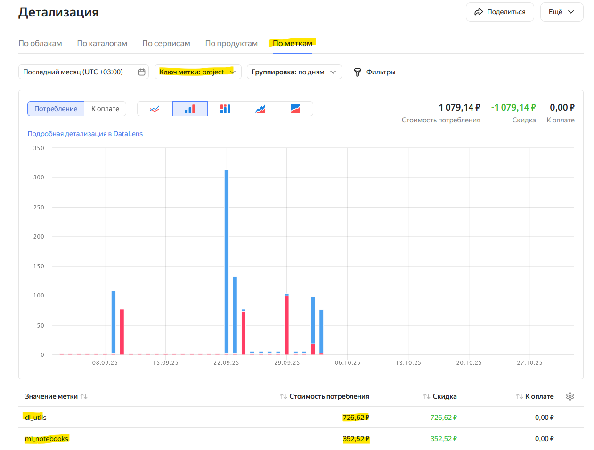
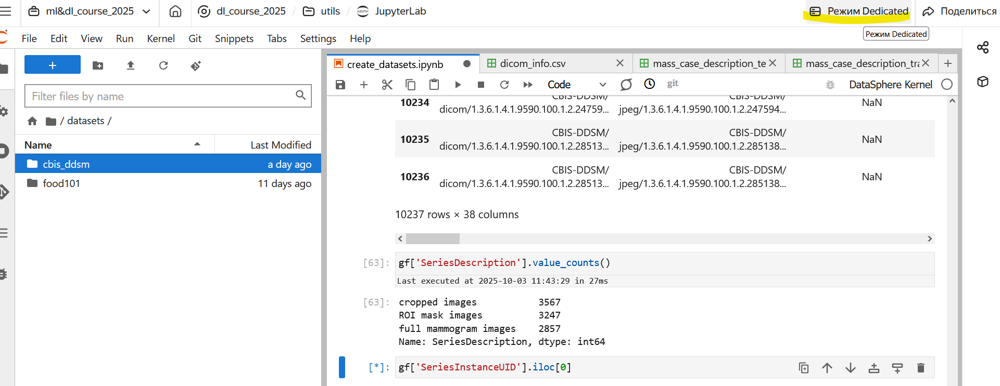
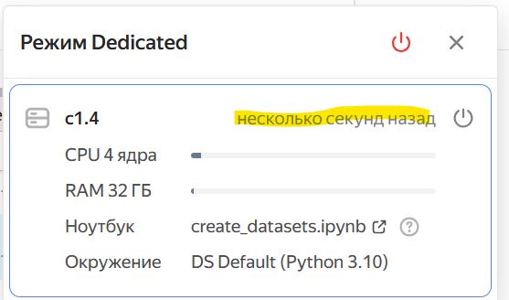

> [!WARNING] **Инструкция требует обновления.**
> На осенний семестр 2026 года грантовый доступ к Yandex DataSphere для текущих курсов пока не предоставлен, а интерфейс и порядок работы сервиса заметно изменились. Шаги ниже перенесены из предыдущей версии курса и могут не соответствовать текущему интерфейсу.
>
> Эта страница относится к прежней схеме грантового доступа и сейчас не является рабочей инструкцией. Ссылки на бюджет, биллинг и чат относятся к прежнему курсу.

> [!DANGER] Проблемы при просмотре биллинга
> Описанный ниже способ, как выяснилось, не позволяет увидеть потраченные командой денежные средства. Ведется поиск решения совместно с сотрудниками Яндекса. Для того, чтобы узнать текущее состояние расходов, тегайте преподавателя курса, Зайцева Максима Дмитриевича (@maxim_zaitsev_808) в топике чата QoS с просьбой прислать скриншот таблицы.

Все вычисления в Yandex Datasphere платны и тарифицируются в юнитах по секундам. Для удобства мы будем пользоваться расчетами в рублях.

Для ML и DL команд предусмотрен разный по объему бюджет. Ознакомиться с ним вы можете в [этой ](https://docs.google.com/spreadsheets/d/18szuAMfHX7eutEyAnh9Mp5CDoFQMPBuX5ghKRFiepq8/edit?usp=sharing)google-таблице.

Для контроля расхода средств вы можете заходить на страницу [биллинга ](https://center.yandex.cloud/billing/accounts/dn2319f25dib6gq08fne/detail?tab=label)с детализированным дашбордом. Для каждого проекта создана своя метка типа

```
project: {your_team_name}-{ml | dl}

```

Через некоторое время после того, как вы начнете тратить средства, в дашборде появится значение метки вашего проекта, как на картинке ниже:



## Как не потратить все деньги за 10 секунд?

1. Пользуйтесь дешевыми cpu-средами для отладки вашего кода;
2. Пользуйтесь рекомендованными средами выполнения, указанными в таблице бюджета на команду;
3. Следите за временем работы среды через специальное окно в правом верху интерфейса Jupyter Lab

   
