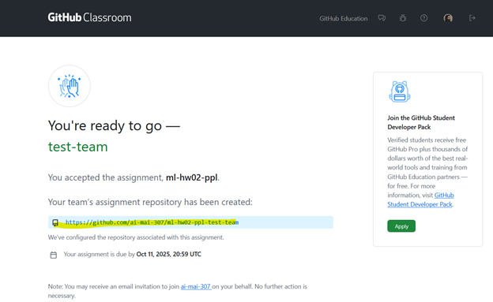
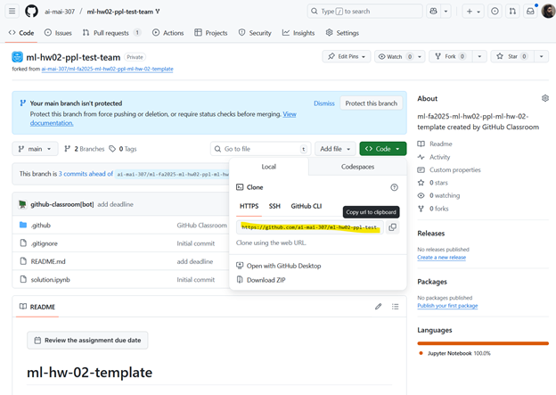
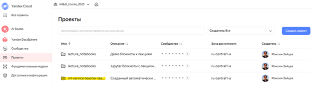
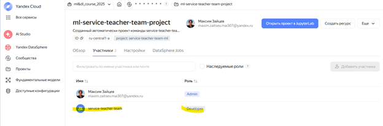
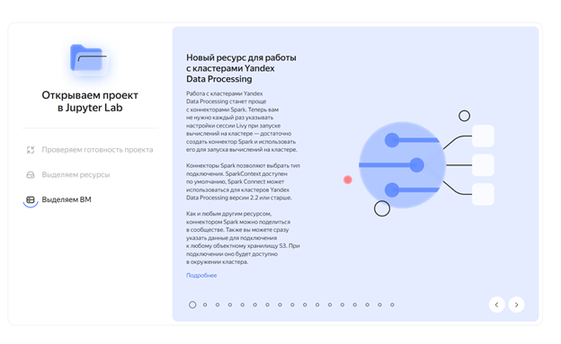
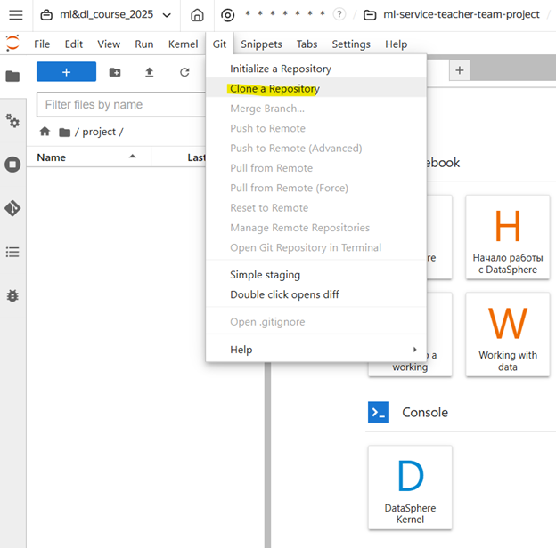
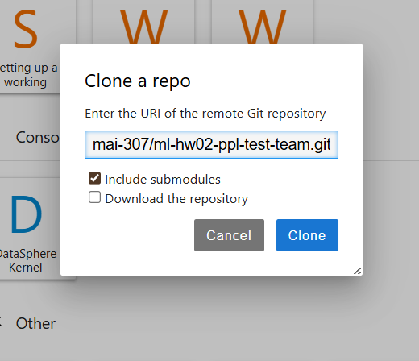
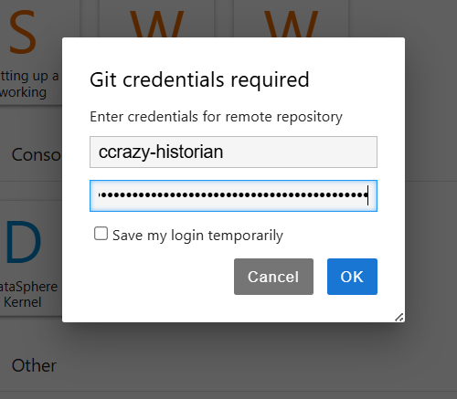
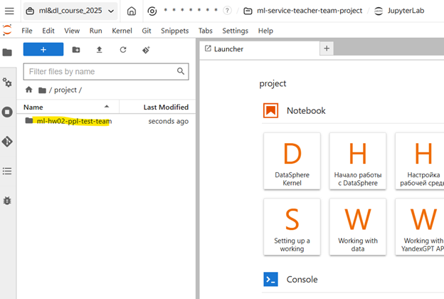
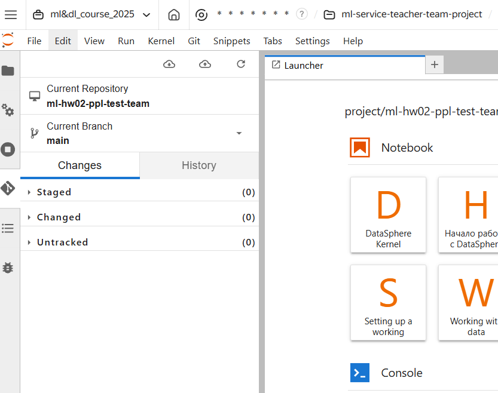

> [!WARNING] **Инструкция требует обновления.**
> На осенний семестр 2026 года грантовый доступ к Yandex DataSphere для текущих курсов пока не предоставлен, а интерфейс и порядок работы сервиса заметно изменились. Шаги ниже перенесены из предыдущей версии курса и могут не соответствовать текущему интерфейсу.

1. Принимаете задание в GitHub Classroom, кликнув на ссылку, которую я прикладываю в топике “Инфо” нашего чата;
2. Автоматически создается репозиторий в рамках GitHub организации;
3. Нажимаете зеленую кнопку “Clone”, раздел HTTPS, копируете строку;
4. Открываете Yandex Datasphere, нажимаете на левой панели вкладку “Проекты”, находите свой;
5. Нажимаете на вкладку “Участники”, чтобы увидеть, что ваша команда имеет роль “Developer”;
6. Открываете проект и ждете некоторое время, пока он откроется;
7. В открывшемся интерфейсе Jupyter Lab на верхней панели нажимаете вкладку “Git”, затем “Clone Repository”;
8. В открывшемся окне вводите ссылку, которую вы скопировали на шаге 3. этой инструкции;
9. Вводите свой ник и GitHub токен, который вы можете найти в сообщении чата по  [ссылке](https://t.me/c/3075180202/7/308);
10. После этого вы увидете в корне вашего проекта склонированный репозиторий;
11. Перейдите в директории склонированного репозитория и нажмите значок Git на левой панели – это GUI интерфейс работы с Git в рамках Yandex Datasphere.
