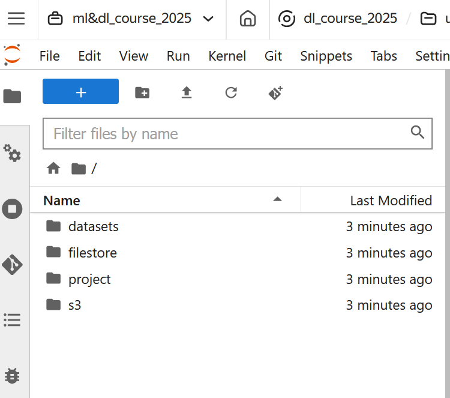
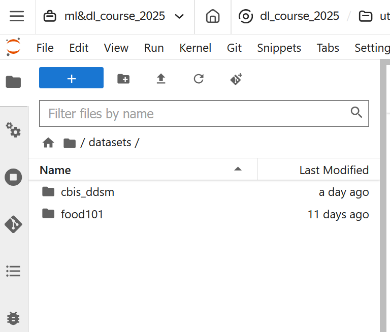
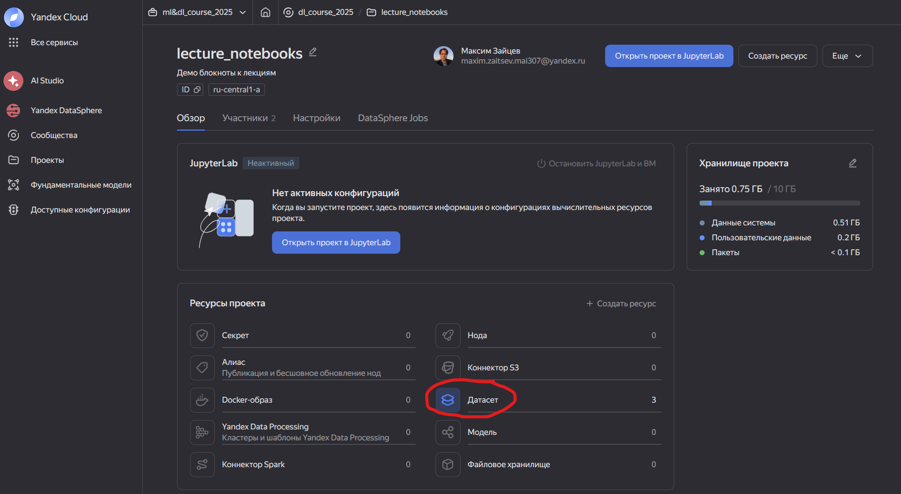
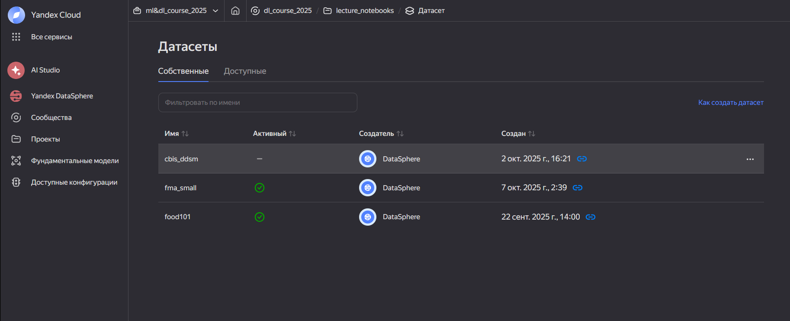
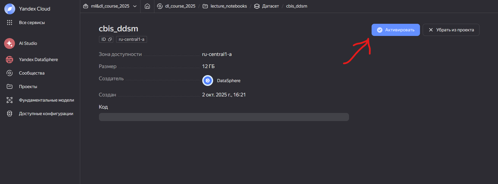

> [!WARNING] **Инструкция требует обновления.**
> На осенний семестр 2026 года грантовый доступ к Yandex DataSphere для текущих курсов пока не предоставлен, а интерфейс и порядок работы сервиса заметно изменились. Шаги ниже перенесены из предыдущей версии курса и могут не соответствовать текущему интерфейсу.

*Датасет в DataSphere* — это механизм хранения информации, который предоставляет быстрый доступ к большим объемам данных.

Все данные, которые будут нужны для выполнения практических заданий, будут доступны как датасеты. Для вас они будут выглядеть как примонтированная директории.





* project -- директория вашего проекта в Yandex Datasphere
* **datasets** -- точка монтирования датасетов

Перед тем, как начать работу с датасетом, убедитесь, что он доступен для вашего проекта и активирован. Для этого откройте панель управления вашиего проекта и в секции ресурсов нажмите кнопку "Датасеты".



- Если вы не видите датасет, который вам нужен для выполнения работы -- напишите преподавателю.
- Если датасет, который вам нужен, не активирован (нет зеленой галочки), нажмите на него и активируйте по нажатию синей кнопки в правом верху:

Проверить доступность датасета можно как в интерфейсе Jupyer Lab, перейдя в директории и найдя там файлы, так и из кода следующим образом:

```python
from pathlib import Path

DATASET_PATH = '/home/jupyter/datasphere/datasets/{DATASET_NAME}'

Path(DATASET_PATH).is_dir()
```

Подробнее про датасеты вы можете узнать из [документации](https://yandex.cloud/ru/docs/datasphere/concepts/dataset).
