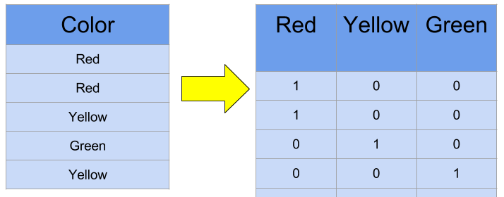
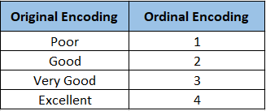
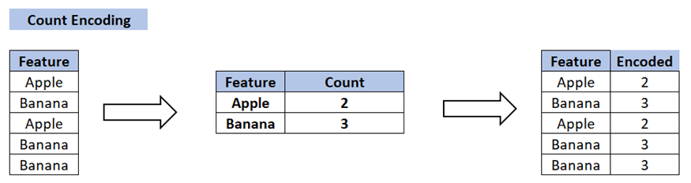
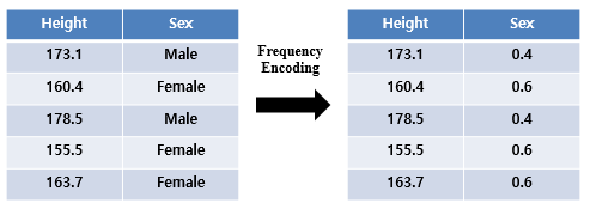

Алгоритмы машинного обучения могут "воспринимать" только числовую форму представления данных, поэтому категориальные признаки необходимо преобразовать одним из описанных ниже спопобов:

## Основные методы

**One-Hot Encoding**: создание бинарных признаков для каждой категории.

Для признака "Цвет" с уникальными значениями ["красный", "синий", "зелёный"] мы создаём три бинарных признака.

**Ordinal Encoding**
Назначение целого числа каждой категории с учетом отношением порядка. Такой способ кодирования стоит использовать только в том случае, если порядок действительно существует и важен (как в примере ниже).

Но что делать, когда количество уникальных значений для одного признака **слишком** велико? Например, сотни и даже тысячи.

**Count Encoding**

Признак примет такое числовое значение, сколько он раз встречается в выборке, т.е.

$$
CE (x_i) = n_{x_i}
$$

**Frequency Encoding**

Признак числовое значение, равное доле объектов с этим признаков среди всех в выборке.

$$
FE (x_i) = \frac{n_{x_i}}{N}
$$

---

[Обзор раздела](../)

[Предыдущая тема: Масштабирование и нормализация данных](../scaling/)

[Следующая тема: Обработка временных признаков](../temporal-features/)
