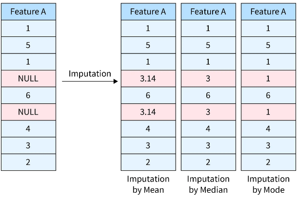
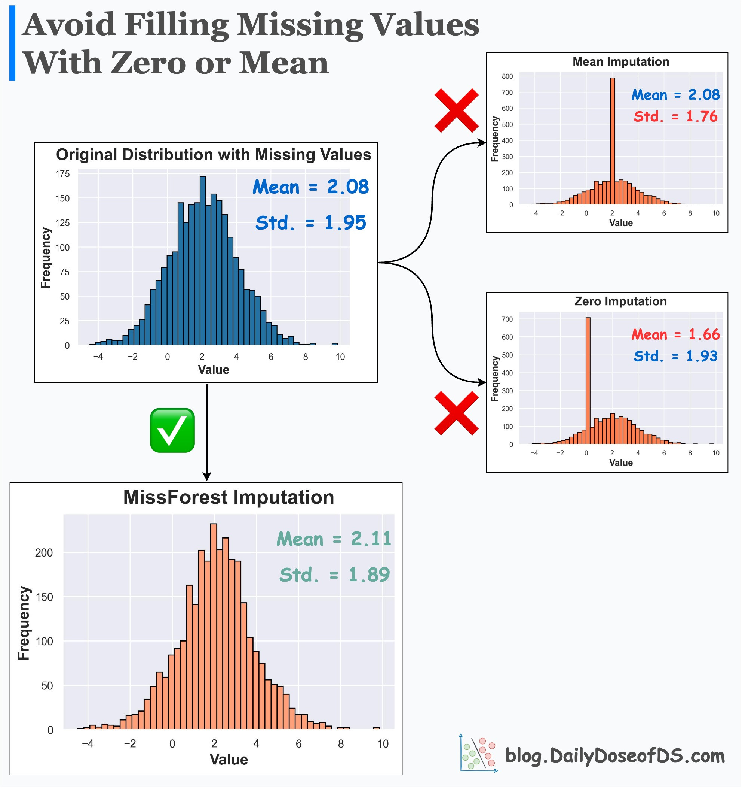
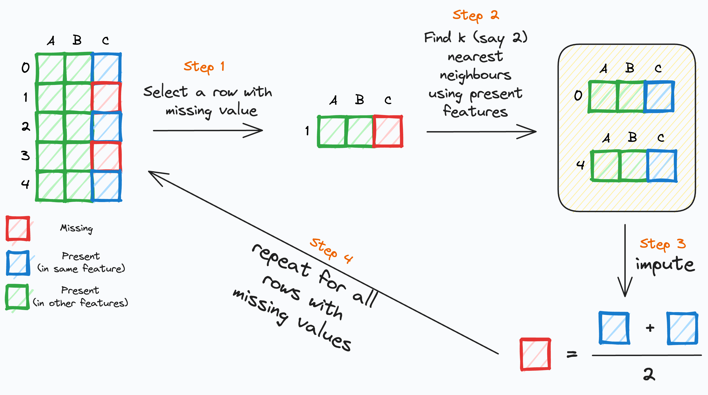
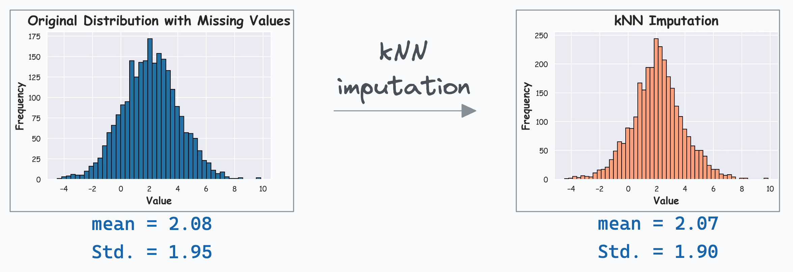

Пропущенное значение в таблице чаще всего обозначается как NaN, появление которых в процессе приведет к вычислительной ошибке. В отличие от выбросов, факт наличия пропущенных определяется быстро и однозначно. Существует несколько способов их обработки. 

## **Удаление строк или столбцов**

Мы можем удалить объект из выборки с пропущенным признаком или весь признак целиком по предопределенным критериям, например:

- процент пропусков в столбце < 5 % для числовых признаков;
- строка содержит > 50 % NA или наблюдается дубликаты в других колонках.

Однако есть риск потерять потенциально важный информативный признак для подгруппы объектов в выборке.

**Заполнение простыми статистиками (Простые импутации, Simple Imputations)**

Пропущенное значение можно заменить каким-нибудь другим, например, простыми статистическими характеристиками.

- **Для числовых признаков**:
    - медиана (устойчива к выбросам),
    - среднее,
    - константа
- **Для категориальных**:
    - мода (самое частое значение)
    - константа (например "missing”), таким образом мы говорим, что отсутствие значение признака  и есть сам признак.

Однако у такого просто подхода есть проблема: мы можем существенно искажать реальное распределение данных, что потенциально может привести к искаженным предсказаниям модели.

Перед рассмотрением альтернативного способа обработать пропущенные значения введем их классификацию:

1. Missing Competely At Random (MCAR): вероятность пропуска вообще не зависит от наблюдаемых данных, т.е. $P(R | X_{obs}, X_{mis}) = P(R)$, где $R$ -- индикатор пропуска. Пример: при выгрузки таблицы часть строк случайным образом исказилась ввиду непредвиденной ошибки
2. Missing At Random (MAR): вероятность пропуска зависит от наблюдаемых (непропущенных) величин, т.е. $P(R | X_{obs}, X_{mis}) = P(R | X_{obs})$. Пример: поле “доход” в таблице чаще всего отсутствует у людей, кто его еще не получает, например, пенсионеров или лиц младше 18
3. Missing Not At random (MNAR): вероятность зависит от ненаблюдаемых (пропущенных) величин, т.е. P(R | X_{obs}, X_{mis}). Пример: екоторые люди сознательно не указывают свой уровень дохода, считая его слишком маленьким или, наоборот, большим

Первый тип легко обрабатывается методом простых импутаций, третий является сложным случаем, несколько слов о том, что с ним делать, будет сказано ниже.

Со вторым типом пропусков можно эффективно работать при помощи метода так называемых модельных импутаций. Мы рассмотрим конкретный метод, применяющий алгоритм поиска k ближайших соседей (k-nearest neighbours, kNN).

Алгоритм kNN для импутации находит группу наиболее схожих объектов среди всего множества данных и использует их для предсказания возможного значения пропуска.

**Шаги алгоритма: включает:**

1. Выбираем строку с пропущенным значением.
2. Находим **k** ближайших соседей по непропущенным значениям.
3. Импутируем пропущенный признак строки , используя соответствующие пропущенные значения k ближайших соседей.
4. Повторяем для всех строк с пропущенными значениями.

## Пару слов о MNAR (Missing Not At Random)

Случай **MNAR** означает, что вероятность пропуска зависит от **самого значения**, которое мы не наблюдаем. Поэтому пропуск становится **информативным событием**: факт того, что значение отсутствует, уже несёт смысл.

Простые импутации в случае MNAR часто приводит к **смещению**: мы систематически занижаем или завышаем распределение признака, потому что пропущенные значения *не похожи* на наблюдаемые. Например, если люди скрывают высокие доходы, то медианная импутация сделает "скрытые" доходы слишком маленькими.

Кроме того, в MNAR часто возникает **проблема неидентифицируемости**: по одним только данным нельзя однозначно восстановить, *какими были* пропущенные значения, потому что механизм пропуска зависит от того, чего мы не видим.

### Так что же с этим делать?

В прикладной статистике для MNAR используют семейства моделей, которые **явно включают механизм пропусков**:

- **Selection models:** моделируют совместно данные и вероятность наблюдения $p(y\mid x)\,p(r\mid y,x)$.
- **Pattern-mixture models:** моделируют распределение данных по паттернам пропусков $p(r\mid x)\,p(y\mid r,x)$.
- **Shared-parameter models:** вводят латентный фактор, влияющий и на $y$, и на $r$.

Эти подходы применимы, но требуют **сильных допущений** или дополнительно источника данных (как можно догадаться, такое бывает редко).

### Практические приёмы в задачах машинного обучения

Если наша цель — **качество предсказания, выделение общей закономерности**, а не исследованих данных само по себе , часто используют более прагматичные стратегии:

1. **Индикатор пропуска**: добавляем бинарный признак `is_missing_*`, чтобы модель могла использовать сам факт пропуска как сигнал;
2. **Импутация константой + индикатор**: заполняем пропуск специальным значением (например, `-1` или `0`), **которое не встречается в корректных данных** или лежит вне допустимого диапазона.  
3. **“Отдельная категория” для категориальных признаков**: для категориальных признаков можно создать категорию `"MISSING"` — это часто лучше, чем пытаться восстановить “правильную” категорию.
4. **Анализ чувствительности (sensitivity analysis)**: пробуем несколько сценариев: например, считаем, что пропущенные доходы “в среднем выше на 10%/20%”, и проверяем, насколько меняются метрики и выводы. Это честный способ показать, что модель устойчива к MNAR-допущениям.

> Подчеркнем еще рах: при MNAR такие эвристики чаще подходят именно для **задач прогнозирования**. Если цель — выявить причины, сделать статистические оценки и интерпретировать данные, то обычно требуется явное моделирование механизма пропусков или дополнительные данные.

---

[Обзор раздела](../)

[Предыдущая тема: Выявление и выбросов аномалий в данных](../outliers/)

[Следующая тема: Sklearn-api](../sklearn-api/)
