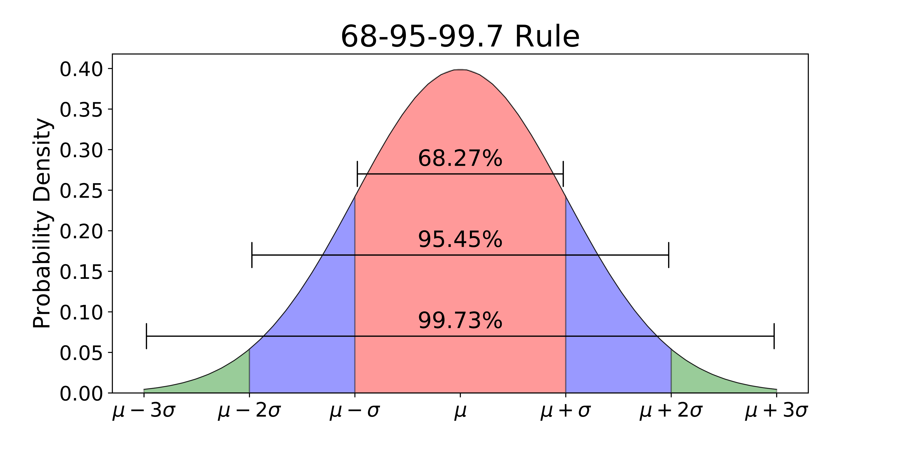
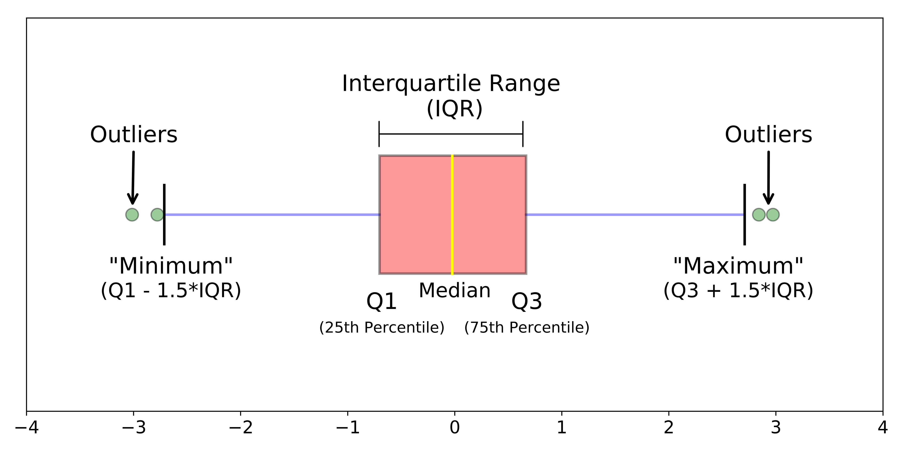

(def) **Аномалии (выбросы)** — это экстремальные значения во входных данных, которые находятся далеко за пределами других наблюдений. Выбросы во входных данных могут исказить и нарушить процесс обучения алгоритмов.

Важно понимать, что выбросы (в большинстве случаев) – это **реальные** наблюдения, которые имели место в действительности. В этом заключается их отличие от ошибок разметки.

## Способы определения выбросов

Рассмотрим два наиболее простых способа **найти** выбросы в данных.

### Правило трех сигм

Если рассматриваемый признак имеет нормальное распределение, т.е. $x\sim\mathcal N(\mu,\sigma^2)$, то ~ 99.7% наблюдений лежат в $\mu-3\sigma,\,\mu+3\sigma$. Значения за пределами с большой вероятностью можно считать выбросами.

## Что делать с выбросами?

Обнаружив выбросы, мы можем принять одно из возможных решений:

1. Удалить строки, значение признака которых определено как выброс. Это нормальное решение в случае, если доля таких строк наверняка (например, 1-5%). Однако в таком случае мы рискуем исключить из обучающих данных релевантную и важную для последющего принятия решений информацию (например, из списка пользователей-донатеров в мобильной игре будут исключены все так называемые "киты", т.е. те пользователи, которые делают большие суммы пожертвований);
2. Заменить значение признаков, принятые за выброс, каким-нибудь другим: например, средним по признаку, медианой, модой (самым частым значением и т.д.). Таким образом, мы не исключаем эти объекты целиком из обучающей выборки, но тем самым искажем распределение данных, что может негативно сказаться на результатах обучения;
3. ВНести дополнительный признак в данные -- "коэффициент аномальности". Значением этого признаки может быть доля признаков, признанных как аномальный. Например, если у каждой строки в таблице 10 признаков, а 2 из них -- аномальные, то значение этого коэффициента будет равно 0.2. В таком случае мы не искажаем оригинальное распределение признаков и не исключаем потенциально релевантные данные.

### Межквартильное расстояние (IQR-правило)

Если распределение рассматриваемого признака не похоже на нормальное, то стоит воспользоваться методом межквартильного расстояния.

Выбросом считаются все значения, которые выходят за пределы диапазона: $[Q_1 - 1.5 × IQR, Q_3 + 1.5 × IQR]$, где $Q_1$ – первый квартиль, $Q_2$ – второй, а $IQR = Q_3 - Q_1$

---

[Обзор раздела](../)

[Предыдущая тема: Обработка временных признаков](../temporal-features/)

[Следующая тема: Обработка пропущенных значений](../missing-values/)
