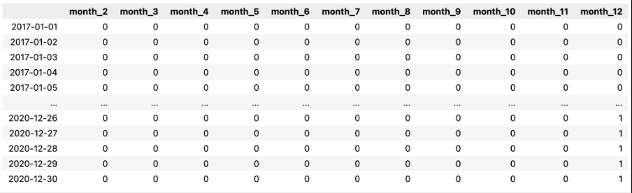
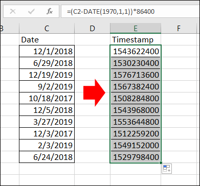
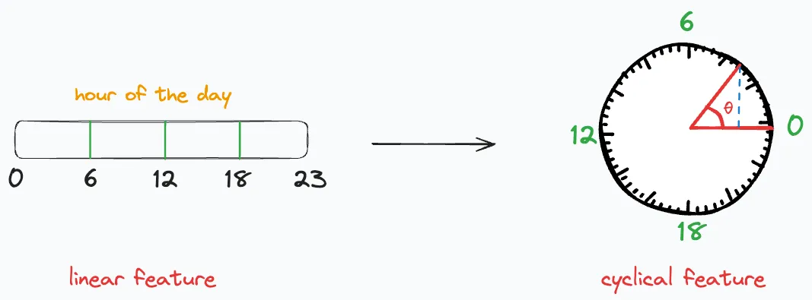

Дата и время -- часто встречающийся тип признаков в данных, которые трудно однозначно отнести к числовому или категориальному. Существуют разные форматы представлениия таких данных, для наиболее популярных из них ниже приведены несколько способов преобразования в пригодную для машинного обучения форму представления.

## Время как категориальный признак

**Идея.** Разбиваем сутки на несколько смысловых интервалов — «ночь», «утро», «день», «вечер» — и превращаем их в категориальный признак, который затем обрабатывается с помощью вышеописанных методов (чаще всего используют one-hot кодирование).

Недостатком такого подхода является потеря временных зависимостей и закономерностей в данных, которые наблюдаются в масштабе одного значения выбранной категории (например, в рамках одного часа).

## Перевод в timestamp

**Идея.** Перевести дату и время в простое числовое представление — количество секунд (миллисекунд) от фиксированного нулевого момента, чаще всего 1 января 1970 г. UTC.

Недостатком такого подхода является сложности масштабирования: число секунд от 1970-го до 2025-го ≈ **$1,7 \times 10^{10}$**.

## Циклическое кодирование

**Идея.** Часы, дни недели и месяцы **циклически повторяются**. При one-hot или ординальном кодировании может получиться ситуация, что между полуночью (0 часов) и 23 часами есть существенная разница, но в реальности это не так – разница всего в 1 час. Для того, чтобы отразить циклический характер времени можно воспользоваться к тригонометрическому (sin-cos) кодированию

**Метод.** Представляем циклический признак как точку на окружности радиуса равным 1:

$$
x_{\sin} = \sin\!\left(2\pi \tfrac{t}{P}\right),\qquad x_{\cos} = \cos\!\left(2\pi \tfrac{t}{P}\right)
$$

где $t$ — целое значение (час 0…23, месяц 1…12), $P$ — период.

---

[Обзор раздела](../)

[Предыдущая тема: Преобразование категориальных признаков](../categorical-features/)

[Следующая тема: Выявление и выбросов аномалий в данных](../outliers/)
